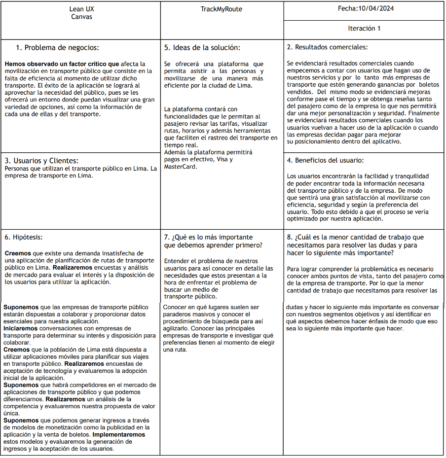

# Universidad Peruana de Ciencias Aplicadas

  

### 
Informe de Trabajo Final

- **Carrera**: Ingeniería de Software
- **Curso**: Diseño de Experimentos de Ingenieria de Software
- **Sección**: SW72
- **Profesor**: Juan Carlos Tinoco Licas
- **Ciclo**: 2024-2
- **Nombre del Startup**: RouteLogic
- **Nombre del Producto**: TrackMyRoute
- **Relación de Integrantes**:
   - **Relación de Integrantes**:
        | Nombre                                      | Código        |
        | --------------------------------------------| ------------- |
        | Luza Carhuamaca, Jose Adrian                | u202213404    |
        | Elsner De La Torre Ugarte, Julio Esteban    | u202111654    |
        | Miranda Sinarahua, Piero Stephano           | u20181g752    |
        | Landeo Simeón, Favio Sebastian              | u202119588    |
        | Poma Espinoza, Gustavo Arturo               | u20221c138    |
        | Ramirez Alfaro, Miguel Angel                | u202117152    |

- **Mes y Año**: Septiembre del 2024

---

# Registro de Versiones del Informe
El objetivo de esta sección es resumir las modificaciones relevantes que se realizan al informe durante el ciclo de vida del proyecto. Esta sección inicia en una página nueva y se incluye un cuadro con la siguiente estructura:

| **Versión** | **Fecha** | **Autor** | **Descripción de Modificación** |
|-------------|-----------|-----------|---------------------------------|
|    TB1      |           |           |                                 |
|             |           |           |                                 |
|             |           |           |                                 |
---
# Project Report Collaboration Insights 

URL del repositorio del proyecto: [https://github.com/upc-pre-2402-si732-sw72-G3/Informe]

  

  

  

---

# Tabla de contenidos
- [Universidad Peruana de Ciencias Aplicadas](#universidad-peruana-de-ciencias-aplicadas)
    - [Informe de Trabajo Final](#informe-de-trabajo-final)
- [Registro de Versiones del Informe](#registro-de-versiones-del-informe)
  - [| v4.0        | 28/06/2024| Todos     | Integración de Back y Front  de nuestro Sistema|](#-v40---------28062024-todos------integración-de-back-y-front--de-nuestro-sistema)
- [Project Report Collaboration Insights](#project-report-collaboration-insights)
- [Tabla de contenidos](#tabla-de-contenidos)
  - [STUDENT OUTCOME](#student-outcome)
- [Capítulo I: Introducción](#capítulo-i-introducción)
  - [1.1 Startup Profile](#11-startup-profile)
    - [1.1.1 Descripción de la Startup](#111-descripción-de-la-startup)
    - [1.1.2 Perfiles de integrantes del equipo](#112-perfiles-de-integrantes-del-equipo)
  - [1.2. Solution Profile](#12-solution-profile)
    - [1.2.1. Antecedentes y problemática](#121-antecedentes-y-problemática)
    - [1.2.2. Lean UX Process](#122-lean-ux-process)
      - [1.2.2.1. Lean UX Problem Statements](#1221-lean-ux-problem-statements)
      - [1.2.2.2. Lean UX Assumptions](#1222-lean-ux-assumptions)
      - [1.2.2.3. Lean UX Hypothesis Statements](#1223-lean-ux-hypothesis-statements)
      - [1.2.2.4. Lean UX Canvas](#1224-lean-ux-canvas)
  - [1.3. Segmentos Objetivo](#13-segmentos-objetivo)
- [Capítulo II: Requirements Elicitation \& Analysis](#capítulo-ii-requirements-elicitation--analysis)
  - [2.1. Competidores](#21-competidores)
    - [2.1.1. Análisis competitivo](#211-análisis-competitivo)
    - [2.1.2. Estrategias y tácticas frente a competidores](#212-estrategias-y-tácticas-frente-a-competidores)
  - [2.2 Entrevistas](#22-entrevistas)
    - [2.2.1 Diseño de entrevistas](#221-diseño-de-entrevistas)
    - [2.2.2. Registro de entrevistas](#222-registro-de-entrevistas)
    - [2.2.3. Análisis de entrevistas](#223-análisis-de-entrevistas)
  - [2.3 Needfinding](#23-needfinding)
    - [2.3.1. User Personas](#231-user-personas)
    - [2.3.2. User Task Matrix](#232-user-task-matrix)
    - [2.3.3. User Journey Mapping](#233-user-journey-mapping)
    - [2.3.4. Empathy Mapping](#234-empathy-mapping)
    - [2.3.5. As-is Scenario Mapping](#235-as-is-scenario-mapping)
- [Capítulo III: Requeriments Specifications](#capítulo-iii-requeriments-specifications)
  - [3.1 To-Be Scenario Mapping](#31-to-be-scenario-mapping)
  - [3.2 User Stories](#32-user-stories)
  - [3.3 Impact Mapping](#33-impact-mapping)
  - [3.4 Product Backlog](#34-product-backlog)
  - [|34| HU34| Recuperación de Contraseña| Como cliente, quiero tener la opción de recuperar mi contraseña en caso de olvido o pérdida para que pueda volver a acceder a mi cuenta sin problemas| 3|](#34-hu34-recuperación-de-contraseña-como-cliente-quiero-tener-la-opción-de-recuperar-mi-contraseña-en-caso-de-olvido-o-pérdida-para-que-pueda-volver-a-acceder-a-mi-cuenta-sin-problemas-3)
- [Capítulo IV: Product Design](#capítulo-iv-product-design)
  - [4.1 Style Guidelines](#41-style-guidelines)
  - [4.2 Information Architecture](#42-information-architecture)
  - [4.3 Landing Page UI Design](#43-landing-page-ui-design)
  - [4.4 Web Applications UX/UI Design](#44-web-applications-uxui-design)
  - [4.5 Web Applications Prototyping](#45-web-applications-prototyping)
  - [4.6 Domain-Driven Software Architecture](#46-domain-driven-software-architecture)
      - [4.6.1. Software Architecture Context Diagram](#461-software-architecture-context-diagram)
      - [4.6.2. Software Architecture Container Diagram](#462-software-architecture-container-diagram)
    - [4.6.3 Software Architecture Components Diagrams](#463-software-architecture-components-diagrams)
        - [Diagrama de componentes #1:](#diagrama-de-componentes-1)
        - [Diagrama de componentes #2:](#diagrama-de-componentes-2)
        - [Diagrama de componentes #3:](#diagrama-de-componentes-3)
        - [Diagrama de componentes #4:](#diagrama-de-componentes-4)
  - [4.7 Software Object-Oriented Design](#47-software-object-oriented-design)
    - [4.7.1 Class Diagrams](#471-class-diagrams)
    - [4.7.2 Class Dictionary](#472-class-dictionary)
  - [4.8 Database Design](#48-database-design)
    - [4.8.1 Database Diagram](#481-database-diagram)
- [Capítulo V: Product Implementation, Validation \& Deployment](#capítulo-v-product-implementation-validation--deployment)
  - [5.1 Software Configuration Management](#51-software-configuration-management)
    - [5.1.1 Software Development Environment Configuration](#511-software-development-environment-configuration)
    - [5.1.2 Source Code Management](#512-source-code-management)
    - [5.1.3 Source Code Style Guide \& Conventions](#513-source-code-style-guide--conventions)
    - [5.1.4 Software Deployment Configuration](#514-software-deployment-configuration)
      - [Repositorios de la Organización](#repositorios-de-la-organización)
      - [Creación de ramas](#creación-de-ramas)
    - [Agregar reglas de protección](#agregar-reglas-de-protección)
  - [Lanzamiento del proyecto](#lanzamiento-del-proyecto)
    - [Landing Page Deployment:](#landing-page-deployment)
    - [Frontend-Application Deployment](#frontend-application-deployment)
  - [5.2 Landing Page, Services \& Applications Implementation.](#52-landing-page-services--applications-implementation)
    - [5.2.2. Sprint 2](#522-sprint-2)
    - [5.2.3. Sprint 3](#523-sprint-3)
    - [5.2.4. Sprint 4](#524-sprint-4)
  - [5.3. Validation Interviews](#53-validation-interviews)
    - [5.3.1. Diseño de Entrevistas](#531-diseño-de-entrevistas)
    - [5.3.2. Registro de Entrevistas](#532-registro-de-entrevistas)
- [Conclusiones](#conclusiones)
- [Anexos](#anexos)
---

# Capítulo I: Introducción
## 1.1 Startup Profile

### 1.1.1 Descripción de la Startup

"RouteLogic" es una startup que busca revolucionar la manera en que las personas se desplazan por la ciudad usando el transporte público. Nuestro objetivo es optimizar y facilitar la movilidad urbana, ofreciendo a los residentes de Lima una aplicación integral que les permita encontrar las rutas de transporte público más eficientes para llegar a sus destinos. Nuestra plataforma no solo ayuda a los usuarios a planificar sus viajes de forma óptima, sino que también proporciona información en tiempo real sobre el estado de las rutas y la disponibilidad de los medios de transporte. Además, trabajamos en conjunto con las empresas de transporte público para ofrecerles una visión actualizada del uso de sus servicios, mejorando así la calidad que brindan a sus clientes.

### 1.1.2 Perfiles de integrantes del equipo

<table align="center"  border="1" width="70%" style="text-align:center;">
    <tr align="center">
        <td rowspan="3">
             
        </td>
        <td align="left">
            <b>Nombre y Apellido:</b>
             
            Jose Adrian Luza Carhuamaca
        </td>
    </tr>
    <tr>
        <td align="left">
        <b>Carrera:</b>
         
        Ingeniería de Software
        </td>
    </tr>
    <tr>
        <td align="left">
        <b>Acerca de:</b>
         
        Soy estudiante de Ingeniería de Software en la Universidad Peruana de Ciencias Aplicadas, con una profunda pasión por el aprendizaje continuo. Me gusta participar en proyectos que desafíen mi creatividad y habilidades para desarrollar soluciones innovadoras, contribuyendo activamente al trabajo en equipo y al logro de objetivos comunes. Estoy siempre en busca de nuevas oportunidades para mejorar, crecer y marcar una diferencia.
        </td>
    </tr>
    <tr align="center">
        <td rowspan="3">
            
        </td>
        <td align="left">
            <b>Nombre y Apellido:</b>
             
            Favio Sebastián Landeo Simeón
        </td>
    </tr>
    <tr>
        <td align="left">
        <b>Carrera:</b>
         
        Ingeniería de Software
        </td>
    </tr>
    <tr>
        <td align="left">
        <b>Acerca de:</b>
         
       Tengo 20 años y actualmente estoy cursando el séptimo ciclo de la carrera de Ingeniería de Software. Estoy disponible para ayudar siempre a mis compañeros y además tiendo a generar buenas relaciones sociales con diferentes tipos de personas gracias a mi tolerancia y capacidad de trabajo en equipo. En mis tiempos libres me gusta escuchar música, jugar videojuegos y editar videos.
        </td>
    </tr>
    <tr align="center">
        <td rowspan="3">
            
        </td>
        <td align="left">
            <b>Nombre y Apellido:</b>
             
            (Nombre aqui)
        </td>
    </tr>
    <tr>
        <td align="left">
        <b>Carrera:</b>
         
        Ingeniería de Software
        </td>
    </tr>
    <tr>
        <td align="left">
        <b>Acerca de:</b>
         
        (Texto Aqui)
        </td>
    </tr>
    <tr align="center">
        <td rowspan="3">
            
        </td>
        <td align="left">
            <b>Nombre y Apellido: </b>
             
            (Nombre aqui)
        </td>
    </tr>
    <tr>
        <td align="left">
        <b>Carrera:</b>
         
        Ingeniería de Software
        </td>
    </tr>
    <tr>
        <td align="left">
        <b>Acerca de:</b>
         
        (Texto Aqui).
        </td>
    </tr>
    <tr align="center">
        <td rowspan="3">
            
        </td>
        <td align="left">
            <b>Nombre y Apellido:</b>
             
            (Nombre aqui)
        </td>
    </tr>
    <tr>
        <td align="left">
        <b>Carrera:</b>
         
        Ingeniería de Software
        </td>
    </tr>
    <tr>
        <td align="left">
        <b>Acerca de:</b>
         
        (Texto Aqui)
        </td>
    </tr>
</table>

## 1.2. Solution Profile

En esta sección iniciaremos por un análisis de los antecedentes y problemática sobre la movilización en transporte público para identificar las raíces del problema e identificar algunas necesidades que se deban cubrir para llegar a una solución de la problemática. Asimismo, luego pasaremos por el proceso UX para poder analizar más a detalle la problemática y poder plantear una hipótesis acerca de la problemática.

### 1.2.1. Antecedentes y problemática

El transporte público en Lima ha estado influenciado por diversos problemas a lo largo de su historia. Con el crecimiento poblacional y urbano, la demanda de servicios de transporte ha aumentado, lo que ha planteado desafíos a la eficiencia y calidad del transporte en la ciudad. Lima alguna vez contó con sistemas de transporte como los tranvías en el siglo XIX, pero la falta de inversión y planificación condujo a su desaparición en la segunda mitad del siglo XX. Entre los problemas más urgentes, la congestión del tráfico, el aumento de vehículos particulares y la infraestructura inadecuada han resultado en largos tiempos de viaje y constante congestión en las calles de Lima. Asimismo, la falta de mantenimiento y servicios insuficientes han deteriorado la experiencia de los usuarios, quienes frecuentemente se ven obligados a usar autobuses y combis en malas condiciones. La inseguridad en el transporte, junto con tarifas elevadas y falta de accesibilidad para personas con discapacidad, son también problemas significativos que requieren atención urgente.

¿Qué?: La movilización en transportes públicos en Lima se refiere al desplazamiento de personas dentro de la ciudad utilizando diferentes medios de transporte público, tales como autobuses, combis, el sistema de buses de tránsito rápido Metropolitano, y el Tren Eléctrico. Este proceso abarca los desplazamientos diarios para trabajar, estudiar y realizar otras actividades cotidianas.

¿Quién?: Los principales actores en la movilización de transporte público en Lima son los usuarios, tanto residentes locales como visitantes de la ciudad. Además, las autoridades gubernamentales y las empresas de transporte público juegan un rol crucial en la gestión y regulación de estos servicios.

¿Por qué?: Las personas utilizan el transporte público en Lima por varias razones, incluyendo la congestión del tráfico, la falta de estacionamiento, la necesidad de una opción de movilidad asequible y la preocupación por el medio ambiente. Además, muchas personas no tienen acceso a un automóvil personal y dependen del transporte público para sus desplazamientos diarios.

¿Dónde?: Esta movilización ocurre en toda la ciudad de Lima, abarcando desde el centro histórico hasta los distritos periféricos y las áreas metropolitanas circundantes. Los usuarios se desplazan tanto dentro de la ciudad como hacia los suburbios.

¿Cuándo?: La movilización en transporte público en Lima se da todos los días, durante todas las horas del día, ya que es esencial para las actividades diarias de la población. Los horarios de operación varían según la ruta y el tipo de transporte.

¿Cómo?: Los usuarios acceden al transporte público en Lima a través de una red de paraderos y estaciones que conectan diversas rutas y servicios. Sistemas de transporte masivo como el Metropolitano y el Tren Eléctrico cuentan con tarjetas de acceso y estaciones designadas para abordar. Los autobuses y combis tienen paraderos específicos en las calles.

¿Cuánto?: El costo del transporte público en Lima varía según el tipo de servicio y la distancia recorrida. Los boletos pueden oscilar entre unos pocos céntimos y varios soles peruanos, dependiendo de la ruta y el sistema de transporte. Existen opciones de tarifas con descuento para aquellos que utilizan tarjetas de prepago, así como para estudiantes y personas mayores.

Conclusiones de las 5W y 2H: En resumen, la movilización en transporte público es una parte fundamental de la vida cotidiana en Lima, Perú, tanto para residentes como para visitantes. Este sistema es indispensable para muchas personas que lo utilizan para moverse por la ciudad debido a la congestión del tráfico, la falta de estacionamiento y la necesidad de alternativas de transporte accesibles. A pesar de los desafíos como la congestión, la seguridad y la insuficiencia en la infraestructura, el transporte público sigue siendo crucial para mantener la movilidad en una ciudad en constante expansión y cambio. Los esfuerzos de las autoridades locales y gubernamentales, como la implementación de sistemas de transporte masivo y la regulación del sector, son pasos importantes hacia la mejora de la movilización en Lima.

### 1.2.2. Lean UX Process

#### 1.2.2.1. Lean UX Problem Statements

El objetivo principal de TrackRoute es facilitar que las personas planifiquen y realicen viajes en transporte público de manera sencilla y eficiente. Además, buscamos disminuir los costos asociados al transporte y aliviar la congestión vehicular, lo que también contribuye a mejorar la calidad del aire, reduciendo así el impacto ambiental de los desplazamientos diarios en la ciudad.

#### 1.2.2.2. Lean UX Assumptions

User Assumptions

I. ¿Quién es el usuario?

TrackRoute está diseñado para cualquier persona que utilice el transporte público en Lima. Esto incluye estudiantes, trabajadores, turistas y cualquier otra persona que necesite planificar un viaje en la ciudad. La aplicación es útil para locales y visitantes que no están familiarizados con el sistema de transporte público de Lima y requieren asistencia para organizar sus desplazamientos.

II. ¿Dónde encaja nuestro producto en la vida del usuario?

Nuestro servicio es crucial para los residentes de Lima que dependen del transporte público para sus desplazamientos diarios. TrackRoute les proporciona una herramienta esencial para encontrar la mejor ruta hacia su destino, optimizando su tiempo y reduciendo la incertidumbre en sus viajes. Esto se traduce en una mayor comodidad y productividad en su vida cotidiana.

III. ¿Qué problemas enfrenta nuestro producto y cómo evitarlos?

La precisión de la información en tiempo real es fundamental para la efectividad de TrackRoute. Datos inexactos pueden llevar a los usuarios a rutas incorrectas, generando frustración. Asimismo, garantizar la privacidad y seguridad de los datos de ubicación es clave para evitar problemas como la exposición de información sensible o el seguimiento no autorizado.

IV. ¿Cuándo y cómo es utilizado nuestro producto?

Los usuarios pueden acceder a TrackRoute a través de dispositivos móviles como teléfonos inteligentes o tabletas. Tras descargar la aplicación desde tiendas como la App Store o Google Play, los usuarios ingresan su ubicación actual y destino. La aplicación ofrece información sobre rutas disponibles, tiempos estimados de viaje y actualizaciones en tiempo real sobre la ubicación de los vehículos de transporte público.

V. ¿Qué características son esenciales?

TrackRoute es una herramienta indispensable para los usuarios de transporte público en Lima. Ofrece características clave como búsqueda de rutas, información en tiempo real, notificaciones y alertas, mapas interactivos, detalles de tarifas y opciones de pago, comentarios de usuarios, historial de viajes, accesibilidad y medidas de seguridad. La aplicación mejora la experiencia del usuario al ayudarlo a planificar y seguir sus rutas de manera eficiente, brindando un servicio personalizado que facilita la movilidad en Lima.

VI. ¿Cómo debe verse y comportarse nuestro producto?

Nuestra plataforma debe ser visualmente atractiva e intuitiva, lo que permitirá a los usuarios confiar en nosotros y alcanzar sus objetivos al utilizar la aplicación.

Business Assumptions

1. Demanda de Usuarios:
Suponemos que existe una demanda significativa para una aplicación de planificación de rutas de transporte público en Lima, ya que muchas personas buscan optimizar sus viajes.

2. Colaboración con Empresas de Transporte:
Suponemos que las empresas de transporte público en Lima estarán dispuestas a colaborar, proporcionando datos actualizados sobre sus rutas y vehículos para integrarlos en nuestra aplicación.

3. Disponibilidad de Datos en Tiempo Real:
Suponemos que podemos acceder a datos en tiempo real de los sistemas de transporte público, lo que nos permitirá proporcionar información precisa sobre la ubicación y el estado de los vehículos.

4. Aceptación de Tecnología:
Suponemos que la población de Lima está dispuesta a adoptar y utilizar aplicaciones móviles para planificar sus viajes en transporte público, y que cuentan con los dispositivos y la conectividad necesarios.

5. Monetización:
Suponemos que podemos generar ingresos a través de modelos de monetización como la publicidad en la aplicación, la venta de boletos de transporte o la suscripción premium para características adicionales.

6. Seguridad de Datos:
Suponemos que podemos garantizar la seguridad y privacidad de los datos personales de los usuarios, lo que fomentará la confianza en nuestra aplicación.

7. Competencia:
Suponemos que habrá competidores en el mercado de aplicaciones de transporte público en Lima, y debemos encontrar formas de diferenciarnos y ofrecer un valor único a los usuarios.

8. Retención de Usuarios:
Suponemos que podemos mantener una base de usuarios activa y comprometida a largo plazo mediante actualizaciones regulares de la aplicación, características adicionales y un excelente servicio al cliente.

9. Regulaciones y Cumplimiento Normativo:
Suponemos que podemos cumplir con todas las regulaciones y requisitos legales relacionados con la operación de una aplicación de transporte público en Lima.

#### 1.2.2.3. Lean UX Hypothesis Statements

Creemos que existe una demanda no satisfecha para una aplicación de planificación de rutas de transporte público en Lima. Por ello, realizaremos encuestas y estudios de mercado para evaluar el interés y la disposición de los usuarios a utilizar la aplicación. 

Suponemos que las empresas de transporte público estarán interesadas en colaborar, proporcionando datos esenciales para nuestra aplicación. Iniciaremos conversaciones con estas empresas para determinar su voluntad de cooperar. También creemos que la población de Lima está dispuesta a utilizar aplicaciones móviles para planificar sus viajes en transporte público. 

Realizaremos encuestas sobre la aceptación de tecnología y evaluaremos la adopción inicial de la aplicación. Suponemos que habrá competencia en el mercado de aplicaciones de transporte público y que podemos diferenciarnos. Analizaremos la competencia y evaluaremos nuestra propuesta de valor única. Por último, suponemos que podemos generar ingresos a través de modelos de monetización como la publicidad en la aplicación y la venta de boletos. 

Implementaremos estos modelos y evaluaremos su efectividad en la generación de ingresos y la aceptación de los usuarios.

#### 1.2.2.4. Lean UX Canvas

---

## 1.3. Segmentos Objetivo

Segmento objetivo 1: Pasajeros en búsqueda de un autobús. (Pasajeros)

• Personas que se desplazan al trabajo o a la escuela utilizando el transporte público: Aquellos que realizan viajes       diarios en Lima y buscan una forma eficiente y confiable de llegar a sus destinos.

• Turistas que visitan Lima y prefieren utilizar el transporte público: Viajeros que exploran la ciudad y optan por un medio de transporte accesible y económico.

• Personas sin acceso a un vehículo personal: Aquellos que dependen exclusivamente del transporte público para sus desplazamientos diarios dentro de la ciudad.

Segmento objetivo 2: Empresas de transporte que operan en Lima.

• Gerentes de operaciones y logística de estas empresas: Profesionales encargados de la planificación, organización y optimización de las rutas y servicios de transporte público.

• Empresas de transporte formalizadas y en cumplimiento con la normativa: Entidades que operan legalmente en Lima y buscan mejorar la calidad y eficiencia de sus servicios a través de la colaboración con TrackRoute.

# Capítulo III: Requeriments Specifications

## 3.1 To-Be Scenario Mapping

Con la herramiento del To-be scenario mapping exploramos las mejoras y las nuevas funcionalidades que se incorporarán en la aplicación “TrackMyRoute”. Estas mejoras están diseñadas para optimizar la experiencia de los usuarios al movilizarse por la ciudad de Lima en transporte público y proporcionar a la empresa de transporte una visión en tiempo real de sus clientes. A través de este proceso, visualizamos cómo la aplicación evolucionará para brindar un servicio más eficiente y útil a los dos grupos de usuarios.

  

 

