# Universidad Peruana de Ciencias Aplicadas

  

### 
Informe de Trabajo Final

- **Carrera**: Ingeniería de Software
- **Curso**: Diseño de Experimentos de Ingenierpia de Software
- **Sección**: SW72
- **Profesor**: Juan Carlos Tinoco Licas
- **Ciclo**: 2024-2
- **Nombre del Startup**: RouteLogic
- **Nombre del Producto**: TrackMyRoute
- **Relación de Integrantes**:

| **Nombre**                               | **Código** |
| ---------------------------------------- | ---------- |
| Luza Carhuamaca, Jose Adrian             | u202213404 |
| Elsner De La Torre Ugarte, Julio Esteban | u202111654 |
| Miranda Sinarahua, Piero Stephano        | u20181g752 |
| Landeo Simeón, Favio Sebastian           | u202119588 |
| Poma Espinoza, Gustavo Arturo            | u20221c138 |
| Ramirez Alfaro, Miguel Angel             | u202117152 |

- **Mes y Año**: Septiembre del 2024

---

# Registro de Versiones del Informe

El objetivo de esta sección es resumir las modificaciones relevantes que se realizan al informe durante el ciclo de vida del proyecto. Esta sección inicia en una página nueva y se incluye un cuadro con la siguiente estructura:

| **Versión** | **Fecha**  | **Autor** | **Descripción de Modificación**                                                                                                          |
| ----------- | ---------- | --------- | ---------------------------------------------------------------------------------------------------------------------------------------- |
| TB1         | 4/09/2024  | Todos     | Añadimos los capítulos 1, 2, 3, 4 y 5. Además se tomó en cuenta la creación de los prototipos en dispositivos móviles.                   |
| TP1         | 24/09/2024 | Todos     | Hicimos los cambios que el profesor nos brindó en la retroalimentación de la versión anterior junto a la adición de los capítulos 6 y 7. |

---

# Project Report Collaboration Insights

URL del repositorio del proyecto: [https://github.com/upc-pre-2402-si732-sw72-G3/Informe]

  

  

  

---

# Tabla de contenidos

- [Universidad Peruana de Ciencias Aplicadas](#universidad-peruana-de-ciencias-aplicadas)
  - [Informe de Trabajo Final](#informe-de-trabajo-final)
- [Registro de Versiones del Informe](#registro-de-versiones-del-informe)
- [Project Report Collaboration Insights](#project-report-collaboration-insights)
- [Tabla de contenidos](#tabla-de-contenidos)
  - [STUDENT OUTCOME](#student-outcome)
- [Capítulo I: Introducción](#capítulo-i-introducción)
  - [1.1 Startup Profile](#11-startup-profile)
    - [1.1.1 Descripción de la Startup](#111-descripción-de-la-startup)
    - [1.1.2 Perfiles de integrantes del equipo](#112-perfiles-de-integrantes-del-equipo)
  - [1.2. Solution Profile](#12-solution-profile)
    - [1.2.1. Antecedentes y problemática](#121-antecedentes-y-problemática)
    - [1.2.2. Lean UX Process](#122-lean-ux-process)
      - [1.2.2.1. Lean UX Problem Statements](#1221-lean-ux-problem-statements)
      - [1.2.2.2. Lean UX Assumptions](#1222-lean-ux-assumptions)
      - [1.2.2.3. Lean UX Hypothesis Statements](#1223-lean-ux-hypothesis-statements)
      - [1.2.2.4. Lean UX Canvas](#1224-lean-ux-canvas)
  - [1.3. Segmentos Objetivo](#13-segmentos-objetivo)
- [Capítulo II: Requirements Elicitation \& Analysis](#capítulo-ii-requirements-elicitation--analysis)
  - [2.1. Competidores](#21-competidores)
    - [2.1.1. Análisis competitivo](#211-análisis-competitivo)
    - [2.1.2. Estrategias y tácticas frente a competidores](#212-estrategias-y-tácticas-frente-a-competidores)
  - [2.2 Entrevistas](#22-entrevistas)
    - [2.2.1 Diseño de entrevistas](#221-diseño-de-entrevistas)
    - [2.2.2. Registro de entrevistas](#222-registro-de-entrevistas)
    - [2.2.3. Análisis de entrevistas](#223-análisis-de-entrevistas)
  - [2.3 Needfinding](#23-needfinding)
    - [2.3.1. User Personas](#231-user-personas)
    - [2.3.2. User Task Matrix](#232-user-task-matrix)
    - [2.3.3. User Journey Mapping](#233-user-journey-mapping)
    - [2.3.4. Empathy Mapping](#234-empathy-mapping)
    - [2.3.5. As-is Scenario Mapping](#235-as-is-scenario-mapping)
- [Capítulo III: Requeriments Specifications](#capítulo-iii-requeriments-specifications)
  - [3.1 To-Be Scenario Mapping](#31-to-be-scenario-mapping)
  - [3.2 User Stories](#32-user-stories)
  - [3.3 Impact Mapping](#33-impact-mapping)
  - [3.4 Product Backlog](#34-product-backlog)
  - [|34| HU34| Recuperación de Contraseña| Como cliente, quiero tener la opción de recuperar mi contraseña en caso de olvido o pérdida para que pueda volver a acceder a mi cuenta sin problemas| 3|](#34-hu34-recuperación-de-contraseña-como-cliente-quiero-tener-la-opción-de-recuperar-mi-contraseña-en-caso-de-olvido-o-pérdida-para-que-pueda-volver-a-acceder-a-mi-cuenta-sin-problemas-3)
- [Capítulo IV: Product Design](#capítulo-iv-product-design)
  - [4.1. Style Guidelines.](#41-style-guidelines)
    - [4.1.1. General Style Guidelines.](#411-general-style-guidelines)
    - [4.1.2. Web Style Guidelines.](#412-web-style-guidelines)
    - [4.1.3. Mobile Style Guidelines.](#413-mobile-style-guidelines)
      - [4.1.3.1. iOS Mobile Style Guidelines.](#4131-ios-mobile-style-guidelines)
      - [4.1.3.2. Android Mobile Style Guidelines.](#4132-android-mobile-style-guidelines)
  - [4.2. Information Architecture.](#42-information-architecture)
    - [4.2.1. Organization Systems.](#421-organization-systems)
    - [4.2.2. Labeling Systems.](#422-labeling-systems)
    - [4.2.3. SEO Tags and Meta Tags](#423-seo-tags-and-meta-tags)
    - [4.2.4. Searching Systems.](#424-searching-systems)
    - [4.2.5. Navigation Systems.](#425-navigation-systems)
  - [4.3. Landing Page UI Design.](#43-landing-page-ui-design)
    - [4.3.1. Landing Page Wireframe.](#431-landing-page-wireframe)
    - [4.3.2. Landing Page Mock-up.](#432-landing-page-mock-up)
  - [4.4. Mobile Applications UX/UI Design.](#44-mobile-applications-uxui-design)
    - [4.4.1. Mobile Applications Wireframes.](#441-mobile-applications-wireframes)
    - [4.4.2. Mobile Applications Wireflow Diagrams.](#442-mobile-applications-wireflow-diagrams)
    - [4.4.3. Mobile Applications Mock-ups.](#443-mobile-applications-mock-ups)
    - [4.4.4. Mobile Applications User Flow Diagrams.](#444-mobile-applications-user-flow-diagrams)
  - [4.5. Mobile Applications Prototyping.](#45-mobile-applications-prototyping)
    - [4.5.1. Android Mobile Applications Prototyping.](#451-android-mobile-applications-prototyping)
    - [4.5.2. iOS Mobile Applications Prototyping.](#452-ios-mobile-applications-prototyping)
    - [4.6. Web Applications UX/UI Design.](#46-web-applications-uxui-design)
    - [4.6.1. Web Applications Wireframes.](#461-web-applications-wireframes)
    - [4.6.2. Web Applications Wireflow Diagrams.](#462-web-applications-wireflow-diagrams)
    - [4.6.3. Web Applications Mock-ups.](#463-web-applications-mock-ups)
    - [4.6.4. Web Applications User Flow Diagrams.](#464-web-applications-user-flow-diagrams)
  - [4.7. Web Applications Prototyping.](#47-web-applications-prototyping)
  - [4.8. Domain-Driven Software Architecture.](#48-domain-driven-software-architecture)
    - [4.8.1. Software Architecture Context Diagram.](#481-software-architecture-context-diagram)
    - [4.8.2. Software Architecture Container Diagrams.](#482-software-architecture-container-diagrams)
    - [4.8.3. Software Architecture Components Diagrams.](#483-software-architecture-components-diagrams)
      - [Diagrama de componentes #1:](#diagrama-de-componentes-1)
      - [Diagrama de componentes #2:](#diagrama-de-componentes-2)
      - [Diagrama de componentes #3:](#diagrama-de-componentes-3)
      - [Diagrama de componentes #4:](#diagrama-de-componentes-4)
  - [4.9. Software Object-Oriented Design.](#49-software-object-oriented-design)
    - [4.9.1. Class Diagrams.](#491-class-diagrams)
    - [4.9.2. Class Dictionary.](#492-class-dictionary)
  - [4.10. Database Design.](#410-database-design)
    - [4.10.1. Relational/Non-Relational Database Diagram.](#4101-relationalnon-relational-database-diagram)
- [Capítulo V: Product Implementation](#capítulo-v-product-implementation)
  - [5.1 Software Configuration Management](#51-software-configuration-management)
    - [5.1.1 Software Development Environment Configuration](#511-software-development-environment-configuration)
    - [5.1.2 Source Code Management](#512-source-code-management)
    - [5.1.3 Source Code Style Guide \& Conventions](#513-source-code-style-guide--conventions)
    - [5.1.4 Software Deployment Configuration](#514-software-deployment-configuration)
      - [Repositorios de la Organización](#repositorios-de-la-organización)
      - [Creación de ramas](#creación-de-ramas)
    - [Agregar reglas de protección](#agregar-reglas-de-protección)
  - [Lanzamiento del proyecto](#lanzamiento-del-proyecto)
    - [Landing Page Deployment:](#landing-page-deployment)
    - [Frontend-Application Deployment](#frontend-application-deployment)
  - [5.2 Landing Page, Services \& Applications Implementation.](#52-landing-page-services--applications-implementation)
    - [5.2.2. Sprint 2](#522-sprint-2)
    - [5.2.3. Sprint 3](#523-sprint-3)
    - [5.2.4. Sprint 4](#524-sprint-4)
  - [5.3. Validation Interviews](#53-validation-interviews)
    - [5.3.1. Diseño de Entrevistas](#531-diseño-de-entrevistas)
    - [5.3.2. Registro de Entrevistas](#532-registro-de-entrevistas)
- [Capítulo VI: Product Verification \& Validation](#capítulo-vi-product-verification--validation)
  - [6.1. Testing Suites \& Validation](#61-testing-suites--validation)
    - [6.1.1. Core Entities Unit Tests](#611-core-entities-unit-tests)
    - [6.1.2. Core Integration Tests](#612-core-integration-tests)
    - [6.1.3. Core Behavior-Driven Development](#613-core-behavior-driven-development)
    - [6.1.4. Core System Tests](#614-core-system-tests)
- [6.2 Static testing \& Verification](#62--static-testing--verification)
  - [6.2.1. Static Code Analysis](#621-static-code-analysis)
    - [6.2.1.1. Coding standard \& Code conventions.](#6211-coding-standard--code-conventions)
    - [Naming Conventions](#naming-conventions)
    - [Indentación y Espaciado](#indentación-y-espaciado)
    - [Comentarios](#comentarios)
    - [Organización de Archivos](#organización-de-archivos)
    - [6.2.1.2. Code Quality \& Code Security.](#6212-code-quality--code-security)
  - [6.2.2. Reviews](#622-reviews)
    - [Documentación de Revisiones](#documentación-de-revisiones)
- [6.3 Validation Interviews](#63-validation-interviews)
  - [6.3.1 Diseño de Entrevistas](#631-diseño-de-entrevistas)
    - [Segmento 1: Usuarios Diarios de la Página Web](#segmento-1-usuarios-diarios-de-la-página-web)
    - [Segmento 2: Empresas que Utilizan la Página Web](#segmento-2-empresas-que-utilizan-la-página-web)
  - [6.3.2 Registro de Entrevistas](#632-registro-de-entrevistas)
    - [Segmento 1](#segmento-1)
    - [Segmento 2](#segmento-2)
  - [6.3.3 Evaluación Según Heurísticas](#633-evaluación-según-heurísticas)
    - [Segmento 1](#segmento-1-1)
    - [Segmento 2](#segmento-2-1)
- [Capítulo VII: DevOps Practices](#capítulo-vii-devops-practices)
  - [7.1. Continuous Integration](#71-continuous-integration)
    - [7.1.1. Tools and Practices](#711-tools-and-practices)
    - [7.1.2. Build \& Test Suite Pipeline Components](#712-build--test-suite-pipeline-components)
  - [7.2. Continuous Delivery](#72-continuous-delivery)
    - [7.2.1. Tools and Practices](#721-tools-and-practices)
    - [7.2.2. Stages Deployment Pipeline Components](#722-stages-deployment-pipeline-components)
  - [7.3. Continuous Deployment](#73-continuous-deployment)
    - [7.3.1. Tools and Practices](#731-tools-and-practices)
    - [7.3.2. Production Deployment Pipeline Components](#732-production-deployment-pipeline-components)
  - [7.4. Continuous Monitoring](#74-continuous-monitoring)
- [Capítulo VIII: Experiment-Driven Development](#capítulo-viii-experiment-driven-development)
  - [8.1. Experiment Planning](#81-experiment-planning)
    - [8.1.1. As-Is Summary](#811-as-is-summary)
    - [8.1.2. Raw Material: Assumptions, Knowledge Gaps, Ideas, Claims.](#812--raw-material-assumptions-knowledge-gaps-ideas-claims)
    - [8.1.3. Experiment-Ready Question](#813-experiment-ready-question)
    - [8.1.4. Questions Backlog](#814-questions-backlog)
    - [8.1.5. Experiment Cards](#815-experiment-cards)
- [8.2 Experiment Design](#82-experiment-design)
  - [8.2.1 Hypotheses](#821-hypotheses)
  - [8.2.2 Measures](#822-measures)
  - [8.2.3 Conditions](#823-conditions)
  - [8.2.4 Scale Calculations and Decisions](#824-scale-calculations-and-decisions)
  - [8.2.5 Methods Selection](#825-methods-selection)
  - [8.2.6 Data Analytics: Goals, KPIs, and Metrics Selection](#826-data-analytics-goals-kpis-and-metrics-selection)
  - [8.2.7 Web and Mobile Tracking Plan](#827-web-and-mobile-tracking-plan)
  - [8.3. Experimentation](#83-experimentation)
    - [8.3.1. To-Be User Stories](#831-to-be-user-stories)
    - [8.3.2. To-Be Product Backlog](#832-to-be-product-backlog)
  - [8.5. Continuous Learning](#85-continuous-learning)
    - [8.5.2. Shareback Sessions Artifacs: Learning Workflow](#852-shareback-sessions-artifacs-learning-workflow)
  - [8.6. To-Be Software Platform Pre-Launch](#86-to-be-software-platform-pre-launch)
- [Conclusiones](#conclusiones)
- [Anexos](#anexos)

---

## STUDENT OUTCOME

<b>ABET – EAC - Student Outcome 4</b>

| Criterio específico                                                                                                                                     | Acciones realizadas                                                                                                                                                                                                                                                                                                                                                                                                                                                                                                                                                                                                                                                                                                                                                                                                                                                                                                                                                                                                                                                                                                                                                                                                                                                                                                                                                                                                                                                                                                                                                                                                                                                                                                                                                                                                                                                                                                                                                                                                                                                                                                                                                                                                                                                                                                                                                                                                                                                                                                                                                                                                                                                                                                                                                                                                                                                                                   | Conclusiones                                                                                                                                                                                                                                                                                                                                                                                                                                                                                                                                                                                                                                                                                                                                                                                                                                                                                                                                                                                                                                                                                                                                                                                                                                                                                                                                                                                                                                                                                                                                                                                                                                                                                                                                                                                                                                                                                                                                                                    |
| ------------------------------------------------------------------------------------------------------------------------------------------------------- | ----------------------------------------------------------------------------------------------------------------------------------------------------------------------------------------------------------------------------------------------------------------------------------------------------------------------------------------------------------------------------------------------------------------------------------------------------------------------------------------------------------------------------------------------------------------------------------------------------------------------------------------------------------------------------------------------------------------------------------------------------------------------------------------------------------------------------------------------------------------------------------------------------------------------------------------------------------------------------------------------------------------------------------------------------------------------------------------------------------------------------------------------------------------------------------------------------------------------------------------------------------------------------------------------------------------------------------------------------------------------------------------------------------------------------------------------------------------------------------------------------------------------------------------------------------------------------------------------------------------------------------------------------------------------------------------------------------------------------------------------------------------------------------------------------------------------------------------------------------------------------------------------------------------------------------------------------------------------------------------------------------------------------------------------------------------------------------------------------------------------------------------------------------------------------------------------------------------------------------------------------------------------------------------------------------------------------------------------------------------------------------------------------------------------------------------------------------------------------------------------------------------------------------------------------------------------------------------------------------------------------------------------------------------------------------------------------------------------------------------------------------------------------------------------------------------------------------------------------------------------------------------------------- | ------------------------------------------------------------------------------------------------------------------------------------------------------------------------------------------------------------------------------------------------------------------------------------------------------------------------------------------------------------------------------------------------------------------------------------------------------------------------------------------------------------------------------------------------------------------------------------------------------------------------------------------------------------------------------------------------------------------------------------------------------------------------------------------------------------------------------------------------------------------------------------------------------------------------------------------------------------------------------------------------------------------------------------------------------------------------------------------------------------------------------------------------------------------------------------------------------------------------------------------------------------------------------------------------------------------------------------------------------------------------------------------------------------------------------------------------------------------------------------------------------------------------------------------------------------------------------------------------------------------------------------------------------------------------------------------------------------------------------------------------------------------------------------------------------------------------------------------------------------------------------------------------------------------------------------------------------------------------------- |
| Reconoce responsabilidad ética y profesional en situaciones de ingeniería de software.                                                                  | **Luza Carhuamaca, Jose Adrian**   **TB1:**   Durante la elaboración del Capítulo 1, me enfoqué en reconocer la responsabilidad ética y profesional. Para ello, detallé la descripción de la startup y los perfiles de los integrantes del equipo, asegurándome de que cada perfil refleje el compromiso ético de cada miembro. También desarrollé los apartados relacionados con los antecedentes, problemática y el proceso Lean UX, teniendo en cuenta prácticas éticas y transparentes en la recolección y presentación de la información.       **Elsner De La Torre Ugarte, Julio Esteban**   **TB1:**   Durante el desarrollo del proyecto, adquirí conocimientos en la implementación de arquitecturas de software basadas en el Diseño Orientado al Dominio (DDD), donde pude modelar entidades clave, definir contextos delimitados y aplicar una arquitectura basada en eventos. A lo largo de este proceso, me enfoqué en la responsabilidad ética y profesional, garantizando que las soluciones no solo se alinearan con las necesidades del negocio, sino que también fueran justas, equitativas y respetuosas con los derechos de los usuarios. Además, consideré la importancia de utilizar fuentes y tecnologías que cumplan con los estándares éticos y legales, asegurando un desarrollo de software prudente y confiable.       **Miranda Sinarahua, Piero Stephano**   **TB1:**   Mediante el desarrollo profesional y etico logre identificar las especificacioes y requerimientos necesarios para el desarrollo del trabajo. Contribuí añadiendo mapas e historias de usuarios los cuales se tomaron en cuenta para caracteristicas posteriores mencionadas en el informe.       **Landeo Simeón, Favio Sebastián**   **TB1:**   Realicé el capítulo 5 correspondiente a la implementación del producto, cómo se ejecuta y dónde.       **Poma Espinoza, Gustavo Arturo**   **TB1:**   Participé activamente en la identificación de problemas éticos y profesionales en el desarrollo del proyecto, asegurando que todas las decisiones técnicas cumplieran con los estándares de la industria y con las regulaciones aplicables. Colaboré en la implementación de prácticas de desarrollo sostenible y en la creación de documentación que refleje el compromiso del equipo con la responsabilidad ética.       **Ramirez Alfaro, Miguel Angel**   **TB1:**   (TB1)                                                                                                                                                                                                                                                                                                                                                                                                                        | **Luza Carhuamaca, Jose Adrian**   **TB1:**   Estas acciones permitieron asegurar que la información presentada en el trabajo este enlazado con los principios éticos y profesionales requeridos, fortaleciendo la integridad del proyecto y destacando la importancia del comportamiento ético en todas las etapas del desarrollo.       **Elsner De La Torre Ugarte, Julio Esteban**   **TB1:**   Llevar a cabo esta parte del informe me hizo reconocer las responsabilidades éticas y profesionales como futuro desarrollador de software, así como comprender que la información y demás funciones son importantes para ser un buen profesional.       **Miranda Sinarahua, Piero Stephano**   **TB1:**   Se concluye que al realizar un trabajo profesional de manera etica se puede conseguir un producto que alcance un gran impacto al publico objetivo. De igual manera, la toma de decisiones previas al desarrollo es una necesidad fundamental para una correcta propuesta de solucion.       **Landeo Simeón, Favio Sebastián**   **TB1:**   En esta entrega aprendí que la responsabilidad de utilizar fuentes son importantes para el desarrollo de un software con un uso prudente y ético.       **Poma Espinoza, Gustavo Arturo**   **TB1:**   El análisis detallado de las implicancias éticas y profesionales durante el desarrollo del proyecto permitió al equipo anticiparse a posibles riesgos y garantizar que todas las soluciones técnicas propuestas fueran responsables y sostenibles a largo plazo.       **Ramirez Alfaro, Miguel Angel**   **TB2:**   El diseño experimental evaluó la eficiencia de TrackMyRoute mediante hipótesis, métricas clave, condiciones controladas y reales, garantizando datos sólidos para optimizar precisión y satisfacción del usuario.                                                                                       |
| . Para                                                                                                                                                  |
| Emite juicios informados considerando el impacto de las soluciones de ingeniería de software en contextos globales, económicos, ambientales y sociales. | **Luza Carhuamaca, Jose Adrian**   **TB1:**   Al redactar el Capítulo 1, consideré el impacto de las soluciones planteadas en diversos contextos. Desarrollé el perfil de la solución y los segmentos objetivo teniendo en cuenta los efectos potenciales en el ámbito global, económico, ambiental y social. Además, abordé el proceso Lean UX de manera que promoviera una visión integral de las posibles consecuencias de nuestras decisiones en diferentes entornos.       **Elsner De La Torre Ugarte, Julio Esteban**   **TB1:**   En el proyecto, aprendí a diseñar y desarrollar prototipos tanto para aplicaciones móviles en Android e iOS como para aplicaciones web, aplicando principios de UX/UI. Esto incluye la creación de wireframes, diagramas wireflow, mock-ups y diagramas de flujo de usuario, lo que me permitió entender y optimizar la experiencia del usuario desde las primeras fases del proyecto. Al aplicar estos principios, consideré el impacto global de las soluciones, asegurando que fueran accesibles, intuitivas y alineadas con las necesidades del usuario final, mientras que las decisiones de diseño también reflejaron una consideración consciente de la sostenibilidad ambiental y la responsabilidad social. Además, el proyecto incorporó arquitecturas de software basadas en el Diseño Orientado al Dominio (DDD), asegurando que las soluciones fueran escalables y adaptables a diferentes contextos económicos y culturales, lo que favorece la globalización del software desarrollado.       **Miranda Sinarahua, Piero Stephano**   **TB1:**   Participe en la toma de datos y decision de funcionalidades y caracteristicas las cuales ayudaron a que nuestro proyecto tenga un impacto social y economico en la poblacion. Asi, la solucion tecnologica propuesta conllevara a mejorar los servicios de transporte de la ciudad correspondiente.       **Landeo Simeón, Favio Sebastián**   **TB1:**   Realicé el capítulo 5 correspondiente a la implementación del producto, cómo se ejecuta y dónde.       **Poma Espinoza, Gustavo Arturo**   **TB1:**   Realicé un análisis exhaustivo de las posibles consecuencias globales y locales de nuestra solución de software, evaluando su impacto en el medio ambiente y en las comunidades que dependen de los servicios de transporte. Participé en la creación de estrategias que maximicen los beneficios sociales y minimicen los impactos negativos.       **Ramirez Alfaro, Miguel Angel**   **TB1:**   Para el trabajo mi parte fue realizar el Cap 5, donde Integré completamente el backend con el frontend, realizando pruebas exhaustivas y asegurando que todas las funcionalidades trabajaran de manera coherente, lo que permitió ofrecer una experiencia de usuario integral y fluida. | **Luza Carhuamaca, Jose Adrian**   **TB1:**   Gracias a esta perspectiva global en la redacción del Capítulo 1, logré presentar una solución que no solo responde a necesidades específicas, sino que también es consciente de su impacto en diferentes contextos, promoviendo un enfoque equilibrado y sostenible en el desarrollo del proyecto.       **Elsner De La Torre Ugarte, Julio Esteban**   **TB1:**   Con la realización de mi parte en este proyecto entendí que los juicios e información que brindamos a los usuarios mediante nuestro software es importante desde el punto de vista ético y profesional.       **Miranda Sinarahua, Piero Stephano**   **TB1:**   Se conluye que el trabajo realizado favorece a la poblacion en un contexto global,economico ,ambiental y social, ya que ofrece un beneficio el cual es aprovechado en actividades cotidianas.       **Landeo Simeón, Favio Sebastián**   **TB1:**   Aprendí a manejar la información que brindo en un proyecto. Es muy importante porque los usuarios tienen que saber que la fuente es confiable y de buena ética.       **Poma Espinoza, Gustavo Arturo**   **TB1:**   La consideración de los contextos globales, económicos, ambientales y sociales en el diseño de la aplicación nos permitió desarrollar una solución más holística y efectiva, alineada con los objetivos de desarrollo sostenible.       **Ramirez Alfaro, Miguel Angel**  **TB1:** En conclusion con el apoño y esfuerzo de nuestro equipo logramos completar los requisitos de nuestra propuesta y realizamos las pruebas necesarias para comprobar nuestor trabajo.   **Ramirez Alfaro, Miguel Angel**   **TB2:** El proyecto TrackMyRoute optimiza la planificación de rutas mediante herramientas de seguimiento y análisis, mejorando la precisión, eficiencia y experiencia del usuario en escenarios reales y simulados. |
|  |

---

# Capítulo I: Introducción

## 1.1 Startup Profile

### 1.1.1 Descripción de la Startup

"RouteLogic" es una startup que busca revolucionar la manera en que las personas se desplazan por la ciudad usando el transporte público. Nuestro objetivo es optimizar y facilitar la movilidad urbana, ofreciendo a los residentes de Lima una aplicación integral que les permita encontrar las rutas de transporte público más eficientes para llegar a sus destinos. Nuestra plataforma no solo ayuda a los usuarios a planificar sus viajes de forma óptima, sino que también proporciona información en tiempo real sobre el estado de las rutas y la disponibilidad de los medios de transporte. Además, trabajamos en conjunto con las empresas de transporte público para ofrecerles una visión actualizada del uso de sus servicios, mejorando así la calidad que brindan a sus clientes.

### 1.1.2 Perfiles de integrantes del equipo

<table align="center"  border="1" width="70%" style="text-align:center;">
    <tr align="center">
        <td rowspan="3">
             
        </td>
        <td align="left">
            <b>Nombre y Apellido:</b>
             
            Jose Adrian Luza Carhuamaca
        </td>
    </tr>
    <tr>
        <td align="left">
        <b>Carrera:</b>
         
        Ingeniería de Software
        </td>
    </tr>
    <tr>
        <td align="left">
        <b>Acerca de:</b>
         
        Soy estudiante de Ingeniería de Software en la Universidad Peruana de Ciencias Aplicadas, con una profunda pasión por el aprendizaje continuo. Me gusta participar en proyectos que desafíen mi creatividad y habilidades para desarrollar soluciones innovadoras, contribuyendo activamente al trabajo en equipo y al logro de objetivos comunes. Estoy siempre en busca de nuevas oportunidades para mejorar, crecer y marcar una diferencia.
        </td>
    </tr>
    <tr align="center">
        <td rowspan="3">
            
        </td>
        <td align="left">
            <b>Nombre y Apellido:</b>
             
            Favio Sebastián Landeo Simeón
        </td>
    </tr>
    <tr>
        <td align="left">
        <b>Carrera:</b>
         
        Ingeniería de Software
        </td>
    </tr>
    <tr>
        <td align="left">
        <b>Acerca de:</b>
         
       Tengo 20 años y actualmente estoy cursando el séptimo ciclo de la carrera de Ingeniería de Software. Estoy disponible para ayudar siempre a mis compañeros y además tiendo a generar buenas relaciones sociales con diferentes tipos de personas gracias a mi tolerancia y capacidad de trabajo en equipo. En mis tiempos libres me gusta escuchar música, jugar videojuegos y editar videos.
        </td>
    </tr>
    <tr align="center">
        <td rowspan="3">
            
        </td>
        <td align="left">
            <b>Nombre y Apellido:</b>
             
            Julio Esteban Elsner De La Torre Ugarte
        </td>
    </tr>
    <tr>
        <td align="left">
        <b>Carrera:</b>
         
        Ingeniería de Software
        </td>
    </tr>
    <tr>
        <td align="left">
        <b>Acerca de:</b>
         
        Mi nombre es Julio Elsner De La Torre Ugarte, tengo 21 años y soy estudiante de la carrera de ingeniería de software. Con anterioridad ya he tenido experiencia con el tipo de trabajos que conllevan trabajo grupal y que busca una solución a alguna problemática. En mi opinión, soy bastante hábil extrayendo información de algún problema lo cual mejora el trabajo conjunto en grupo y la organización en general.
        </td>
    </tr>
    <tr align="center">
        <td rowspan="3">
            
        </td>
        <td align="left">
            <b>Nombre y Apellido: </b>
             
            Gustavo Arturo Poma Espinoza
        </td>
    </tr>
    <tr>
        <td align="left">
        <b>Carrera:</b>
         
        Ingeniería de Software
        </td>
    </tr>
    <tr>
        <td align="left">
        <b>Acerca de:</b>
         
        Mi nombre es Gustavo, actualmente estoy cursando el sexto ciclo de la carrera de Ingeniería de Software. Disfruto escuchando música, ya que siento que esta actividad me inspira creatividad. Tengo una sólida comprensión de algoritmos y estructuras de datos, y experiencia en desarrollo web y móvil. Me considero una persona con alta capacidad de trabajo en equipo, siempre dispuesto a ayudar a mis compañeros, lo que me permite generar buenas relaciones sociales con diferentes tipos de personas.
        </td>
    </tr>
    <tr align="center">
        <td rowspan="3">
            
        </td>
        <td align="left">
            <b>Nombre y Apellido:</b>
             
            Piero Stephano Miranda Sinarahua
        </td>
    </tr>
    <tr>
        <td align="left">
        <b>Carrera:</b>
         
        Ingeniería de Software
        </td>
    </tr>
    <tr>
        <td align="left">
        <b>Acerca de:</b>
         
        Me llamo Piero Miranda y actualmente estoy llevando la carrera de Ingeniería de Software. Considero que soy una persona responsable y que puedo aportar al equipo en cualquier aspecto que se requiera. De igual 
         manera, siento que los conocimientos que he ido adquiriendo en ciclos anteriores serán de gran ayuda para llevar a cabo el presente trabajo.
        </td>
    </tr>
	<tr align="center">
        <td rowspan="3">
             
        </td>
        <td align="left">
            <b>Nombre y Apellido:</b>
             
            Miguel Angel Ramirez Alfaro Soy estudiante de 8vo ciclo de la carrera profesional de Ingeniería de Software. Me apasiona la tecnología y sus infinitas aplicaciones. Me considero un joven innovador, soñador , responsable y comprometido. Además, me gusta trabajar en equipo solucionar problemas y mejorar los procesos que nos faciliten el trabajo, pero sobre todo, mejoremos la experiencia del usuario (cliente).
            </td>
        </td>
  </tr>  
</table>

## 1.2. Solution Profile

En esta sección iniciaremos por un análisis de los antecedentes y problemática sobre la movilización en transporte público para identificar las raíces del problema e identificar algunas necesidades que se deban cubrir para llegar a una solución de la problemática. Asimismo, luego pasaremos por el proceso UX para poder analizar más a detalle la problemática y poder plantear una hipótesis acerca de la problemática.

### 1.2.1. Antecedentes y problemática

El transporte público en Lima ha estado influenciado por diversos problemas a lo largo de su historia. Con el crecimiento poblacional y urbano, la demanda de servicios de transporte ha aumentado, lo que ha planteado desafíos a la eficiencia y calidad del transporte en la ciudad. Lima alguna vez contó con sistemas de transporte como los tranvías en el siglo XIX, pero la falta de inversión y planificación condujo a su desaparición en la segunda mitad del siglo XX. Entre los problemas más urgentes, la congestión del tráfico, el aumento de vehículos particulares y la infraestructura inadecuada han resultado en largos tiempos de viaje y constante congestión en las calles de Lima. Asimismo, la falta de mantenimiento y servicios insuficientes han deteriorado la experiencia de los usuarios, quienes frecuentemente se ven obligados a usar autobuses y combis en malas condiciones. La inseguridad en el transporte, junto con tarifas elevadas y falta de accesibilidad para personas con discapacidad, son también problemas significativos que requieren atención urgente.

¿Qué?: La movilización en transportes públicos en Lima se refiere al desplazamiento de personas dentro de la ciudad utilizando diferentes medios de transporte público, tales como autobuses, combis, el sistema de buses de tránsito rápido Metropolitano, y el Tren Eléctrico. Este proceso abarca los desplazamientos diarios para trabajar, estudiar y realizar otras actividades cotidianas.

¿Quién?: Los principales actores en la movilización de transporte público en Lima son los usuarios, tanto residentes locales como visitantes de la ciudad. Además, las autoridades gubernamentales y las empresas de transporte público juegan un rol crucial en la gestión y regulación de estos servicios.

¿Por qué?: Las personas utilizan el transporte público en Lima por varias razones, incluyendo la congestión del tráfico, la falta de estacionamiento, la necesidad de una opción de movilidad asequible y la preocupación por el medio ambiente. Además, muchas personas no tienen acceso a un automóvil personal y dependen del transporte público para sus desplazamientos diarios.

¿Dónde?: Esta movilización ocurre en toda la ciudad de Lima, abarcando desde el centro histórico hasta los distritos periféricos y las áreas metropolitanas circundantes. Los usuarios se desplazan tanto dentro de la ciudad como hacia los suburbios.

¿Cuándo?: La movilización en transporte público en Lima se da todos los días, durante todas las horas del día, ya que es esencial para las actividades diarias de la población. Los horarios de operación varían según la ruta y el tipo de transporte.

¿Cómo?: Los usuarios acceden al transporte público en Lima a través de una red de paraderos y estaciones que conectan diversas rutas y servicios. Sistemas de transporte masivo como el Metropolitano y el Tren Eléctrico cuentan con tarjetas de acceso y estaciones designadas para abordar. Los autobuses y combis tienen paraderos específicos en las calles.

¿Cuánto?: El costo del transporte público en Lima varía según el tipo de servicio y la distancia recorrida. Los boletos pueden oscilar entre unos pocos céntimos y varios soles peruanos, dependiendo de la ruta y el sistema de transporte. Existen opciones de tarifas con descuento para aquellos que utilizan tarjetas de prepago, así como para estudiantes y personas mayores.

Conclusiones de las 5W y 2H: En resumen, la movilización en transporte público es una parte fundamental de la vida cotidiana en Lima, Perú, tanto para residentes como para visitantes. Este sistema es indispensable para muchas personas que lo utilizan para moverse por la ciudad debido a la congestión del tráfico, la falta de estacionamiento y la necesidad de alternativas de transporte accesibles. A pesar de los desafíos como la congestión, la seguridad y la insuficiencia en la infraestructura, el transporte público sigue siendo crucial para mantener la movilidad en una ciudad en constante expansión y cambio. Los esfuerzos de las autoridades locales y gubernamentales, como la implementación de sistemas de transporte masivo y la regulación del sector, son pasos importantes hacia la mejora de la movilización en Lima.

### 1.2.2. Lean UX Process

#### 1.2.2.1. Lean UX Problem Statements

El objetivo principal de TrackRoute es facilitar que las personas planifiquen y realicen viajes en transporte público de manera sencilla y eficiente. Además, buscamos disminuir los costos asociados al transporte y aliviar la congestión vehicular, lo que también contribuye a mejorar la calidad del aire, reduciendo así el impacto ambiental de los desplazamientos diarios en la ciudad.

#### 1.2.2.2. Lean UX Assumptions

User Assumptions

I. ¿Quién es el usuario?

TrackRoute está diseñado para cualquier persona que utilice el transporte público en Lima. Esto incluye estudiantes, trabajadores, turistas y cualquier otra persona que necesite planificar un viaje en la ciudad. La aplicación es útil para locales y visitantes que no están familiarizados con el sistema de transporte público de Lima y requieren asistencia para organizar sus desplazamientos.

II. ¿Dónde encaja nuestro producto en la vida del usuario?

Nuestro servicio es crucial para los residentes de Lima que dependen del transporte público para sus desplazamientos diarios. TrackRoute les proporciona una herramienta esencial para encontrar la mejor ruta hacia su destino, optimizando su tiempo y reduciendo la incertidumbre en sus viajes. Esto se traduce en una mayor comodidad y productividad en su vida cotidiana.

III. ¿Qué problemas enfrenta nuestro producto y cómo evitarlos?

La precisión de la información en tiempo real es fundamental para la efectividad de TrackRoute. Datos inexactos pueden llevar a los usuarios a rutas incorrectas, generando frustración. Asimismo, garantizar la privacidad y seguridad de los datos de ubicación es clave para evitar problemas como la exposición de información sensible o el seguimiento no autorizado.

IV. ¿Cuándo y cómo es utilizado nuestro producto?

Los usuarios pueden acceder a TrackRoute a través de dispositivos móviles como teléfonos inteligentes o tabletas. Tras descargar la aplicación desde tiendas como la App Store o Google Play, los usuarios ingresan su ubicación actual y destino. La aplicación ofrece información sobre rutas disponibles, tiempos estimados de viaje y actualizaciones en tiempo real sobre la ubicación de los vehículos de transporte público.

V. ¿Qué características son esenciales?

TrackRoute es una herramienta indispensable para los usuarios de transporte público en Lima. Ofrece características clave como búsqueda de rutas, información en tiempo real, notificaciones y alertas, mapas interactivos, detalles de tarifas y opciones de pago, comentarios de usuarios, historial de viajes, accesibilidad y medidas de seguridad. La aplicación mejora la experiencia del usuario al ayudarlo a planificar y seguir sus rutas de manera eficiente, brindando un servicio personalizado que facilita la movilidad en Lima.

VI. ¿Cómo debe verse y comportarse nuestro producto?

Nuestra plataforma debe ser visualmente atractiva e intuitiva, lo que permitirá a los usuarios confiar en nosotros y alcanzar sus objetivos al utilizar la aplicación.

Business Assumptions

1. Demanda de Usuarios:
   Suponemos que existe una demanda significativa para una aplicación de planificación de rutas de transporte público en Lima, ya que muchas personas buscan optimizar sus viajes.

2. Colaboración con Empresas de Transporte:
   Suponemos que las empresas de transporte público en Lima estarán dispuestas a colaborar, proporcionando datos actualizados sobre sus rutas y vehículos para integrarlos en nuestra aplicación.

3. Disponibilidad de Datos en Tiempo Real:
   Suponemos que podemos acceder a datos en tiempo real de los sistemas de transporte público, lo que nos permitirá proporcionar información precisa sobre la ubicación y el estado de los vehículos.

4. Aceptación de Tecnología:
   Suponemos que la población de Lima está dispuesta a adoptar y utilizar aplicaciones móviles para planificar sus viajes en transporte público, y que cuentan con los dispositivos y la conectividad necesarios.

5. Monetización:
   Suponemos que podemos generar ingresos a través de modelos de monetización como la publicidad en la aplicación, la venta de boletos de transporte o la suscripción premium para características adicionales.

6. Seguridad de Datos:
   Suponemos que podemos garantizar la seguridad y privacidad de los datos personales de los usuarios, lo que fomentará la confianza en nuestra aplicación.

7. Competencia:
   Suponemos que habrá competidores en el mercado de aplicaciones de transporte público en Lima, y debemos encontrar formas de diferenciarnos y ofrecer un valor único a los usuarios.

8. Retención de Usuarios:
   Suponemos que podemos mantener una base de usuarios activa y comprometida a largo plazo mediante actualizaciones regulares de la aplicación, características adicionales y un excelente servicio al cliente.

9. Regulaciones y Cumplimiento Normativo:
   Suponemos que podemos cumplir con todas las regulaciones y requisitos legales relacionados con la operación de una aplicación de transporte público en Lima.

#### 1.2.2.3. Lean UX Hypothesis Statements

Creemos que existe una demanda no satisfecha para una aplicación de planificación de rutas de transporte público en Lima. Por ello, realizaremos encuestas y estudios de mercado para evaluar el interés y la disposición de los usuarios a utilizar la aplicación.

Suponemos que las empresas de transporte público estarán interesadas en colaborar, proporcionando datos esenciales para nuestra aplicación. Iniciaremos conversaciones con estas empresas para determinar su voluntad de cooperar. También creemos que la población de Lima está dispuesta a utilizar aplicaciones móviles para planificar sus viajes en transporte público.

Realizaremos encuestas sobre la aceptación de tecnología y evaluaremos la adopción inicial de la aplicación. Suponemos que habrá competencia en el mercado de aplicaciones de transporte público y que podemos diferenciarnos. Analizaremos la competencia y evaluaremos nuestra propuesta de valor única. Por último, suponemos que podemos generar ingresos a través de modelos de monetización como la publicidad en la aplicación y la venta de boletos.

Implementaremos estos modelos y evaluaremos su efectividad en la generación de ingresos y la aceptación de los usuarios.

#### 1.2.2.4. Lean UX Canvas

---

## 1.3. Segmentos Objetivo

Segmento objetivo 1: Pasajeros en búsqueda de un autobús. (Pasajeros)

• Personas que se desplazan al trabajo o a la escuela utilizando el transporte público: Aquellos que realizan viajes diarios en Lima y buscan una forma eficiente y confiable de llegar a sus destinos.

• Turistas que visitan Lima y prefieren utilizar el transporte público: Viajeros que exploran la ciudad y optan por un medio de transporte accesible y económico.

• Personas sin acceso a un vehículo personal: Aquellos que dependen exclusivamente del transporte público para sus desplazamientos diarios dentro de la ciudad.

Segmento objetivo 2: Empresas de transporte que operan en Lima.

• Gerentes de operaciones y logística de estas empresas: Profesionales encargados de la planificación, organización y optimización de las rutas y servicios de transporte público.

• Empresas de transporte formalizadas y en cumplimiento con la normativa: Entidades que operan legalmente en Lima y buscan mejorar la calidad y eficiencia de sus servicios a través de la colaboración con TrackRoute.

# Capítulo II: Requirements Elicitation & Analysis

## 2.1. Competidores

 
Luego de realizar una investigación en el mercado, hemos encontrado tres proyectos que consideramos como potenciales competidores para TrackMyRoute. Estos son:
  

- **Moovit:**
   

  Moovit es una aplicación de movilidad urbana que proporciona a los usuarios información sobre rutas y horarios de transporte público en tiempo real. Permite a los usuarios planificar sus viajes utilizando una variedad de opciones de transporte público, incluidos autobuses, trenes, metro y tranvías. Moovit también ofrece alertas sobre interrupciones en el servicio y actualizaciones en tiempo real para ayudar a los usuarios a navegar por la ciudad de manera eficiente.
   

  

  

- **Citymapper:**
   

  Citymapper es una aplicación de planificación de viajes que ofrece rutas y horarios para una amplia gama de opciones de transporte en ciudades de todo el mundo. Además de proporcionar información sobre transporte público, Citymapper incluye opciones de transporte alternativo como bicicletas compartidas, scooters eléctricos y servicios de viaje compartido. La aplicación también ofrece detalles sobre tarifas, tiempo de viaje y opciones de rutas más rápidas o escénicas.
   

  

  

- **Trafi:**
   

  Trafi es una aplicación de movilidad urbana que ofrece información detallada sobre rutas y horarios de transporte público, así como opciones para otros modos de transporte, como bicicletas compartidas y servicios de viaje compartido. La aplicación utiliza datos en tiempo real para proporcionar a los usuarios actualizaciones sobre el estado del servicio, retrasos y cambios en las rutas. Trafi está disponible en varias ciudades de todo el mundo y se centra en ofrecer soluciones de movilidad integrales para sus usuarios.
   

  

  

### 2.1.1. Análisis competitivo

<table>
<tbody><tr><th colspan="7" valign="top"><b>Competitive Analysis Landscape</b></th></tr><tr><td colspan="2" rowspan="2">¿Por qué llevar a cabo este análisis?</td><td colspan="5">Escriba en el recuadro la pregunta que busca responder o el objetivo de este análisis.</td></tr><tr><td colspan="5">Este análisis se concretó teniendo como finalidad el poder identificar a nuestros potenciales competidores e idear estrategias y tácticas para diferenciarnos de ellos.</td></tr><tr><td colspan="3">Nuestro Producto / Competidores</td><td colspan="1" valign="top" style="font-weight: bold;">TrackMyRoute </td><td colspan="1" valign="top" style="font-weight: bold;">Moovit </td><td colspan="1" valign="top" style="font-weight: bold;">Citymapper </td><td colspan="1" valign="top" style="font-weight: bold;">Trafi </td></tr><tr><td colspan="1" rowspan="2">Perfil</td><td colspan="2">Overview</td><td colspan="1" valign="top">TrackMyRoute se destaca por su enfoque específico en mejorar la movilidad urbana en Lima, Perú. Ofrece una combinación de planificación de rutas, información en tiempo real sobre el estado del transporte público y la posibilidad de realizar pagos de pasajes dentro de la aplicación. Su colaboración con empresas de transporte público locales y la opción de una versión premium con funciones adicionales lo convierten en una opción atractiva para los residentes de Lima que buscan optimizar sus desplazamientos por la ciudad.</td><td colspan="1" valign="top">Moovit es una aplicación ampliamente reconocida a nivel mundial por su capacidad para proporcionar información detallada sobre rutas y horarios de transporte público en tiempo real. Con una amplia disponibilidad internacional, Moovit se destaca por su capacidad para ofrecer actualizaciones en tiempo real sobre el estado del servicio, alertas de servicio y una comunidad activa de usuarios que contribuyen con información valiosa sobre el transporte público en sus ciudades.</td><td colspan="1" valign="top">Citymapper es conocida por su enfoque integral en la planificación de viajes, ofreciendo opciones para una variedad de modos de transporte, incluidos el transporte público, bicicletas compartidas, scooters eléctricos y servicios de viaje compartido. Su diseño intuitivo y la capacidad de ofrecer opciones de rutas más rápidas o escénicas lo convierten en una opción popular entre los usuarios que buscan soluciones de movilidad flexibles y personalizadas en ciudades de todo el mundo.</td><td colspan="1" valign="top">Trafi ofrece una solución completa para la planificación de viajes en ciudades de todo el mundo, con información detallada sobre rutas y horarios de transporte público, así como opciones para otros modos de transporte como bicicletas compartidas y servicios de viaje compartido. Su enfoque en ofrecer soluciones de movilidad integrales y actualizaciones en tiempo real sobre el estado del servicio lo convierten en una herramienta valiosa para los usuarios que buscan optimizar sus desplazamientos urbanos.</td></tr><tr><td colspan="2">Ventaja competitiva</td><td colspan="1" valign="top">TrackMyRoute se destaca por su enfoque localizado en Lima, Perú, lo que permite una adaptación precisa a las necesidades del sistema de transporte público local. Además, su integración con las empresas de transporte público ofrece una experiencia más confiable y personalizada para los usuarios, brindando acceso a datos actualizados y recursos exclusivos.</td><td colspan="1" valign="top">Moovit sobresale por su amplia disponibilidad internacional, convirtiéndose en una opción confiable para usuarios que viajan entre diferentes ciudades y países. Además, sus actualizaciones en tiempo real sobre el estado del servicio y la participación activa de la comunidad de usuarios garantizan información precisa y confiable para optimizar los viajes en transporte público.</td><td colspan="1" valign="top">Citymapper ofrece una ventaja competitiva a través de su variedad de modos de transporte, que incluyen opciones como transporte público, bicicletas compartidas y servicios de viaje compartido. Su diseño intuitivo y las opciones de rutas personalizadas hacen que la planificación de viajes sea flexible y adaptada a las preferencias individuales de los usuarios.</td><td colspan="1" valign="top">Trafi destaca por ofrecer soluciones integrales de movilidad, proporcionando información detallada sobre una amplia variedad de modos de transporte. Sus actualizaciones en tiempo real sobre el estado del servicio permiten a los usuarios tomar decisiones informadas sobre sus desplazamientos, adaptándose a cualquier cambio en el transporte público de manera eficiente.</td></tr><tr><td colspan="1" rowspan="2">Perfil de Marketing</td><td colspan="2">Mercado objetivo</td><td colspan="1" valign="top">El mercado objetivo principal para TrackMyRoute son los residentes de Lima, Perú, que dependen del transporte público para sus desplazamientos diarios. Esto incluye a estudiantes, trabajadores y cualquier persona que utilice el transporte público en la ciudad. Además, la aplicación también puede ser útil para turistas y visitantes que desean explorar Lima utilizando el transporte público.</td><td colspan="1" valign="top">Moovit tiene un mercado objetivo amplio y diverso que abarca usuarios de transporte público en ciudades de todo el mundo. Esto incluye a personas de todas las edades y grupos demográficos que utilizan el transporte público como parte de su rutina diaria, así como viajeros y turistas que buscan orientación sobre el transporte público en nuevas ubicaciones.</td><td colspan="1" valign="top">Citymapper se dirige a usuarios urbanos en ciudades de todo el mundo que buscan una solución integral para planificar sus viajes utilizando una variedad de modos de transporte. Esto incluye a personas jóvenes y activas que prefieren opciones de movilidad flexibles y personalizadas, así como a profesionales y trabajadores que necesitan optimizar sus desplazamientos diarios.</td><td colspan="1" valign="top">Trafi está dirigido a usuarios urbanos en ciudades de todo el mundo que buscan una solución completa para planificar y optimizar sus viajes utilizando diferentes modos de transporte. Su mercado objetivo incluye a personas de todas las edades y grupos demográficos que dependen del transporte público y están interesadas en recibir información actualizada y precisa sobre sus opciones de movilidad.</td></tr><tr><td colspan="2">Estrategias de marketing</td><td colspan="1" valign="top">Publicidad dirigida en redes sociales, enfocada en residentes de Lima y colaboración con empresas de transporte público para promoción mutua.</td><td colspan="1" valign="top">Publicidad en plataformas online y apps de viajes. Tambien programas de referidos para usuarios existentes.</td><td colspan="1" valign="top">Creación de contenido educativo en video. Colaboraciones con influencers locales.</td><td colspan="1" valign="top">Optimización SEO para mejorar visibilidad en búsquedas. Participación en eventos de movilidad urbana.</td></tr><tr><td colspan="1" rowspan="3">Perfil de Producto</td><td colspan="2">Productos &amp; Servicios</td><td colspan="1" valign="top">TrackMyRoute ofrece una aplicación móvil para la planificación de rutas de transporte público en Lima, con una versión premium que incluye características como pagos integrados y actualizaciones en tiempo real. Además, se colabora con empresas de transporte público para mejorar la calidad de los servicios y la experiencia del usuario.</td><td colspan="1" valign="top">Moovit proporciona una aplicación móvil para la planificación de rutas y horarios de transporte público a nivel global. Ofrece actualizaciones en tiempo real sobre el estado del servicio y alertas de servicio, junto con una comunidad activa de usuarios que contribuyen con información sobre el transporte público.</td><td colspan="1" valign="top">Citymapper ofrece una aplicación móvil para la planificación de viajes integrales en ciudades de todo el mundo. La aplicación proporciona rutas para una variedad de modos de transporte y opciones de rutas personalizadas, con un diseño intuitivo para mejorar la experiencia del usuario.</td><td colspan="1" valign="top">Trafi es una aplicación móvil que permite la planificación de viajes en ciudades globales. Ofrece información detallada sobre rutas y horarios de transporte público, así como opciones para otros modos de transporte. Además, proporciona actualizaciones en tiempo real sobre el estado del servicio y soluciones integrales de movilidad para usuarios urbanos.</td></tr><tr><td colspan="2">Precios &amp; Costos</td><td colspan="1" valign="top">Ofrece una versión gratuita con opciones básicas y una versión premium con características adicionales que los usuarios pueden adquirir mediante una tarifa mensual o anual. Los ingresos provienen de la venta de la versión premium y los costos asociados incluyen desarrollo inicial, mantenimiento de servidores, actualizaciones de software y posibles costos de soporte técnico.</td><td colspan="1" valign="top">La aplicación es gratuita para los usuarios, generando ingresos principalmente a través de acuerdos de publicidad y posiblemente asociaciones con empresas de transporte público. Los costos incluyen el desarrollo continuo de la aplicación, mantenimiento de servidores y posibles costos de soporte técnico y marketing.</td><td colspan="1" valign="top">Es gratuita para los usuarios y probablemente genere ingresos a través de acuerdos de publicidad y posibles asociaciones con empresas de transporte. Los costos están asociados con el desarrollo y mantenimiento continuo de la aplicación, así como los gastos de servidores y posibles costos de marketing.</td><td colspan="1" valign="top">Igualmente gratuita para los usuarios, Trafi podría generar ingresos a través de acuerdos de publicidad y posiblemente asociaciones con empresas de transporte. Los costos incluyen el desarrollo y mantenimiento de la aplicación, así como los gastos de servidores y posibles costos de marketing y soporte técnico.</td></tr><tr><td colspan="2">Canales de distribución (Web y/o Móvil)</td><td colspan="1" valign="top">La aplicación puede distribuirse a través de su propio sitio web, donde los usuarios pueden acceder a información sobre la aplicación y descargarla desde enlaces directos a las tiendas de aplicaciones.</td><td colspan="1" valign="top">Moovit ofrece información sobre la aplicación y enlaces de descarga en su sitio web oficial, permitiendo a los usuarios acceder y descargar la aplicación desde sus navegadores web.</td><td colspan="1" valign="top">Citymapper proporciona información sobre la aplicación y enlaces de descarga en su sitio web oficial, permitiendo a los usuarios acceder y descargar la aplicación desde sus navegadores web.</td><td colspan="1" valign="top">Trafi ofrece información sobre la aplicación y enlaces de descarga en su sitio web oficial, permitiendo a los usuarios acceder y descargar la aplicación desde sus navegadores web.</td><tr></tr><td colspan="1" rowspan="5">Análisis SWOT</td></td></tr><tr><td colspan="2">Fortalezas</td><td colspan="1" valign="top">Enfoque localizado en Lima, integración con empresas de transporte público, versión premium con funciones adicionales.</td><td colspan="1" valign="top">Amplia disponibilidad internacional, actualizaciones en tiempo real, comunidad activa de usuarios.</td><td colspan="1" valign="top">Variedad de modos de transporte, diseño intuitivo, opciones de rutas personalizadas.</td><td colspan="1" valign="top">Soluciones integrales de movilidad, actualizaciones en tiempo real, enfoque en la experiencia del usuario.</td></tr><tr><td colspan="2">Debilidades</td><td colspan="1" valign="top">Dependencia del desarrollo del sistema de transporte público en Lima, competencia con aplicaciones establecidas.</td><td colspan="1" valign="top">Dependencia de la calidad de los datos de transporte público, competencia con otras aplicaciones similares.</td><td colspan="1" valign="top">Dependencia de la calidad de los datos de transporte, competencia con aplicaciones establecidas como Moovit.</td><td colspan="1" valign="top">Dependencia de la calidad de los datos de transporte público, competencia con aplicaciones más establecidas como Moovit y Citymapper.</td></tr><tr><td colspan="2">Oportunidades</td><td colspan="1" valign="top">Crecimiento del mercado de aplicaciones de movilidad urbana en Lima, colaboración con más empresas de transporte público, expansión a otras ciudades.</td><td colspan="1" valign="top">Expansión a nuevos mercados, desarrollo de nuevas características y funcionalidades, colaboraciones con más empresas de transporte.</td><td colspan="1" valign="top">Expansión a nuevas ciudades, desarrollo de nuevas características innovadoras, colaboraciones con empresas de transporte y urbanismo.</td><td colspan="1" valign="top">Expansión a nuevos mercados globales, desarrollo de nuevas funciones para mejorar la experiencia del usuario, colaboraciones con empresas de transporte y gobierno.</td></tr><tr><td colspan="2">Amenazas</td><td colspan="1" valign="top">Cambios en la infraestructura de transporte, entrada de competidores locales o globales.</td><td colspan="1" valign="top">Entrada de nuevos competidores, cambios en las políticas de datos de transporte público.</td><td colspan="1" valign="top">Cambios en la infraestructura de transporte, entrada de nuevos competidores con características similares.</td><td colspan="1" valign="top"> Cambios en las políticas de transporte, entrada de nuevos competidores con enfoques similares.</td></tr></tbody></table>

### 2.1.2. Estrategias y tácticas frente a competidores

1. **Diferenciación de Producto:**

Estrategia: TrackMyRoute se enfocará en resaltar las características únicas de la aplicación, como la integración con empresas de transporte público locales y la oferta de una versión premium con funciones exclusivas.
   
Tácticas: Para llevar a cabo esta estrategia, se implementarán campañas de marketing que destaquen estas características distintivas, utilizando mensajes claros y persuasivos para comunicar el valor añadido de la aplicación en comparación con los competidores.

2. **Desarrollo Continuo:**

Estrategia: La startup se comprometerá a mantenerse actualizada con las últimas tendencias y tecnologías en el mercado de movilidad urbana.
   
Tácticas: Para lograr esto, se planificarán actualizaciones frecuentes de la aplicación para mejorar la experiencia del usuario, se agregarán nuevas características basadas en comentarios de usuarios y análisis de competidores, y se buscarán colaboraciones con empresas de transporte público para integrar nuevas funcionalidades.

3. **Colaboraciones Estratégicas:**

Estrategia: Se buscarán asociaciones con empresas de transporte público y otras organizaciones relacionadas con la movilidad urbana.
   
Tácticas: Para implementar esta estrategia, la startup identificará oportunidades para colaborar con empresas de transporte público en la mejora de la infraestructura de datos, ofrecerá promociones y descuentos exclusivos para los usuarios de la aplicación en colaboración con estas empresas, y participará activamente en eventos y conferencias de la industria para establecer conexiones con otras organizaciones del sector.

4. **Enfoque en la Experiencia del Usuario:**

Estrategia: La prioridad será la satisfacción del usuario y la facilidad de uso de la aplicación.
   
Tácticas: Para llevar a cabo esta estrategia, se realizarán pruebas de usuario para identificar áreas de mejora en la experiencia del usuario, se ofrecerá soporte técnico receptivo y eficiente, y se proporcionarán recursos educativos y tutoriales para ayudar a los usuarios a aprovechar al máximo la aplicación.

5. **Análisis Competitivo Continuo:**

Estrategia: La startup se comprometerá a monitorear de cerca las acciones y estrategias de los competidores.
   
Tácticas: Para ejecutar esta estrategia, se realizarán análisis periódicos de la competencia para identificar nuevas oportunidades y amenazas, se seguirán de cerca las actualizaciones y lanzamientos de productos de los competidores, y se ajustará la estrategia de la startup en función de los cambios en el mercado competitivo.

## 2.2 Entrevistas

### 2.2.1 Diseño de entrevistas

Nuestro objetivo es obtener información sobre las necesidades y los problemas de los usuarios de
transporte público en Lima. Esta información se utilizará para mejorar el servicio de nuestra empresa.
Nuestros participantes serán usuarios de transporte público en Lima. Se seleccionarán participantes
con diferentes perfiles, como edad, género, lugar de residencia, y frecuencia de uso del transporte
público.
Las preguntas serán abiertas y no directivas para que los participantes puedan expresar sus opiniones
libremente. A continuación, se presentan algunos ejemplos de preguntas:

**Segmento 1: Usuarios Diarios de Transporte Público en Lima:**

- ¿Con qué frecuencia utilizas el transporte público en Lima?
- ¿Cuál es tu principal motivo para utilizar el transporte público en lugar de otros medios de transporte?
- ¿Cuáles son los horarios en los que más utilizas el transporte público y por qué?
- ¿Has experimentado problemas de puntualidad con el transporte público? Si es así, ¿puedes describir una situación en la que esto haya sido un problema para ti?
- ¿Has tenido alguna experiencia negativa o insegura mientras usabas el transporte público en Lima? Si es así, ¿puedes contarnos más al respecto?
- ¿Qué tan satisfecho estás con la accesibilidad del transporte público en términos de paradas, estaciones y rutas disponibles?
- ¿Cómo te enteras de las actualizaciones o cambios en el servicio de transporte público en Lima?
- ¿Has utilizado aplicaciones o sitios web relacionados con el transporte público en Lima? Si es así, ¿cuál ha sido tu experiencia con ellos?
- ¿Qué características de nuestra aplicación encuentras más útiles en tu rutina de viaje diario?
- ¿Hay alguna característica específica que sientas que falta en la aplicación y que te gustaría ver implementada?
- ¿Cómo crees que podríamos mejorar la experiencia general de los usuarios en nuestra aplicación de transporte público?

**Segmento 2: Empresas de transporte en Lima:**

1. ¿Cuál es el nombre de su empresa de transporte público?
2. ¿Cuál es su rol dentro de la empresa?
3. ¿Podría describir brevemente las principales operaciones y servicios de transporte que ofrece su empresa en Lima?
4. ¿Qué desafíos enfrenta actualmente su empresa en términos de operaciones de transporte y atención al cliente?
5. ¿Está su empresa utilizando alguna aplicación o plataforma tecnológica para gestionar sus servicios de transporte?
6. ¿Qué características o funcionalidades consideraría más útiles en una aplicación destinada a empresas de transporte público como la suya?
7. ¿Cómo cree que una aplicación de este tipo podría mejorar la eficiencia y la calidad de los servicios de transporte que ofrece su empresa?
8. ¿Qué aspectos consideraría más importantes al evaluar y seleccionar una aplicación para su empresa?
9. ¿Cuál sería su principal preocupación o requisito al considerar la adopción de una nueva aplicación o plataforma tecnológica para su empresa de transporte público?
10. ¿Tiene alguna experiencia previa en la implementación o uso de aplicaciones similares en su empresa o en la industria del transporte público en general?

### 2.2.2. Registro de entrevistas

**Entrevista 01**

Entrevista #1:

  

Nombre: Albre Cañamero, Jose
**Enlace de entrevista:**
https://upcedupe-my.sharepoint.com/:v:/g/personal/u202214695_upc_edu_pe/EeS3yHZQ_xNArGNUtPUQuIQBAW61pI0n41otb6jIoq6hjQ?e=s4DVuo
**Resumen de la entrevista:**
El entrevistado, es un joven de 19 años que actualmente se encuentra estudiando la carrera de sociologia, el diaramente se moviliza por el transporte publico, debido a que le resulta mas económico movilizarse por ese medio. Nos comenta que la idea de nuestra le gusta mucho, porque el quisiera tener mas conocimiento sobre las mejores rutas que pueda tomar, quisiera que nosotros tengamos convenio con las empresas de los buses.

**Entrevista 02**

Entrevistado 2:

Nombre y apellidos: Fabio Horna

Edad: 24 años

Ubicación: Lima

Evidencia de la reunión:

Inicio: 00:04

Fin: 02:57

**Enlace de entrevista:** https://upcedupe-my.sharepoint.com/:v:/g/personal/u202018894_upc_edu_pe/EddQn8WabOhChWfh2viP_c8BR0u5fm4qwyeLOcOZLOEE1g?e=uzQA3P&nav=eyJyZWZlcnJhbEluZm8iOnsicmVmZXJyYWxBcHAiOiJTdHJlYW1XZWJBcHAiLCJyZWZlcnJhbFZpZXciOiJTaGFyZURpYWxvZy1MaW5rIiwicmVmZXJyYWxBcHBQbGF0Zm9ybSI6IldlYiIsInJlZmVycmFsTW9kZSI6InZpZXcifX0%3D

**Resumen de la entrevista:**
Nuestro entrevistado fue Fabio Horna, un joven de 24 años que trabaja en una empresa de transporte público, discutió varios aspectos de su rol como auditor y las operaciones de la empresa en Lima. Explicó los servicios de transporte que ofrece la empresa, identificando los desafíos actuales en operaciones y atención al cliente, como la eficiencia y la satisfacción del usuario. Además, mencionó que su empresa desea incorporar tecnología para mejorar la gestión de los servicios, y destacó las funcionalidades importantes que debería tener una aplicación para optimizar estos procesos. Fabio valoró características como la usabilidad y la integración de datos al seleccionar tecnología y expresó preocupaciones sobre la implementación efectiva de nuevas plataformas. También compartió experiencias previas con tecnologías similares en el sector del transporte público.

**Entrevista 03**

Nombre y apellidos: Alba Murillo

Edad: 24 años

Ubicación: Lima

Evidencia de la reunión:

**Enlace de entrevista:** https://upcedupe-my.sharepoint.com/personal/u202018894_upc_edu_pe/_layouts/15/stream.aspx?id=%2Fpersonal%2Fu202018894%5Fupc%5Fedu%5Fpe%2FDocuments%2FOpenSource%2FEntrevista02%20Segmento2%2Emp4&nav=eyJyZWZlcnJhbEluZm8iOnsicmVmZXJyYWxBcHAiOiJPbmVEcml2ZUZvckJ1c2luZXNzIiwicmVmZXJyYWxBcHBQbGF0Zm9ybSI6IldlYiIsInJlZmVycmFsTW9kZSI6InZpZXciLCJyZWZlcnJhbFZpZXciOiJNeUZpbGVzTGlua0NvcHkifX0&ga=1&referrer=StreamWebApp%2EWeb&referrerScenario=AddressBarCopied%2Eview

**Resumen de la entrevista:**

El análisis de la entrevista revela que los usuarios de transporte público en Lima valoran la puntualidad, la disponibilidad de información actualizada y la seguridad durante los viajes. Utilizan principalmente dispositivos móviles para acceder a aplicaciones y canales digitales, como Google Maps y Moovit, para planificar sus viajes. Esperan características como la visualización en tiempo real de los autobuses y notificaciones sobre cambios en el servicio, junto con una interfaz intuitiva y opciones de personalización. Su disposición a pagar por una versión premium depende de si ofrece mejoras significativas en la experiencia de viaje. En resumen, los usuarios buscan una aplicación confiable, precisa y fácil de usar que satisfaga sus necesidades de planificación de viajes en transporte público y mejore su experiencia general.

### 2.2.3. Análisis de entrevistas

**Análisis de las Entrevistas: Usuarios Regulares del Transporte Público en Lima**

El análisis de la entrevista revela que los usuarios de transporte público en Lima valoran la puntualidad, la disponibilidad de información actualizada y la seguridad durante los viajes. Utilizan principalmente dispositivos móviles para acceder a aplicaciones y canales digitales, como Google Maps y Moovit, para planificar sus viajes. Esperan características como la visualización en tiempo real de los autobuses y notificaciones sobre cambios en el servicio, junto con una interfaz intuitiva y opciones de personalización. Su disposición a pagar por una versión premium depende de si ofrece mejoras significativas en la experiencia de viaje. En resumen, los usuarios buscan una aplicación confiable, precisa y fácil de usar que satisfaga sus necesidades de planificación de viajes en transporte público y mejore su experiencia general.

**Análisis de las Entrevistas: Empresas de Transporte Público en Lima**

Las empresas de transporte público en Lima expresaron la necesidad de una aplicación que les permita optimizar la gestión de sus flotas, coordinar horarios y mejorar la eficiencia operativa. Esperan una aplicación fácil de usar que proporcione información precisa y actualizada sobre las rutas de transporte público, los horarios y las ubicaciones de las paradas. Además, valorarían características adicionales como la capacidad de gestionar flotas de manera eficiente, la generación de informes de rendimiento y la integración con sistemas de pago electrónico. La fiabilidad y la consistencia en el funcionamiento de la aplicación son aspectos clave para estas empresas, quienes necesitan contar con una herramienta confiable para gestionar sus operaciones diarias. Están abiertas a colaborar estrechamente con los desarrolladores de la aplicación para adaptarla a sus necesidades específicas y garantizar una implementación exitosa en sus operaciones

## 2.3 Needfinding

### 2.3.1. User Personas

Los User Personas son necesarios para la formación de este proyecto, ya que brindan una perspectiva completa de los usuarios clave. Estos perfiles detallados permiten a la startup diseñar una plataforma y experiencia enfocada y personalizada, abordando de manera efectiva los desafíos específicos de cada segmento objetivo:

**User Persona del segmento: Usuarios Diarios de Transporte Público en Lima**

  

**User Persona del segmento: Empresas de transporte en Lima**

  

 

### 2.3.2. User Task Matrix

En esta seccion, se describen las tareas típicas que realizan los dos segmentos objetivos. Se evalúa la frecuencia y la severidad de cada tarea de los user persona, lo que ayuda a priorizar y entender cuáles son las áreas clave en las que el producto podría influir.

**Segmento Objetivo:** Usuarios Diarios de Transporte Público en Lima

|                        Tarea                         |  Frecuencia  | Severidad |
| :--------------------------------------------------: | :----------: | :-------: |
|              Planificar viajes diarios               | Casi siempre |   Alta    |
|     Obtener información sobre transporte público     | Casi siempre |   Alta    |
|              Minimizar tiempo de viaje               | Casi siempre |   Alta    |
|       Evitar retrasos en el transporte público       | Casi siempre |   Alta    |
|              Acceder a noticias locales              |   A veces    |   Media   |
|                Buscar eventos locales                |   A veces    |   Media   |
|             Acceder a descuentos locales             |   A veces    |   Media   |
| Utilizar transporte público en horarios no laborales |   Rara vez   |   Baja    |
|            Interactuar con la aplicación             | Casi siempre |   Alta    |

**Segmento Objetivo:** Empresas de transporte en Lima

| Tareas                                                    | Frecuencia   | Severidad |
| --------------------------------------------------------- | ------------ | --------- |
| Registrar la empresa en la aplicación                     | Una vez      | Alta      |
| Configurar y personalizar la aplicación                   | Rara vez     | Alta      |
| Programar rutas y horarios de los vehículos               | Casi Siempre | Alta      |
| Supervisar el estado y la ubicación de los vehículos      | Casi siempre | Alta      |
| Comunicarse con los conductores en tiempo real            | Casi siempre | Alta      |
| Generar informes de rendimiento y eficiencia              | Rara vez     | Alta      |
| Integrar la aplicación con sistemas de pago               | Rara vez     | Alta      |
| Proporcionar retroalimentación sobre la aplicación        | Rara vez     | Media     |
| Monitorear la satisfacción del cliente y gestionar quejas | Casi siempre | Media     |

### 2.3.3. User Journey Mapping

**User Journey Mapping del segmento: Usuarios Diarios de Transporte Público en Lima**

  

**User Journey Mapping del segmento: Empresas de transporte en Lima**

  

### 2.3.4. Empathy Mapping

### 2.3.5. As-is Scenario Mapping

As-is Map del Usuario
 

 
 

As-is Map de la Empresa
 

# Capítulo III: Requeriments Specifications

## 3.1 To-Be Scenario Mapping

Con la herramiento del To-be scenario mapping exploramos las mejoras y las nuevas funcionalidades que se incorporarán en la aplicación “TrackMyRoute”. Estas mejoras están diseñadas para optimizar la experiencia de los usuarios al movilizarse por la ciudad de Lima en transporte público y proporcionar a la empresa de transporte una visión en tiempo real de sus clientes. A través de este proceso, visualizamos cómo la aplicación evolucionará para brindar un servicio más eficiente y útil a los dos grupos de usuarios.

  

 

## 3.2 User Stories

En la sección de User Stories, detallaremos las diversas necesidades y requerimientos de nuestros
usuarios y la empresa de transporte. Cada historia de usuario representará un escenario o una función
específica que se espera que la aplicación proporcione, con el objetivo de cumplir connuestro
propósito principal: ayudar a las personas a navegar por la ciudad de Lima utilizando el transporte
público de manera eficiente y brindar a la empresa de transporte información en tiempo real sobre sus
clientes. A través de estas historias de usuario, podremos comprender mejor cómo la aplicación
satisfará las necesidades de ambas partes y proporcionará una solución integral para la movilidad
urbana.

| **Epic / Story ID** | **Título**                                       | **Descripción**                                                                                                                                                                                                                                     | **Criterios de Aceptación**                                                                                                                                                                                                                                                                                                                                                                                                                                                                                           | **Relacionado con (Epic ID)** |
| ------------------- | ------------------------------------------------ | --------------------------------------------------------------------------------------------------------------------------------------------------------------------------------------------------------------------------------------------------- | --------------------------------------------------------------------------------------------------------------------------------------------------------------------------------------------------------------------------------------------------------------------------------------------------------------------------------------------------------------------------------------------------------------------------------------------------------------------------------------------------------------------- | ----------------------------- |
| HU01                | Registrar al usuario                             | Como cliente quiero registrarme con todos mis datos pertinentes (nombre, correo, edad, etc.) en la aplicación para poder hacer uso de sus funcionalidades.                                                                                          | Escenario: El cliente se registra en la aplicación. Dado que el cliente se encuentra en la pantalla de inicio de sesión,Y el cliente quiere registrarse para usar la aplicación,Cuando el cliente rellena un formulario de creación de una cuenta nueva con todos sus datos personales pertinentes,Entonces el sistema guardará todos sus datos y le permitirá acceder a las funcionalidades de la aplicación.                                                                                                        | EPIC001                       |
| HU02                | Inicio de sesión en la aplicación                | Como cliente quiero iniciar sesión en la aplicación con mis credenciales (correo y contraseña) para poder entrar a la aplicación con mi cuenta existente                                                                                            | Escenario: El cliente quiere iniciar sesión en la aplicación Dado que el cliente se encuentra en la pantalla de inicio de sesión,Y el usuario ya tiene una cuenta existente,Cuando el cliente rellena los campos de la pantalla de inicio de sesión con sus credenciales (correo y contraseña) correctamente,Entonces el cliente podrá acceder a las funcionalidades de la aplicación con su cuenta existente.                                                                                                        | EPIC001                       |
| HU03                | Eliminar cuenta o usuario                        | Como cliente quiero tener la posibilidad de borrar mi cuenta para que mis datos ya no permanezcan en la base de datos de la aplicación.                                                                                                             | Escenario: El cliente quiere eliminar una cuenta o usuario Dado que el cliente se encuentra en la pantalla de ajustes de la cuenta,Y el cliente tiene la intención de borrar su cuenta,Cuando el cliente selecciona la opción de borrar su cuenta en la aplicación,Entonces la aplicación eliminará su cuenta y los datos personales del cliente de la base de datos.                                                                                                                                                 | EPIC001                       |
| HU04                | Registro de rutas y buses                        | Como desarrollador quiero registrar a las rutas de transporte urbano y a los buses que transitan por estas para así tener un registro de todas las que se encuentren en Lima.                                                                       | Escenario: el desarrollador quiere registrar las rutas de los buses. Dado que el desarrollador se encuentra en la pantalla de ingreso de datos en la base de datos,Y el desarrollador tiene a la mano los datos de las rutas y los buses,Cuando el desarrollador quiera insertar los datos pertinentes,Entonces la aplicación guardará en la base de datos todos los datos relacionados con las rutas y los buses                                                                                                     | EPIC002                       |
| HU05                | Registro de conductores                          | Como desarrollador quiero registrar a los conductores de los buses para así tener un registro de todos los conductores que transitan por las rutas por motivos de seguridad al usuario.                                                             | Escenario: El desarrollador quiere registrar a los conductores de los buses. Dado que el desarrollador se encuentra en la pantalla de ingreso de datos en la base de datos,Y el desarrollador tiene a la mano los datos de las rutas y los buses,Cuando el desarrollador quiera insertar los datos pertinentes,Entonces la aplicación guardará en la base de datos todos los datos relacionados con las rutas y los buses.                                                                                            | EPIC002                       |
| HU06                | Registro de las empresas operadoras de rutas     | Como desarrollador quiero registrar a las empresas que operan en cada una de las rutas de transporte urbano en buses para así tener un registro de todas estas empresas en la base de datos de la aplicación                                        | Escenario: El desarrollador quiere registrar a las empresas operadoras de rutas. Dado que el desarrollador se encuentra en la pantalla de ingreso de datos en la base de datos,Y el desarrollador tiene a la mano los datos de las empresas operadoras de las rutas de transporte de buses,Cuando el desarrollador quiera insertar los datos pertinentes, Entonces la aplicación guardará en la base de datos todos los datos relacionados con las empresas operadoras de las rutas.                                  | EPIC002                       |
| HU07                | Implementación de servicios externos             | Como desarrollador quiero implementar servicios externos de otras empresas como Google Maps para así poder darle la funcionalidad deseada a la aplicación sin tener que desarrollar todo desde cero                                                 | Escenario: El desarrollador quiere implementar servicios externos a la app.Dado que el desarrollador se encuentra en la pantalla de implementación de servicios externos,Y el desarrollador ha juntado el código y los requisitos necesarios para llamar al servicio externo,Cuando el desarrollador quiera crear una funcionalidad que llame a un servicio externo de otra empresa,Entonces la aplicación hará uso de este servicio cuando lo requiera.                                                              | EPIC002                       |
| HU08                | Visualización del menú de opciones               | Como cliente quiero ver el menú de opciones de la aplicación para así tener una idea de las funcionalidades que están presentes en esta.                                                                                                            | Escenario: El cliente quiere ver las funciones de la aplicación.Dado que el cliente se encuentra en la pantalla de inicio de la aplicación,Y el cliente quiere ver qué puede ser la aplicación,Cuando el cliente selecciona el botón que abre el menú de opciones,Entonces la aplicación deberá mostrarle al usuario el menú de opciones con todas las funcionalidades presentes.                                                                                                                                     | EPIC003                       |
| HU09                | Configuración de búsqueda de ruta personalizada  | Como cliente quiero modificar ciertas opciones relacionadas a la búsqueda de rutas (tiempo de viaje, distancia al paradero, mostrar la ruta más rápida, etc.) para optimizar esta búsqueda según mis preferencias.                                  | Escenario: El cliente quiere realizar una búsqueda personalizada.Dado que el cliente se encuentra en la pantalla de búsqueda de rutas,Y el cliente quiere especificar las condiciones de búsqueda según su parecer,Cuando el cliente modifique los criterios de búsqueda,Entonces la aplicación le mostrará las rutas disponibles según los filtros de búsqueda establecidos por el usuario.                                                                                                                          | EPIC003                       |
| HU10                | Visualización del mapa                           | Como cliente quiero ver un mapa interactivo con las rutas presentes para tener una idea más clara del posible camino por el que quiera viajar.                                                                                                      | Escenario: El cliente quiere ver el mapa. Dado que el cliente se encuentra en la pantalla principal, Y el cliente desea visualizar el mapa con las rutas disponibles, Cuando el cliente seleccione la opción de buscar rutas e ingrese todos los filtros que desee, Entonces la aplicación deberá mostrar un mapa interactivo de la zona con las posibles rutas.                                                                                                                                                      | EPIC003                       |
| HU11                | Visualización de costos del pasaje               | Como cliente quiero ver el costo del pasaje aproximado al elegir una ruta en la aplicación para saber con anticipación cuánto dinero debo tener para costear el viaje                                                                               | Escenario: El cliente quiere ver los costos de pasaje. Dado que el cliente se encuentra en la pantalla principal, Y el cliente desea ver cuánto le costaría realizar un viaje por cierta ruta, Cuando el cliente haya seleccionado la opción de buscar rutas y haya realizado la búsqueda de las rutas disponibles, Entonces la aplicación deberá mostrar el costo aproximado de cada viaje por ruta.                                                                                                                 | EPIC003                       |
| HU12                | Visualización del número de buses a abordar      | Como cliente quiero ver cuántos buses se tiene que abordar para llegar al destino para determinar qué ruta sería la mejor conforme a la situación en la que me encuentre.                                                                           | Escenario: El cliente quiere ver cuántos buses puede abordar Dado que el cliente se encuentra en la pantalla principal, Y el cliente desea saber cuántos buses debe abordar para llegar a cierto lugar, Cuando el cliente haya seleccionado la opción de buscar rutas y haya realizado la búsqueda de las rutas disponibles, Entonces la aplicación deberá mostrar la cantidad de buses que se deberá abordar para llegar al destino.                                                                                 | EPIC003                       |
| HU13                | Planificación de viajes                          | Como cliente quiero planificar mis viajes en función a mi ubicación actual y al destino (se muestran los horarios de salida y de llegada de los buses, su ubicación, etc.) para organizar mejor mis tiempos.                                        | Escenario: El cliente quiere planificar un viaje Dado que el cliente se encuentra en la pantalla principal, Y el cliente desea planificar un viaje, Cuando el cliente haya seleccionado la opción de buscar rutas y haya realizado la búsqueda de las rutas disponibles, Entonces la aplicación deberá permitirle al cliente el planificar su viaje dependiendo de los tiempos estimados del viaje hipotético.                                                                                                        | EPIC003                       |
| HU14                | Información en tiempo real                       | Como cliente quiero observar la información pertinente a mi viaje en tiempo real (ubicación actual de los autobuses, su hora estimada de llegada y cualquier retraso o cambio en la ruta) para tomar mejores decisiones en el acto.                 | Escenario: El cliente quiere ver información de los buses en tiempo real Dado que el cliente ya eligió la ruta en la que desea viajar, Y el cliente desea ver información pertinente a su viaje en tiempo real, Cuando el cliente seleccione la opción para ver la información en tiempo real, Entonces la aplicación le tendrá que mostrar al cliente toda la información relacionada a su viaje actualizada y en tiempo real.                                                                                       | EPIC003                       |
| HU15                | Compra de boletos                                | Como cliente quiero comprar boletos para el transporte público directamente desde la aplicación para agilizar y facilitar el proceso de pago por los boletos o pasajes.                                                                             | Escenario: El cliente quiere comprar un boleto anticipadamente Dado que el cliente ya eligió la ruta en la que desea viajar, Y los buses en los cuales el cliente va a viajar tienen el pago de pasajes por la aplicación disponible, Cuando el cliente le de a la opción para pagar por la aplicación, Entonces la aplicación le permitirá al cliente pagar por el boleto o pasaje desde esta.                                                                                                                       | EPIC003                       |
| HU16                | Notificaciones personalizadas                    | Como cliente quiero recibir notificaciones personalizadas acerca de eventos pertinentes a mi viaje en bus (retrasos, horarios, etc.) para estar al tanto de las situaciones que pueden afectar mi futuro viaje                                      | Escenario: El cliente quiere recibir notificaciones acerca de eventos de buses Dado que el cliente está al tanto de las notificaciones de su celular, Cuando ocurra un evento de importancia para el viaje del cliente, Entonces la aplicación emitirá una notificación, la cual el cliente puede ver o ignorar si es que lo considera necesario.                                                                                                                                                                     | EPIC003                       |
| HU17                | Mapas interactivos                               | Como cliente quiero visualizar mapas interactivos en los que pueda ver la ubicación de las paradas de autobús, la ruta y la ubicación de los autobuses en tiempo real, para así poder tomar mejores decisiones en el momento sobre qué ruta elegir. | Escenario: El cliente quiere visualizar mapas interactivos Dado que el cliente se encuentra en la pantalla principal, Y el cliente desea visualizar el mapa con las rutas disponibles, Cuando el cliente seleccione la opción de buscar rutas e ingrese todos los filtros que desee, Entonces la aplicación deberá mostrar un mapa interactivo de la zona donde se puede ver la ubicación de las paradas de autobús, la ruta y la ubicación de los autobuses en tiempo real.                                          | EPIC003                       |
| HU18                | Integración con otros servicios de transporte    | Como desarrollador quiero integrar la aplicación con otros servicios de transporte público, como trenes o tranvías, para permitir a los usuarios planificar viajes intermodales.                                                                    | Escenario: El desarrollador quiere implementar otros servicios de transporte Dado que el desarrollador se encuentra en la pantalla de implementación de servicios externos, Y el desarrollador ha juntado el código y los requisitos necesarios para incluir a otro servicio de transporte público, Cuando el desarrollador quiera crear una funcionalidad que se integre con otro servicio, Entonces la aplicación hará uso de esta función para permitirles a los clientes la planificación de viajes intermodales. | EPIC002                       |
| HU19                | Accesibilidad                                    | Como desarrollador quiero hacer la aplicación más accesible para personas con discapacidades, ofreciendo opciones de accesibilidad como la navegación por voz y el alto contraste, para ampliar la cantidad de posibles usuarios.                   | Escenario: El desarrollador quiere hacer la aplicación más accesible para el usuario Dado que el desarrollador se encuentra en la pantalla de implementación de servicios de accesibilidad, Y el desarrollador ha juntado el código y los requisitos necesarios para hacer uso de herramientas de accesibilidad, Cuando el desarrollador quiera crear una funcionalidad que mejore la accesibilidad de la aplicación, Entonces la aplicación integrará esta funcionalidad.                                            | EPIC004                       |
| HU20                | Retroalimentación de los usuarios                | Como cliente quiero dar una retroalimentación sobre mi experiencia de viaje o al utilizar la aplicación para dar a conocer mi agrado o mi malestar con respecto al funcionamiento de esta.                                                          | Escenario: El cliente quiere dar una retroalimentación sobre la app. Dado que el cliente está en la pantalla principal de la aplicación, Y el cliente desee dar una retroalimentación sobre su experiencia, Cuando el cliente seleccione la opción para dar una retroalimentación, Entonces la aplicación le deberá dar la posibilidad al cliente de dar una retroalimentación tanto sobre su viaje en el bus, la ruta o la funcionalidad de la aplicación en general.                                                | EPIC004                       |
| HU21                | integración de api de transporte público         | como desarrollador, quiero integrar una api de transporte público para acceder a datos actualizados sobre rutas, horarios y paradas de transporte público en tiempo real.                                                                           | dado que se ha establecido la conexión con la api de transporte público, cuando realizo una solicitud de búsqueda de rutas con una ubicación de origen y destino, entonces la aplicación devuelve datos precisos y actualizados sobre las rutas disponibles, horarios de salida y llegada, y paradas intermedias.                                                                                                                                                                                                     | EPIC003                       |
| HU22                | implementación de sistema de autenticación oauth | como desarrollador, quiero implementar un sistema de autenticación oauth para permitir que los usuarios inicien sesión utilizando sus cuentas de redes sociales.                                                                                    | dado que un usuario intenta iniciar sesión en la aplicación utilizando oauth, cuando selecciona la opción de inicio de sesión con una plataforma de redes sociales, entonces la aplicación redirige al usuario al sitio web de la plataforma de redes sociales para autorizar el acceso.                                                                                                                                                                                                                              | EPIC001                       |
| HU23                | desarrollo de algoritmo de ruta óptima           | como desarrollador, quiero diseñar un algoritmo eficiente para calcular la ruta óptima entre dos puntos dados, teniendo en cuenta factores como la distancia, el tiempo y las preferencias del usuario.                                             | dado que un usuario solicita una búsqueda de ruta entre dos ubicaciones, cuando el algoritmo calcula la ruta óptima basada en las preferencias del usuario y los datos de transporte disponibles, entonces la aplicación devuelve la ruta más rápida y eficiente, considerando factores como la duración del viaje y el número de trasbordos.                                                                                                                                                                         | EPIC003                       |
| HU24                | sección principal de landing page                | como visitante de la landing page, quiero ser recibido por una sección principal llamativa para captar mi atención y despertar mi interés en explorar más sobre la aplicación de seguimiento de rutas.                                              | dado que ingreso a la landing page, cuando miro la sección principal, entonces encuentro un diseño visualmente atractivo con un mensaje claro y conciso que destaque las características únicas de la aplicación.                                                                                                                                                                                                                                                                                                     | EPIC005                       |
| HU25                | información de beneficios                        | como visitante de la landing page, quiero encontrar una sección dedicada a los beneficios de la aplicación de seguimiento de rutas para comprender cómo puede mejorar mi experiencia de viaje.                                                      | dado que estoy interesado en la aplicación, cuando navego por la sección de beneficios, entonces encuentro información clara y convincente sobre cómo la aplicación puede ayudarme a planificar mejor mis viajes, ahorrar tiempo y optimizar mis desplazamientos diarios.                                                                                                                                                                                                                                             | EPIC005                       |
| HU26                | conocer los aliados que respaldan la app         | como visitante de la landing page, quiero ver una lista de aliados que respaldan la aplicación de seguimiento de rutas para sentir confianza en su calidad y fiabilidad.                                                                            | dado que estoy interesado en la aplicación, cuando reviso la sección de aliados, entonces encuentro logotipos o testimonios de empresas, organizaciones o autoridades que respaldan y confían en la aplicación.                                                                                                                                                                                                                                                                                                       | EPIC005                       |
| HU27                | reseñas de usuarios satisfechos                  | como visitante de la landing page, quiero encontrar reseñas y testimonios de usuarios satisfechos para obtener una idea de su experiencia y satisfacción con la aplicación.                                                                         | dado que estoy interesado en la aplicación, cuando busco la sección de reseñas, entonces encuentro testimonios reales de usuarios que describen cómo la aplicación ha mejorado su experiencia de viaje y les ha ayudado en sus desplazamientos diarios.                                                                                                                                                                                                                                                               | EPIC005                       |
| HU28                | conocer los planes de suscripción                | como visitante de la landing page, quiero encontrar información sobre los planes de suscripción disponibles para entender las opciones de pago y beneficios asociados con cada plan.                                                                | dado que estoy interesado en utilizar la aplicación de forma regular, cuando navego por la sección de planes de suscripción, entonces encuentro una descripción clara de los diferentes planes disponibles, sus precios y las características incluidas en cada uno.                                                                                                                                                                                                                                                  | EPIC005                       |
| HU29                | obtener respuestas a preguntas frecuentes        | como visitante de la landing page, quiero acceder a una sección de preguntas frecuentes para encontrar respuestas a mis dudas más comunes sobre la aplicación de seguimiento de rutas.                                                              | dado que tengo preguntas sobre la aplicación, cuando accedo a la sección de preguntas frecuentes, entonces encuentro una lista completa de preguntas comunes y sus respuestas claras y concisas, lo que me ayuda a entender mejor cómo funciona la aplicación y cómo puedo utilizarla eficazmente.                                                                                                                                                                                                                    | EPIC005                       |
| HU30                | Promociones                                      | Como cliente, quiero ver las promociones disponibles en la aplicación para que pueda aprovechar descuentos al utilizar el servicio de transporte público.                                                                                           | Dado que el cliente abre la aplicación, Cuando accede a la sección de promociones, Entonces se muestran claramente todas las promociones vigentes, incluyendo sus términos y condiciones.                                                                                                                                                                                                                                                                                                                             | EPIC005                       |

| Epic ID | Descripción                                                                    |
| ------- | ------------------------------------------------------------------------------ |
| EPIC001 | Como cliente quiero registrarme o iniciar sesión dentro de la app.             |
| EPIC002 | Como desarrollador quiero implementar las funcionalidades de la app.           |
| EPIC003 | Como usuario de la app quiero acceder a las funcionalidades de la misma.       |
| EPIC004 | Como desarrollador quiero generar datos estadísticos acerca del uso de mi app. |
| EPIC005 | Como desarrollador quiero implementar la aplicación móvil.                     |

## 3.3 Impact Mapping

En la sección de Impact Mapping, exploraremos las repercusiones más amplias y los objetivos
estratégicos que buscamos lograr con la implementación de esta aplicación. En lugar de centrarnos en
detalles técnicos o funcionalidades específicas, el Impact Mapping nos ayudará a comprender cómo
nuestro proyecto contribuirá a alcanzar metas más grandes y cómo afectará positivamente a los
diferentes grupos de interés. A través de este mapeo de impacto, identificaremos las conexiones entre
las características de la aplicación y los resultados deseados, lo que nos permitirá tomar decisiones
informadas sobre qué aspectos priorizar y cómo medir el éxito a largo plazo.

  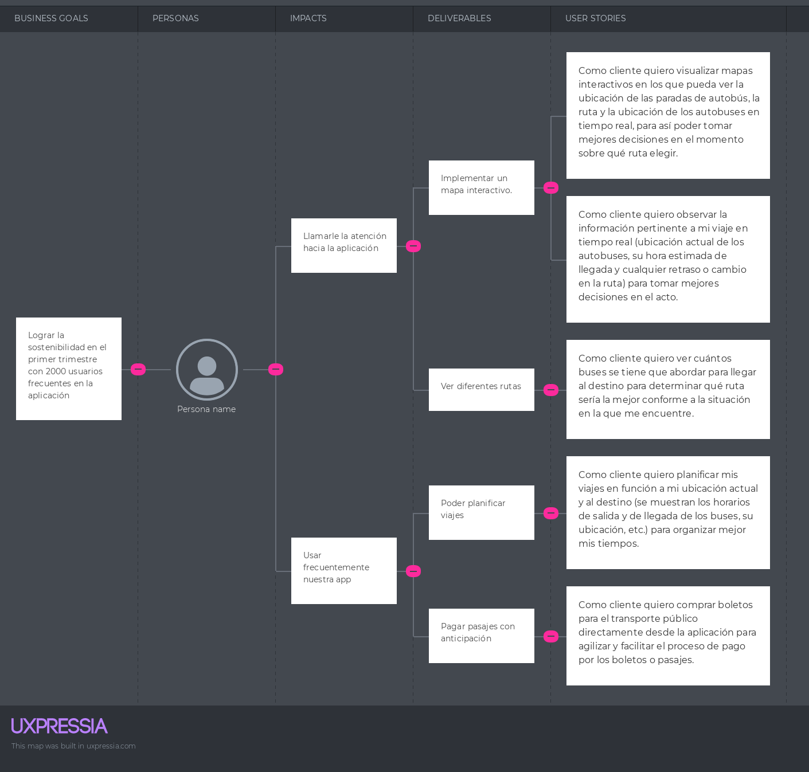

## 3.4 Product Backlog

| #Orden | User Story ID | Título                                           | Descripción                                                                                                                                                                                                                                         | Story Points |
| :----- | :------------ | :----------------------------------------------- | :-------------------------------------------------------------------------------------------------------------------------------------------------------------------------------------------------------------------------------------------------- | :----------- |
| 1      | HU07          | Implementación de servicios externos             | Como desarrollador quiero implementar servicios externos de otras empresas como Google Maps para así poder darle la funcionalidad deseada a la aplicación sin tener que desarrollar todo desde cero                                                 | 5            |
| 2      | HU09          | Configuración de búsqueda de ruta personalizada  | Como cliente quiero modificar ciertas opciones relacionadas a la búsqueda de rutas (tiempo de viaje, distancia al paradero, mostrar la ruta más rápida, etc.) para optimizar esta búsqueda según mis preferencias.                                  | 5            |
| 3      | HU10          | Visualización del mapa                           | Como cliente quiero ver un mapa interactivo con las rutas presentes para tener una idea más clara del posible camino por el que quiera viajar.                                                                                                      | 5            |
| 4      | HU11          | Visualización de costos del pasaje               | Como cliente quiero ver el costo del pasaje aproximado al elegir una ruta en la aplicación para saber con anticipación cuánto dinero debo tener para costear el viaje                                                                               | 5            |
| 5      | HU12          | Visualización del número de buses a abordar      | Como cliente quiero ver cuántos buses se tiene que abordar para llegar al destino para determinar qué ruta sería la mejor conforme a la situación en la que me encuentre.                                                                           | 5            |
| 6      | HU13          | Planificación de viajes                          | Como cliente quiero planificar mis viajes en función a mi ubicación actual y al destino (se muestran los horarios de salida y de llegada de los buses, su ubicación, etc.) para organizar mejor mis tiempos.                                        | 5            |
| 7      | HU14          | Información en tiempo real                       | Como cliente quiero observar la información pertinente a mi viaje en tiempo real (ubicación actual de los autobuses, su hora estimada de llegada y cualquier retraso o cambio en la ruta) para tomar mejores decisiones en el acto.                 | 5            |
| 8      | HU15          | Compra de boletos                                | Como cliente quiero comprar boletos para el transporte público directamente desde la aplicación para agilizar y facilitar el proceso de pago por los boletos o pasajes.                                                                             | 5            |
| 9      | HU17          | Mapas interactivos                               | Como cliente quiero visualizar mapas interactivos en los que pueda ver la ubicación de las paradas de autobús, la ruta y la ubicación de los autobuses en tiempo real, para así poder tomar mejores decisiones en el momento sobre qué ruta elegir. | 5            |
| 10     | HU18          | Integración con otros servicios de transporte    | Como desarrollador quiero integrar la aplicación con otros servicios de transporte público, como trenes o tranvías, para permitir a los usuarios planificar viajes intermodales.                                                                    | 5            |
| 11     | HU21          | integración de api de transporte público         | como desarrollador, quiero integrar una api de transporte público para acceder a datos actualizados sobre rutas, horarios y paradas de transporte público en tiempo real.                                                                           | 5            |
| 12     | HU23          | desarrollo de algoritmo de ruta óptima           | como desarrollador, quiero diseñar un algoritmo eficiente para calcular la ruta óptima entre dos puntos dados, teniendo en cuenta factores como la distancia, el tiempo y las preferencias del usuario.                                             | 5            |
| 13     | HU04          | Registro de rutas y buses                        | Como desarrollador quiero registrar a las rutas de transporte urbano y a los buses que transitan por estas para así tener un registro de todas las que se encuentren en Lima.                                                                       | 3            |
| 14     | HU05          | Registro de conductores                          | Como desarrollador quiero registrar a los conductores de los buses para así tener un registro de todos los conductores que transitan por las rutas por motivos de seguridad al usuario.                                                             | 3            |
| 15     | HU06          | Registro de las empresas operadoras de rutas     | Como desarrollador quiero registrar a las empresas que operan en cada una de las rutas de transporte urbano en buses para así tener un registro de todas estas empresas en la base de datos de la aplicación                                        | 3            |
| 16     | HU08          | Visualización del menú de opciones               | Como cliente quiero ver el menú de opciones de la aplicación para así tener una idea de las funcionalidades que están presentes en esta.                                                                                                            | 3            |
| 17     | HU19          | Accesibilidad                                    | Como desarrollador quiero hacer la aplicación más accesible para personas con discapacidades, ofreciendo opciones de accesibilidad como la navegación por voz y el alto contraste, para ampliar la cantidad de posibles usuarios.                   | 3            |
| 18     | HU20          | Retroalimentación de los usuarios                | Como cliente quiero dar una retroalimentación sobre mi experiencia de viaje o al utilizar la aplicación para dar a conocer mi agrado o mi malestar con respecto al funcionamiento de esta.                                                          | 3            |
| 19     | HU22          | implementación de sistema de autenticación oauth | como desarrollador, quiero implementar un sistema de autenticación oauth para permitir que los usuarios inicien sesión utilizando sus cuentas de redes sociales.                                                                                    | 3            |
| 20     | HU24          | sección principal de landing page                | como visitante de la landing page, quiero ser recibido por una sección principal llamativa para captar mi atención y despertar mi interés en explorar más sobre la aplicación de seguimiento de rutas.                                              | 3            |
| 21     | HU25          | información de beneficios                        | como visitante de la landing page, quiero encontrar una sección dedicada a los beneficios de la aplicación de seguimiento de rutas para comprender cómo puede mejorar mi experiencia de viaje.                                                      | 3            |
| 22     | HU26          | conocer los aliados que respaldan la app         | como visitante de la landing page, quiero ver una lista de aliados que respaldan la aplicación de seguimiento de rutas para sentir confianza en su calidad y fiabilidad.                                                                            | 3            |
| 23     | HU27          | reseñas de usuarios satisfechos                  | como visitante de la landing page, quiero encontrar reseñas y testimonios de usuarios satisfechos para obtener una idea de su experiencia y satisfacción con la aplicación.                                                                         | 3            |
| 24     | HU28          | conocer los planes de suscripción                | como visitante de la landing page, quiero encontrar información sobre los planes de suscripción disponibles para entender las opciones de pago y beneficios asociados con cada plan.                                                                | 3            |
| 25     | HU29          | obtener respuestas a preguntas frecuentes        | como visitante de la landing page, quiero acceder a una sección de preguntas frecuentes para encontrar respuestas a mis dudas más comunes sobre la aplicación de seguimiento de rutas.                                                              | 3            |
| 26     | HU01          | Registrar al usuario                             | Como cliente quiero registrarme con todos mis datos pertinentes (nombre, correo, edad, etc.) en la aplicación para poder hacer uso de sus funcionalidades.                                                                                          | 2            |
| 27     | HU02          | Inicio de sesión en la aplicación                | Como cliente quiero iniciar sesión en la aplicación con mis credenciales (correo y contraseña) para poder entrar a la aplicación con mi cuenta existente                                                                                            | 2            |
| 28     | HU03          | Eliminar cuenta o usuario                        | Como cliente quiero tener la posibilidad de borrar mi cuenta para que mis datos ya no permanezcan en la base de datos de la aplicación.                                                                                                             | 2            |
| 29     | HU16          | Notificaciones personalizadas                    | Como cliente quiero recibir notificaciones personalizadas acerca de eventos pertinentes a mi viaje en bus (retrasos, horarios, etc.) para estar al tanto de las situaciones que pueden afectar mi futuro viaje                                      | 2            |
| 30     | HU30          | Promociones                                      | Como cliente, quiero ver las promociones disponibles en la aplicación para que pueda aprovechar descuentos al utilizar el servicio de transporte público.                                                                                           | 2            |
| 31     | HU31          | Soporte y Ayuda                                  | Como cliente, quiero tener acceso a opciones de soporte y ayuda dentro de la aplicación para que pueda resolver cualquier problema o duda que pueda surgir durante su uso.                                                                          | 2            |
| 32     | HU32          | Configuración                                    | Como cliente, quiero tener la capacidad de personalizar la configuración de mi cuenta en la aplicación para que pueda adaptarla a mis preferencias y necesidades individuales.                                                                      | 3            |
| 33     | HU33          | Historial de Viajes                              | Como cliente, quiero poder acceder a un historial detallado de mis viajes anteriores en la aplicación para que pueda realizar un seguimiento de mis desplazamientos y gastos.                                                                       | 5            |
| 34     | HU34          | Recuperación de Contraseña                       | Como cliente, quiero tener la opción de recuperar mi contraseña en caso de olvido o pérdida para que pueda volver a acceder a mi cuenta sin problemas                                                                                               | 3            |

---

# Capítulo IV: Product Design

## 4.1. Style Guidelines.

Las guías de estilo son los criterios y sugerencias creados para uniformar la apariencia, el estilo y la facilidad de uso tanto de la Landing Page como de la Aplicación Web.

### 4.1.1. General Style Guidelines.

La paleta de colores que estamos usando en nuestra Landing Page y Web Application son los siguientes:

  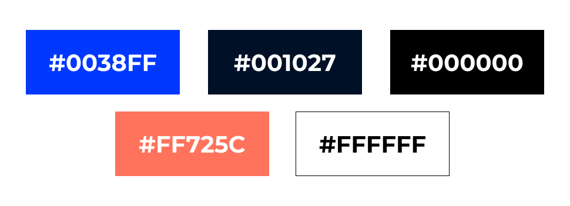

El tono predominante y fundamental de nuestra solución es el azul y sus diversas variaciones, seleccionado con el propósito de generar en nuestros usuarios sensaciones de confianza, seguridad y calma. Nuestra meta es mantener la simplicidad y el minimalismo para lograr que nuestros usuarios se sientan comodos con la aplicación.

Se ha seleccionado MuseoModerno para el logotipo, los títulos y los subtítulos de la Landing Page y la Aplicación Web, ya que su diseño evoca pistas y carreteras, lo cual se considera adecuado para nuestro producto. Para los textos, el contenido informativo y los botones de la Landing Page, se utilizará Montserrat.

  

Optamos por establecer un espaciado entre letras de 1,15 para los textos y el contenido de la página, y de 2 píxeles para los títulos y subtítulos, con el objetivo de garantizar una visualización óptima para nuestros usuarios.

En cuanto al tono de nuestra comunicación, será formal, cortés y tranquilo, ya que la mayoría de nuestro público objetivo son adultos.

### 4.1.2. Web Style Guidelines.

Para el diseño de la Aplicación Web, hemos definido una paleta de colores principal compuesta por azul y blanco, junto con la tipografía Montserrat que abarca el 90% del diseño. Priorizamos la simplicidad en el diseño y la optimización para su funcionamiento eficiente en todos los dispositivos, siguiendo los principios de responsive design y usabilidad.

Utilizamos los siguientes iconos para la parte del dashboard.

  

### 4.1.3. Mobile Style Guidelines.

  

#### 4.1.3.1. iOS Mobile Style Guidelines.

  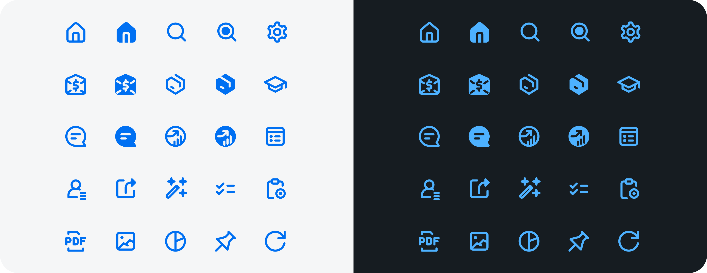

#### 4.1.3.2. Android Mobile Style Guidelines.

  

## 4.2. Information Architecture.

En este apartado, presentaremos el procedimiento de ordenar, configurar y categorizar el contenido de la Landing Page y la Aplicación Web de Track My Route de manera que resulte comprensible y accesible para nuestros usuarios. Ponemos énfasis en diseñar la estructura y la navegación de sistemas de información, asi como páginas web y sistemas de gestión de contenido, con el fin de potenciar la usabilidad y la experiencia del usuario.

### 4.2.1. Organization Systems.

- **Forma jerárquica**
       La aplicación web de TrackMyRoute se organizará de forma jerárquica, comenzando con un panel de control principal que ofrece acceso rápido a las funciones esenciales. Esto incluirá la búsqueda de rutas por ubicación y horarios en tiempo real, así como la opción de pago de pasajes. En un segundo nivel, los usuarios podrán acceder a su historial de viajes y pagos, además de encontrar promociones disponibles para ellos. En un nivel más profundo de jerarquía, tendrán la posibilidad de configurar notificaciones personalizadas y gestionar su perfil de usuario. Además, habrá una sección de ayuda que proporcionará recursos adicionales y soporte. Esta estructura jerárquica está diseñada para garantizar una navegación intuitiva y una experiencia fluida para los usuarios al buscar y gestionar información relacionada con el transporte público.
  - **Organización secuencial (step-by-step to accomplish)**
    En la aplicación web de TrackMyRoute, se ha implementado la organización secuencial en situaciones donde los usuarios necesitan completar una serie de pasos en un orden específico para alcanzar un objetivo determinado. Por ejemplo, durante el proceso de registro de un nuevo usuario, se les guiará a través de una secuencia de pasos que incluirá la creación de una cuenta, la configuración de preferencias y la aceptación de los términos y condiciones. Esto también se observa al buscar rutas y autobuses, así como al pagar el pasaje a través de la aplicación. Esta metodología de organización secuencial ayuda a simplificar y estructurar procesos complejos, lo que facilita la navegación y la comprensión para los usuarios.
  - **Organización matricial**
    En TrackMyRoute, se emplea la organización matricial en situaciones donde hay una diversidad de categorías o dimensiones que se entrelazan y se relacionan entre sí. Esto es evidente al buscar autobuses, donde se muestra un mapa junto con la información de los autobuses y se ofrecen filtros para refinar la búsqueda. Asimismo, se utiliza en la disposición visual de las promociones dirigidas a los usuarios.

### 4.2.2. Labeling Systems.

|      Etiqueta       |                                                                  Descripción                                                                   |
| :-----------------: | :--------------------------------------------------------------------------------------------------------------------------------------------: |
|    Buscar Rutas     |                                  En esta sección se le mostrará al usuario avisos por parte de la aplicación                                   |
|   Notificaciones    | En esta sección el usuario podrá ingresar su origen y destino y visualizar sus rutas y buses, así como un mapa con información en tiempo real. |
|    Pagar Pasaje     |     En esta sección el usuario podrá pagar sus pasajes de su ruta de manera anticipada para ser más eficiente a la hora de abordar el bus.     |
|     Promociones     |                   En esta sección el usuario podrá acceder a distintas promociones que brindamos a nuestros usuarios premium                   |
| Historial de Viajes |                              En esta sección el usuario podrá visualizar sus viajes anteriores y pasajes pagados.                              |
|   Soporte y Ayuda   |                               En esta sección el usuario accede a ayuda por parte de nuestro equipo de soporte.                                |
|    Configuración    |                                   En esta sección el usuario puede configurar sus preferencias y su perfil.                                    |

### 4.2.3. SEO Tags and Meta Tags

Los tags de SEO y Meta tags son cruciales ya que desempeñan una función vital en la optimización para motores de búsqueda (SEO), contribuyendo a mejorar la visibilidad y el ranking de una página web en los resultados de búsqueda. Por ende, para optimizar la búsqueda y el posicionamiento de TrackMyRoute, hemos implementado lo siguiente:

| Landing Page                                                                                                                                                                                                                                                       | Web Application                                                                                                                                                                                                                                                                                                                                                                      |
| ------------------------------------------------------------------------------------------------------------------------------------------------------------------------------------------------------------------------------------------------------------------ | ------------------------------------------------------------------------------------------------------------------------------------------------------------------------------------------------------------------------------------------------------------------------------------------------------------------------------------------------------------------------------------ |
| **Title:** TrackMyRoute **Description:** Optimiza tu viaje y libérate del estrés **Keywords:** Autobús, Metro, Tren, Paradas, Ubicación, Tráfico, Planificador, Seguridad, Comodidad, Precisión, Horario, Buses en Lima, Rutas. **Authors:** TrackMyRoute | **Title:** TrackMyRoute   **Description:** Optimiza tu viaje y libérate del estrés   **Keywords:** Autobús, Metro, Tren, Paradas, Ubicación, Tráfico, Planificador, Seguridad, Comodidad, Precisión, Horario, Buses en Lima, Rutas, Buses, Seguimiento, Mapas, Transporte, Navegación, Tiempo, Notificaciones, Promociones, Pasajes, Historial.   **Authors:** TrackMyRoute |

### 4.2.4. Searching Systems.

El sistema de búsqueda de nuestra aplicación se fundamenta en la ubicación de los autobuses y sus rutas, así como en los puntos de recogida de pasajeros. Esta funcionalidad estará conectada a una base de datos que contiene información sobre los autobuses, sus rutas y los costos de los pasajes. Por lo tanto, esta herramienta de búsqueda estará disponible en las secciones de "Buscar Rutas", "Pagar Pasajes" y "Historial de Viajes".

### 4.2.5. Navigation Systems.

Los métodos de navegación utilizados en TrackMyRoute son los siguientes:

1. Barra de navegación en la Landing Page: Los usuarios pueden desplazarse por nuestra Landing Page para familiarizarse con nuestra aplicación y comprender nuestra propuesta de valor.
2. Barra de navegación en la Aplicación Web: Los usuarios tienen la posibilidad de explorar los distintos apartados y funciones de nuestra propuesta utilizando la barra de navegación.
3. Tarjetas de promociones: Los usuarios pueden ver fácilmente las promociones que les ofrecemos a través de las tarjetas de promociones.

## 4.3. Landing Page UI Design.

### 4.3.1. Landing Page Wireframe.

  

### 4.3.2. Landing Page Mock-up.

Link Landing Page mockup: https://www.figma.com/proto/aJREmuLbY7nLlgmOTtjcW5/TrackMyRoute-Web?type=design&node-id=1-2&t=vpM8mg1HtrwmaE8b-1&scaling=min-zoom&page-id=0%3A1&starting-point-node-id=1%3A2&mode=design

  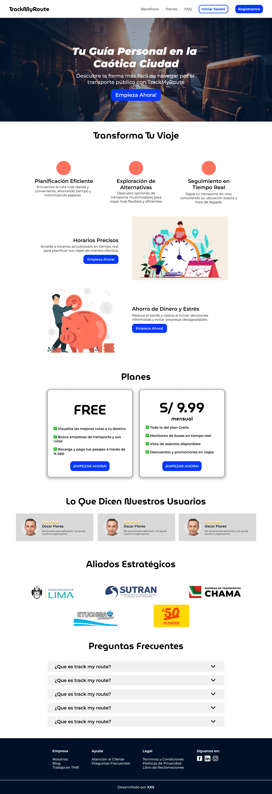

## 4.4. Mobile Applications UX/UI Design.

### 4.4.1. Mobile Applications Wireframes.

  

  

  

  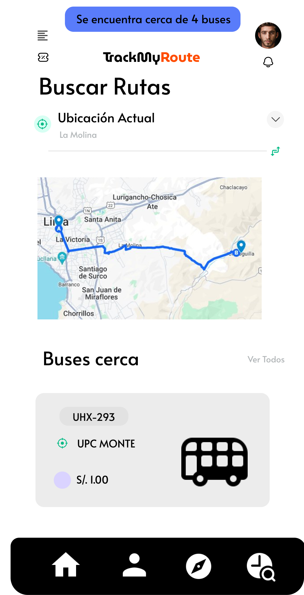

  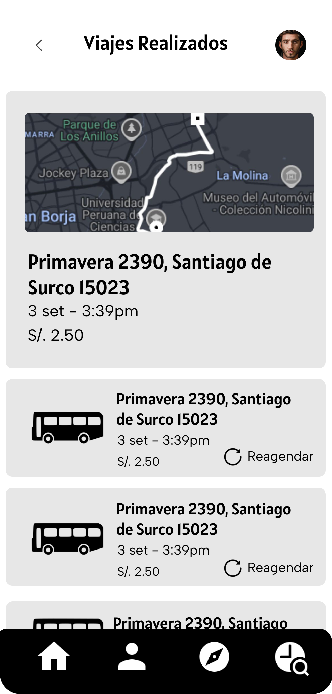

  

  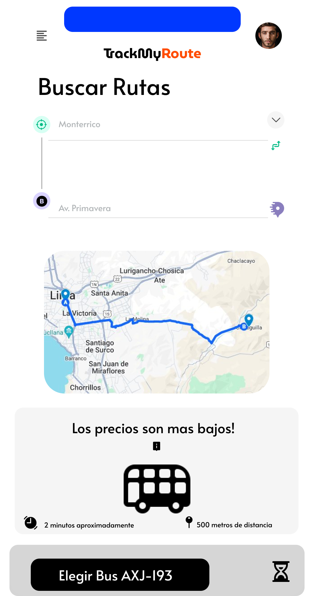

  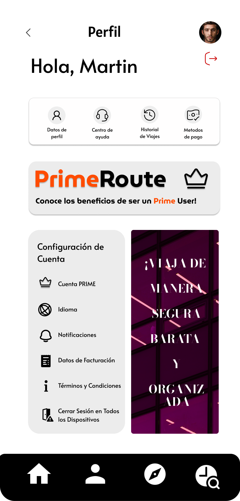

  

  

  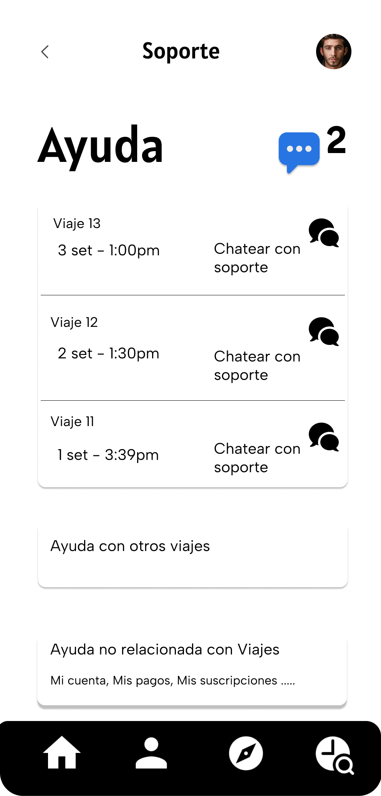

### 4.4.2. Mobile Applications Wireflow Diagrams.

  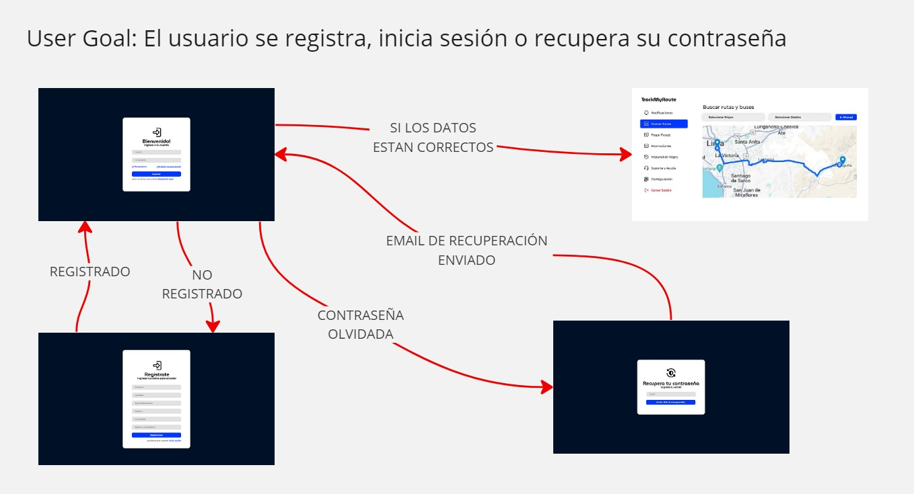

  

### 4.4.3. Mobile Applications Mock-ups.

  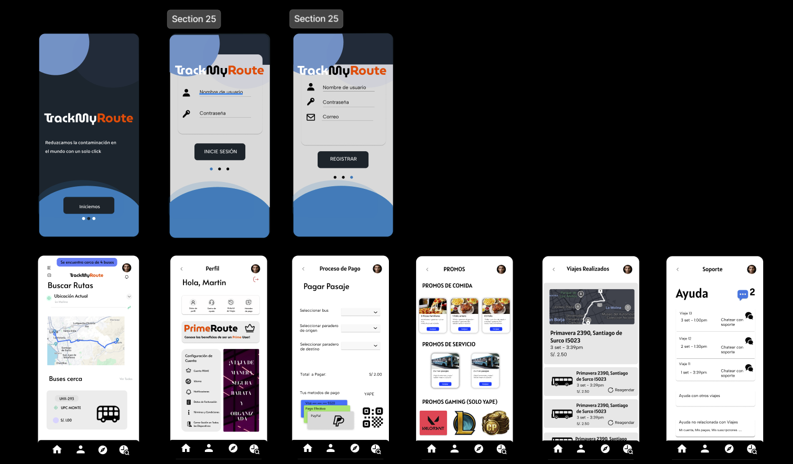

### 4.4.4. Mobile Applications User Flow Diagrams.

  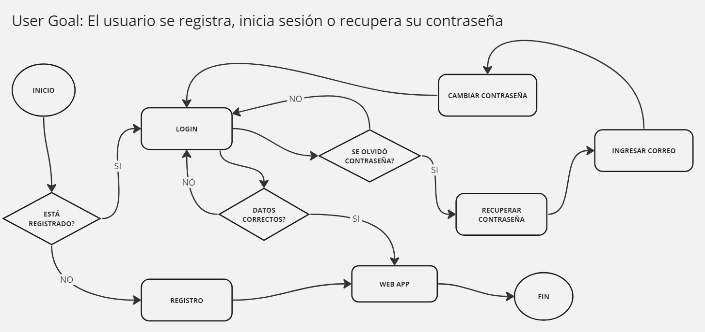

  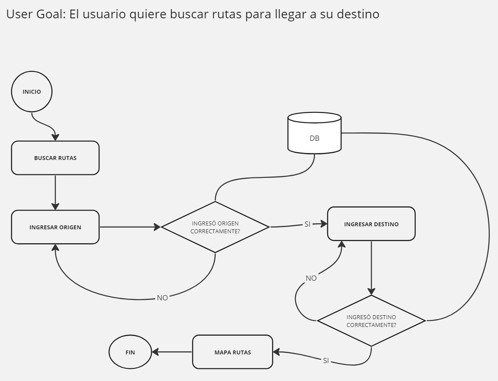

## 4.5. Mobile Applications Prototyping.

  

Link de prototipo: https://www.figma.com/proto/aJREmuLbY7nLlgmOTtjcW5/TrackMyRoute-Web?type=design&node-id=3-6&t=PO71zMM1GnVJDk1r-1&scaling=scale-down-width&page-id=1%3A3&starting-point-node-id=3%3A6&mode=design

### 4.5.1. Android Mobile Applications Prototyping.

Link de prototipo: https://www.figma.com/design/gRfIpmDEc54Tptas8ZOsgU/TrackMyRoute---Experimentos?node-id=0-1&t=7fVzSFGuX1I6ZYXA-1

### 4.5.2. iOS Mobile Applications Prototyping.

Link de prototipo: https://www.figma.com/design/gRfIpmDEc54Tptas8ZOsgU/TrackMyRoute---Experimentos?node-id=0-1&t=7fVzSFGuX1I6ZYXA-1

### 4.6. Web Applications UX/UI Design.

### 4.6.1. Web Applications Wireframes.

Los wireframes actúan como el plano de la aplicación web, delineando la estructura y el diseño de cada página. Se enfocan en:

Diseño de la Página: Estructura básica sin colores ni gráficos.
Ubicación del Contenido: Posicionamiento de elementos clave como menús de navegación, botones y bloques de contenido.
Visualización del Flujo de Usuario: Ilustrando cómo los usuarios navegarán a través de la aplicación.

  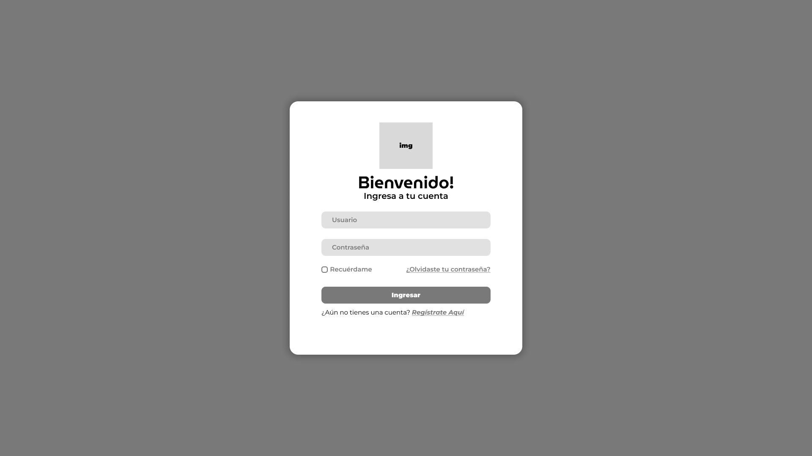

  

  

  

  

  

  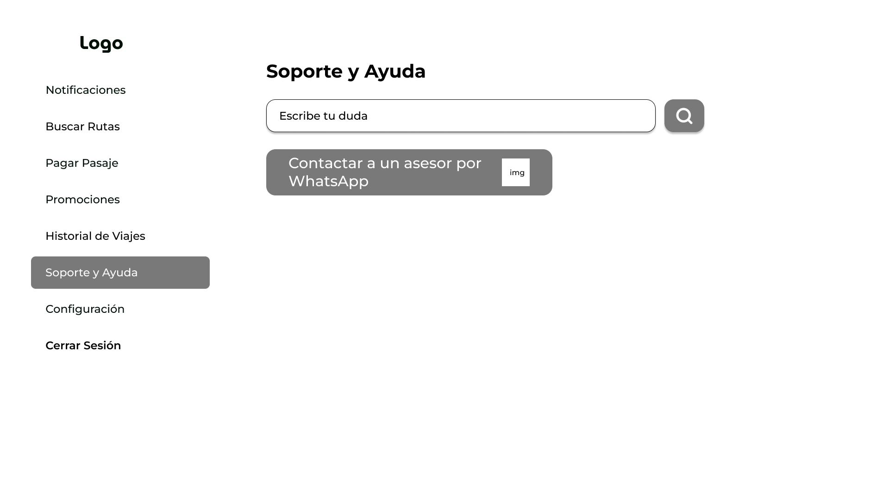

  

Link de wireframe: https://www.figma.com/design/aJREmuLbY7nLlgmOTtjcW5/TrackMyRoute-Web?node-id=2053-676&node-type=FRAME&t=gDbP6FCDP3Ohxegw-0

### 4.6.2. Web Applications Wireflow Diagrams.

  

### 4.6.3. Web Applications Mock-ups.

  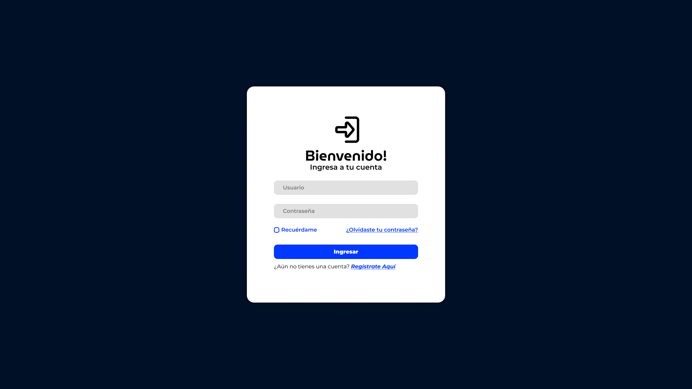

  

  

  

  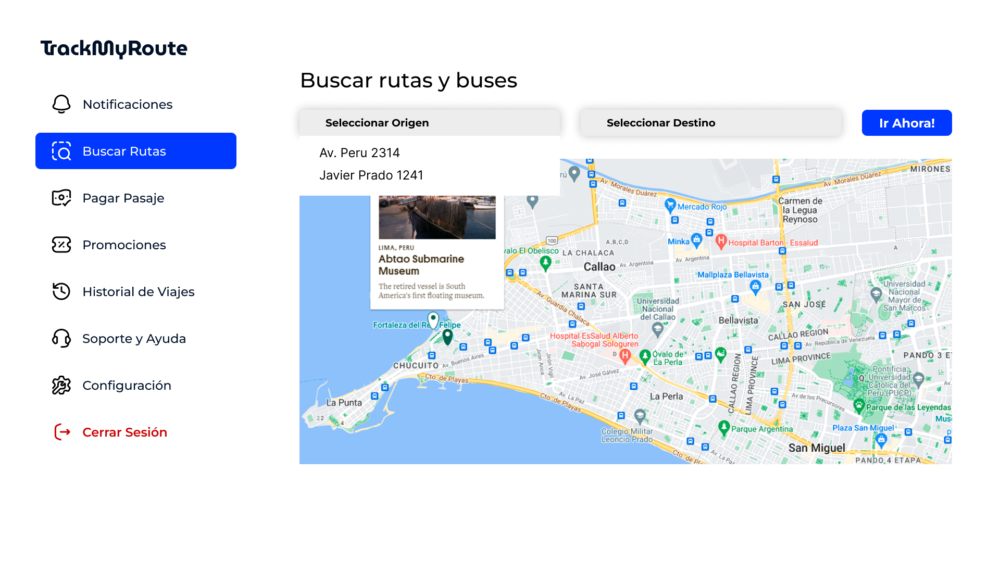

  

  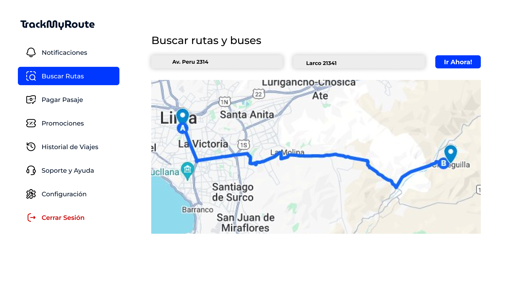

  

  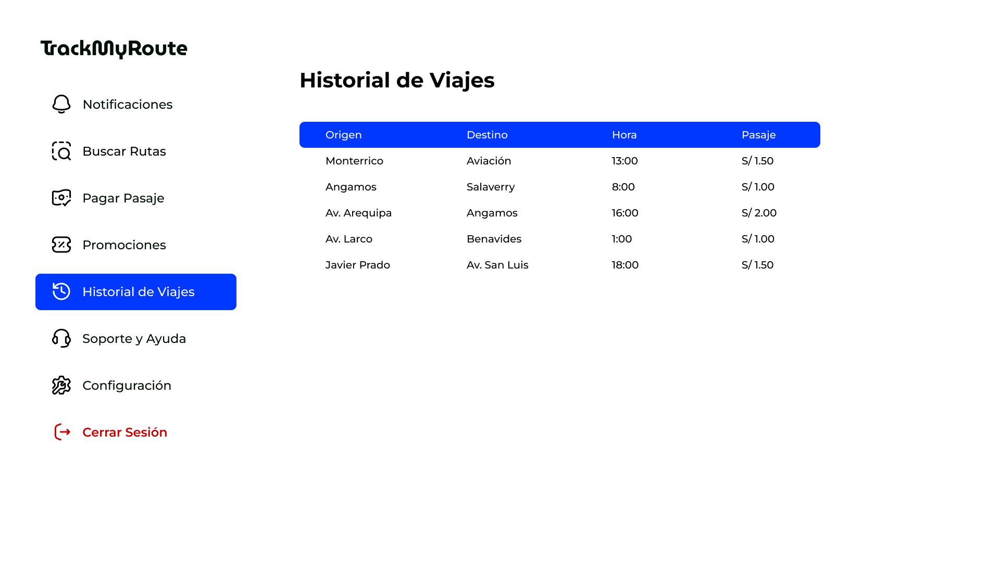

  

  

  

### 4.6.4. Web Applications User Flow Diagrams.

  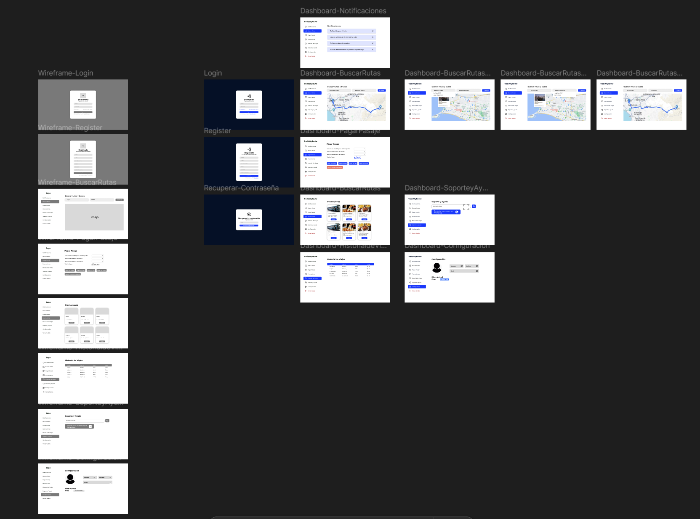

## 4.7. Web Applications Prototyping.

Link de Interactive Prototype: https://www.figma.com/proto/aJREmuLbY7nLlgmOTtjcW5/TrackMyRoute-Web?type=design&node-id=3-6&t=PO71zMM1GnVJDk1r-1&scaling=scale-down-width&page-id=1%3A3&starting-point-node-id=3%3A6&show-proto-sidebar=1

## 4.8. Domain-Driven Software Architecture.

Para el modelo de negocio que utilizaremos para desarrollar nuestro software complejo que se centra en la problematica que abordamos. para ello utilizaremos la tecnica de modelado C4 Model.

### 4.8.1. Software Architecture Context Diagram.

Este es el diagrama de Contexto de nuestro sistema:
 <a target='_blank' href='https://es.imgbb.com/'>

### 4.8.2. Software Architecture Container Diagrams.

Este es el diagrama de Contenedores de nuestro sistema:
 <a target='_blank' href='https://es.imgbb.com/'>

### 4.8.3. Software Architecture Components Diagrams.

Esto son los diagramas de componentes de nuestro sistema:

##### Diagrama de componentes #1:

 <a target='_blank' href='https://es.imgbb.com/'>

##### Diagrama de componentes #2:

 <a target='_blank' href='https://es.imgbb.com/'>

##### Diagrama de componentes #3:

 <a target='_blank' href='https://es.imgbb.com/'>

##### Diagrama de componentes #4:

 <a target='_blank' href='https://es.imgbb.com/'>

## 4.9. Software Object-Oriented Design.

### 4.9.1. Class Diagrams.

Para nuestro sistema, hemos implementado un diagrama de clases. Este diagrama visualiza la estructura estática del software, mostrando las clases, sus atributos y las relaciones entre ellas. Es una herramienta esencial que nos ayuda a comprender cómo se organizan y comunican las diferentes partes de nuestro sistema de software.

Diagramas de clases por módulo:

- User Interface:

 <a target='_blank' href='https://es.imgbb.com/'>

- Subscription:

 <a target='_blank' href='https://es.imgbb.com/'>

- FAQ:

 <a target='_blank' href='https://es.imgbb.com/'>

- Track Route:

 <a target='_blank' href='https://es.imgbb.com/'>

### 4.9.2. Class Dictionary.

Explicacion del funcionamiento de cada funcion por módulo.
Módulos:

- User Interface:
  Para explicar nuestro sistema de usuario este tendra que registrarse para luego iniciar sesion en su cuenta, donde este recibira un correo para confirmar su creacion, todo esto en una clase llamada UserInterface que recibira toda la información.

 <a target='_blank' href='https://es.imgbb.com/'>

- Subscription:
  Este modulo de clases es referido a la eleccion que tenga el usuario sobre la subscripcion que desea poseer.
  

- FAQ:
  Esta esta dirigido a una parte mas de dudas que tenga el usuario sobre el uso o funcionamiento de la aplicación.
  

- Track Route:
  Esta es el modulo que explica el funcionamiento principal de la aplicacion, nos mostrara la ruta de los buses y como de acuerdo a las preferencias del usuario puede variar, ademas de una funcionalidad para pagar el servicio del bus que este desee tomar.

 <a target='_blank' href='https://es.imgbb.com/'>

## 4.10. Database Design.

Para explicar el sistema de nuestra aplicacion comenzemos por las entidades como buses company y customers cada una de ellas se refiere a los usuarios tanto de buses como el cliente que se transporta(Este de acuerdo a la subscripcion que posea tiene distintos beneficios)

### 4.10.1. Relational/Non-Relational Database Diagram.

Utilizamos MySql para le creación de la base de datos por lo cual es una relacional.

Tenemos una entidad que explica la data que va tener cada uno de los buses en nuestro sistema.

Tenemos una entidad llamada tracMyRouteBuses esta se refiere a la data que va recibir sobre las rutas que van a tomar los distintos servicios de buses.

Estas pueden ser personalizadas por el usuario.
 <a target='_blank' href='https://es.imgbb.com/'>

Para que este verifique si es valido la ruta que ah sido escogida y el status es un dato uqe se mandara a la entidad "Status_TrackRouteBuses".

 <a target='_blank' href='https://es.imgbb.com/'>

Tenemos una entidad la cual se encarga de ver la subscripcion actual del usuario y que beneficios este va poseer.

---

# Capítulo V: Product Implementation

## 5.1 Software Configuration Management

### 5.1.1 Software Development Environment Configuration

**Project Management**

Para la organizacion del proyecto necesitabamos una planificación en cuanto a tareas asignadas, un punto de reunión y un repositorio donde trabajaramos en conjunto cada avance del proyecto, es por esto que elegimos las siguientes herramientas:

- Centro de organización de trabajo: Github
- Planificación de tareas: Trello
- Reuniones con el equipo: Google Meet

**Requirements Management**

Para realizar las actividades del proyecto necesitábamos designarlas a cada integrante del grupo en caso de revisión o cambios, esta lista de asignaciones fue realizada en Trello:

<table>
    <tbody>
        <tr>
            <td>Link de referencia: </td>
            <td>https://www.trello.com/</td>
        </tr>
    </tbody>
</table>

**Product UX/UI Design**

Para el diseño de los wireframe y mockups, además de un prototipo de Web App se utilizó Figma:

<table>
    <tbody>
        <tr>
            <td>Link de referencia: </td>
            <td>https://www.figma.com/</td>
        </tr>
    </tbody>
</table>

**Software Development**

La herramienta para la implementación del proyecto es WebStorm de Jetbrains:

<table>
    <tbody>
        <tr>
            <td>Link de referencia: </td>
            <td>https://www.jetbrains.com/es-es/webstorm/</td>
        </tr>
    </tbody>
</table>

**Software Testing**

Gherkin es un sistema de etiquetado utilizado para detallar como se comporta el software de manera legible.

<table>
    <tbody>
        <tr>
            <td>Link de referencia: </td>
            <td>https://cucumber.io/docs/gherkin/</td>
        </tr>
    </tbody>
</table>

**Software Deployment**

Se ha utilizado Github para desplegar la landing page con Github Pages:

<table>
    <tbody>
        <tr>
            <td>Link de referencia: </td>
            <td>https://pages.github.com/</td>
        </tr>
    </tbody>
</table>

**Software Documentation**

Se ha utilizado Github para alojar los distintos repositorios creados por los miembros del equipo para la colaboración en tiempo real mientras se codifican distintas áreas del proyecto.

<table>
    <tbody>
        <tr>
            <td>Link de referencia: </td>
            <td>https://github.com/</td>
        </tr>
    </tbody>
</table>

### 5.1.2 Source Code Management

   <table>
    <tbody>
        <tr>
            <td>Link Landing Page:</td>
            <td> https://g2-aplicacionesweb-si91.github.io/Landing/ </td>
        </tr>
        <tr>
            <td> Backend Services: </td>
            <td> https://github.com/upc-pre-2402-si732-sw72-G3/Backend </td>
        </tr>
        <tr>
            <td> Link Front Web Applications: </td>
            <td> https://github.com/upc-pre-2402-si732-sw72-G3/Frontend </td>
        </tr>
    </tbody>
</table>

**Flujo de trabajo GitFlow**

Usaremos el flujo de trabajo planteado por Vincent Driessen en "A successful Git branching model" con los siguientes parámetros:

- Una rama de producción.
- Una rama de pruebas.
- Una rama en la que se solucionen los bugs rapidamente y vuelvan a producción.
- Ramas de features a implementar.
- Cada cambio en producción debe establecerse como una nueva versión.
- Para este proyecto en concreto consideramos que los cambios en la rama de producción y de pruebas deben tener autorización de un compa­ñero de equipo.

Teniendo en cuenta la información anterior nos inclinamos por este tipo de organización en los branches:

- **Main branch:** Esta rama esta destinada a la producción de la aplicación, cada cambio deberá tener autorización de un compañero de equipo para evitar cambios sin verificar.
- **Hotfix branch:** En esta rama se incluirán todas las versiones que poseen errores identificados y que con cada arreglo de este se despliegue otra vez a Main Branch además de implementarla en lo que será Develop Branch.
- **Release branch:** Esta rama se utilizará para una previa a lo que será el Main Branch, aquí se seguirá de cerca a la aplicación en otros ambientes en busca de bugs.
- **Develop branch:** Esta rama está destinada a las constantes implementaciones en caliente de los features,
- **Features branch:** Cada feature poseerá su respectiva rama, una vez que se encuentre correctamente implementada será fusionada con Develop branch.

Con cada deployment de la aplicación debe establecerse como una nueva versión.

### 5.1.3 Source Code Style Guide & Conventions

Usaremos buenas prácticas en cuanto al código de manera que sea coherente y sostenible.

**HTML:**

- Cada etiqueta, id, nombre y clase será nombrada usando Lowercase.
- Utilizar UTF-8.
- Redacción en inglés.
- En cada referencia a un archivo, colocar el tipo de archivo (.css, .js).
- Terminar cada etiqueta con />.

**CSS:**

- Width del body al 100%.
- En cuanto a las imágenes, especificar el ancho (Width) de acuerdo a la etiqueta padre.
- Cada etiqueta, nombre y clase será nombrada de acuerdo al propósito y clasificación del elemento.
- Separación de palabras con un guion "-".
- Margin y padding en "\*" con valor de 0.

**Commit conventions:** Para las convenciones de commit, se utilizarán las convenciones básicas es decir:
`git commit -m "<message>" -m"<description">`

### 5.1.4 Software Deployment Configuration

#### Repositorios de la Organización

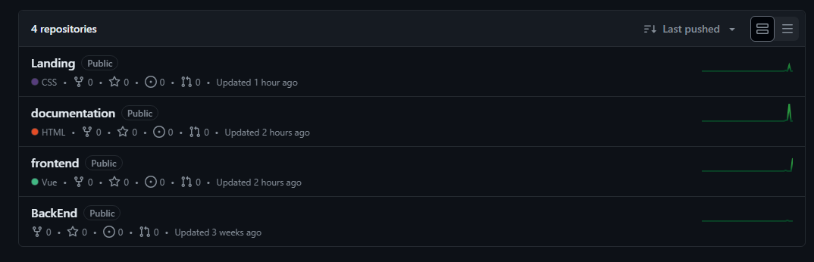

#### Creación de ramas

Para la creación de cada rama del proyecto seguiremos estos pasos:

1. Seleccionar " # Branches":

  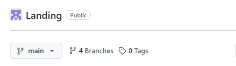

2. Click en "New Branch" :

   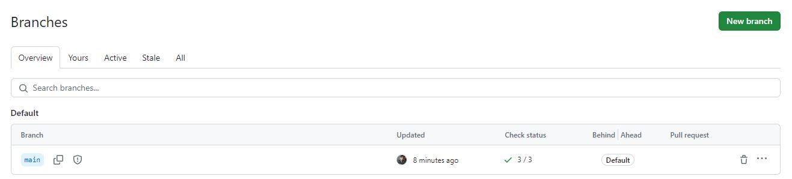

3. Escribir el nombre de cada rama, luego crear nuevo branch:

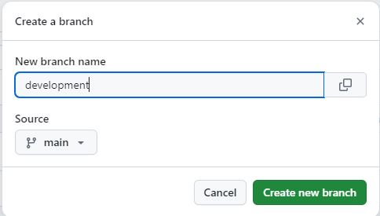

4. Ramas creadas:

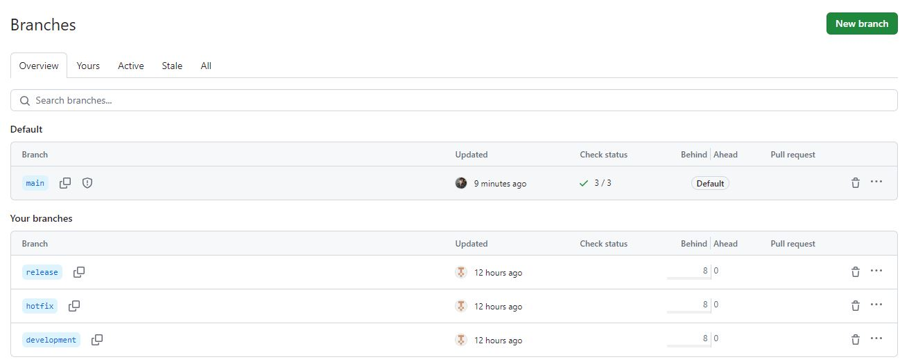

### Agregar reglas de protección

1. Settings -> Branches:

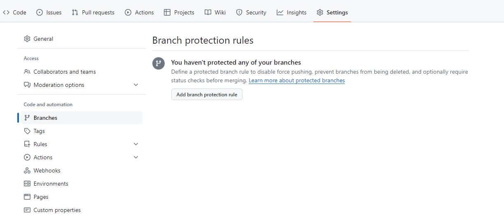

2. Nombrar regla como la rama a proteger y agregarle protección:

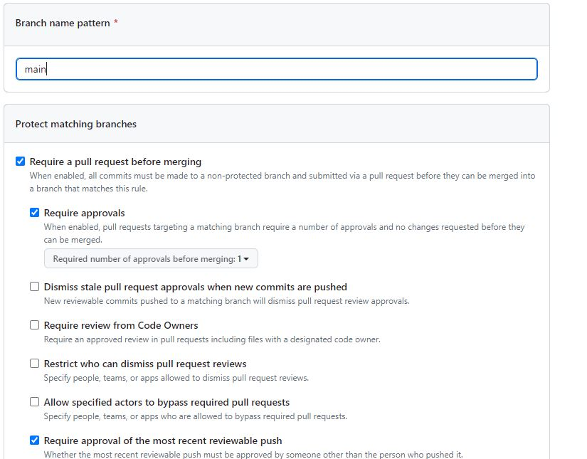

## Lanzamiento del proyecto

### Landing Page Deployment:

Además de control de versiones, Github posee GithubPages, que sirve para lanzar tu proyecto si se encuentra en un repositorio de Github. Para esto necesitamos:

- Una cuenta persona
- Repositorio
- Permisos en el repositorio

1. Seleccionamos al branch "main", luego el directorio "/root" y finalmente guardamos la configuración.

2. Esperamos a que se lanze el proyecto, sabremos que esta listo cuando veamos el URL:

https://g2-aplicacionesweb-si91.github.io/Landing/

### Frontend-Application Deployment

Con el fin de desplegar el frontend usaremos Firebase, que se usa continuamente para el despliegue de aplicaciones web.

<table>
    <tbody>
        <tr>
            <td>Link de Firebase: </td>
            <td>https://firebase.google.com</td>
        </tr>
    </tbody>
</table>

## 5.2 Landing Page, Services & Applications Implementation.

- ### 5.2.1 Sprint 1
- #### 5.2.1.1. Sprint Planning 1

<table>
    <thead>
        <tr>
            <td>Sprint #</td>
            <td>Sprint 1</td>
        </tr>
        <tr>
            <td colspan="2">Sprint Planning Background</td>
        </tr>
    </thead>
    <tbody>
        <tr>
            <td>Date</td>
            <td>30/03/2024</td>
        </tr>
        <tr>
            <td>Time</td>
            <td>00:00 am</td>
        </tr>
        <tr>
            <td>Location</td>
            <td>Google Meet</td>
        </tr>
        <tr>
            <td>Prepared By</td>
            <td>TrackMyRoute</td>
        </tr>
        <tr>
            <td>Attendees (to planning meeting)</td>
            <td>Rivas Sarango, David Alejandro / Ramirez Mendoza, Carlos Arian / Valenzuela Vallejos, Alessandro Stefano  / Casimiro Fernandez, Carlos Oswaldo / Landeo Simeón, Favio Sebastián</td>
        </tr>
        <tr>
            <td>Sprint n – 1 Review Summary</td>
            <td>Debido a que es el primer sprint, no hay reviews de un sprint anterior.</td>
        </tr>
        <tr>
            <td>Sprint n – 1 Retrospective Summary</td>
            <td>Siendo el primer sprint, se mencionará la expectativa de los miembros del equipo: Terminar las actividades antes de la crítica. </td>
        </tr>
        <tr>
            <td colspan="2">Sprint Goal & User Stories</td>
        </tr>
        <tr>
            <td>Sprint 1 Goal</td>
            <td>Diseñar e implementar la Landing Page de TrackMyRoute para dar a conocer el valor de la propuesta.</td>
        </tr>
        <tr>
            <td>Sprint 1 Velocity</td>
            <td>5</td>
        </tr>
        <tr>
            <td>Sum of Story Points</td>
            <td>21</td>
        </tr>
    </tbody>
</table>
  
- #### 5.2.1.2. Sprint Backlog 1
   
  En este primer Sprint backlog el grupo se enfoco en realizar la Landing page. Para el registro de cada tarea utilizamos Trello.

Link trello: https://trello.com/b/Bwzbm2Db/sprint1

<table>
    <thead>
            <tr>
            <td>Sprint #:</td>
            <td colspan="7">Sprint 1</td>
            </tr>
            <tr>
                <td colspan="2">User Story</td>
                <td colspan="6">Work-Item / Task</td>
            </tr>
            <tr>
                <td>ID</td>
                <td>Title</td>
                <td>ID</td>
                <td>Title</td>
                <td>Description</td>
                <td>Estimation (Hours)</td>
                <td>Assigned to</td>
                <td>Status (To-Do/In-Process/To-Review/Done)</td>
            </tr>
    </thead>
    <tbody>
            <tr>
                <td>HU24</td>
                <td>sección principal de landing page</td>
                <td>01</td>
                <td>Sección principal de Landing Page</td>
                <td>Usuario debe serle visualmente atractiva la página y su contenido.</td>
                <td>2</td>
                <td>Favio Landeo</td>
                <td>Done</td>
            </tr>
	    <tr>
                <td>HU25</td>
                <td>información de beneficios</td>
                <td>02</td>
                <td>nformación de beneficios</td>
                <td>Usuario debe poder visualizar una sección dedicada a los beneficios de la aplicación.</td>
                <td>2</td>
                <td>Alessandro Valenzuela</td>
                <td>Done</td>
            </tr>
	    <tr>
                <td>HU26</td>
                <td>conocer los aliados que respaldan la app</td>
                <td>03</td>
                <td>Conocer los aliados que respaldan la app</td>
                <td>Usuario debe poder visualizar una lista de aliados estratégicos.</td>
                <td>2</td>
                <td>Arian Ramirez</td>
                <td>To-Do</td>
            </tr>
	    <tr>
                <td>HU27</td>
                <td>reseñas de usuarios satisfechos</td>
                <td>04</td>
                <td>Reseñas de usuarios satisfechos</td>
                <td>Usuario debe poder visualizar reseñas y testimonios de usuarios satisfechos con la aplicación.</td>
                <td>2</td>
                <td>Not asigned yet</td>
                <td>Arian Ramirez</td>
            </tr>
	    <tr>
                <td>HU28</td>
                <td>conocer los planes de suscripción</td>
                <td>05</td>
                <td>Conocer los planes de suscripción</td>
                <td>Usuario debe poder visualizar información sobre los planes de suscripción.</td>
                <td>2</td>
                <td>Not asigned yet</td>
                <td>Carlos Casimiro</td>
            </tr>
	    <tr>
                <td>HU29</td>
                <td>obtener respuestas a preguntas frecuentes</td>
                <td>06</td>
                <td>Obtener respuestas a preguntas frecuentes</td>
                <td>Usuario debe poder visualizar una sección de preguntas frecuentes.</td>
                <td>2</td>
                <td>Not asigned yet</td>
                <td>David Rivas/td>
            </tr>
    </tbody>
</table>
  
- #### 5.2.1.3. Development Evidence for Sprint Review
<table>
    <thead>
            <tr>
                <td><strong>Repository</strong></td>
                <td><strong>Branch</strong></td>
                <td><strong>Commit ID</strong></td>
                <td><strong>Commit Message</strong></td>
                <td><strong>Commit Message Body</strong></td>
                <td><strong>Commited on (Date)</strong></td>
            </tr>
    </thead>
    <tbody>
            <tr>
                <td>https://github.com/G2-AplicacionesWeb-SI91/Landing</td>
                <td>Landing page - main</td>
                <td>bd194a8</td>
                <td>chore: init commit landing page html and css</td>
                <td>chore: init commit landing page html and css</td>
                <td>14/04/2024</td>
            </tr>
	    <tr>
                <td></td>
                <td>Landing page - main</td>
                <td>7fa250e</td>
                <td>landing ended</td>
                <td>landing ended</td>
                <td>14/04/2024</td>
            </tr>
	    <tr>
                <td></td>
                <td>Landing page - main</td>
                <td>5f79f2a</td>
                <td>fix: img url</td>
                <td>fix: img url</td>
                <td>14/04/2024</td>
            </tr>
	    <tr>
                <td></td>
                <td>Landing page - main</td>
                <td>fed933d</td>
                <td>fix: url img</td>
                <td>fix: url img</td>
                <td>14/04/2024</td>
            </tr>
	    <tr>
                <td></td>
                <td>Landing page - main</td>
                <td>5b5966f</td>
                <td>Update styles.css</td>
                <td>Update styles.css</td>
                <td>14/04/2024</td>
            </tr>
	    <tr>
                <td></td>
                <td>Landing page - main</td>
                <td>934607f</td>
                <td>updated: format document</td>
                <td>updated: format document</td>
                <td>14/04/2024</td>
            </tr>
	    <tr>
                <td></td>
                <td>Landing page - main</td>
                <td>248073c</td>
                <td>Update index.html</td>
                <td>Update index.html</td>
                <td>14/04/2024</td>
            </tr>
    </tbody>
</table>
   
- #### 5.2.1.4. Testing Suite Evidence for Sprint Review
   En este punto del trabajo aun no se empieza el desarrollo de la Web Application por lo que no se esta usando ningun servicio de Testing. 
   
- #### 5.2.1.5. Execution Evidence for Sprint Review

Sección LogIn:

  

  
  Sección Register:
  

  

Sección Recuperar contraseña:

  

Sección Buscar rutas:

  

Sección Pagar pasaje:

  

Sección Historial de viajes:

  

Sección Promos:

  

Sección Soporte:

  

Sección Configuración:

  

  
- #### 5.2.1.6. Services Documentation Evidence for Sprint Review
   En este punto del trabajo aun no se empieza el desarrollo de la Web Application por lo que no hemos hecho la implementación de Web Services.
  
- #### 5.2.1.7. Software Deployment Evidence for Sprint Review
   Para realizar el despliegue de la Landing Page hemos utilizado Github Pages ya que permite alojar paginas desde el mismo repositorio, es fácil y práctica de usar, además de gratuita.

Link de Landing Page desplegada: https://g2-aplicacionesweb-si91.github.io/Landing/

    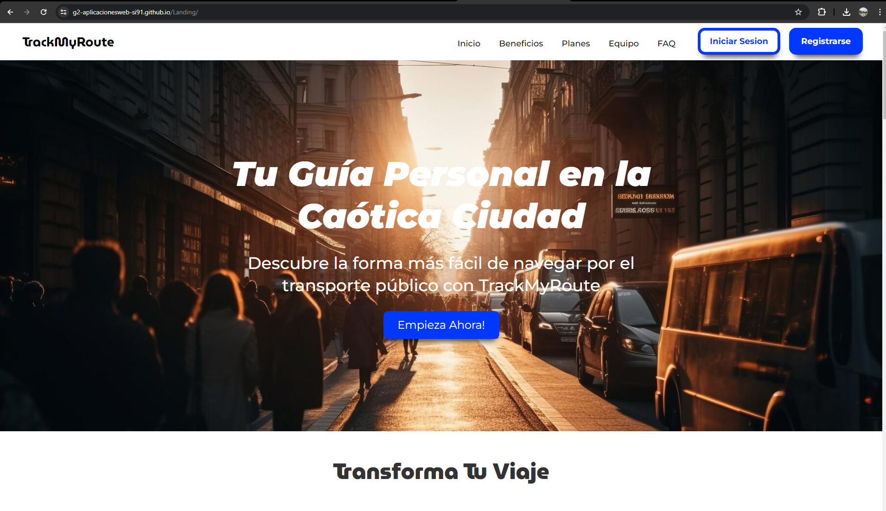

  
	
	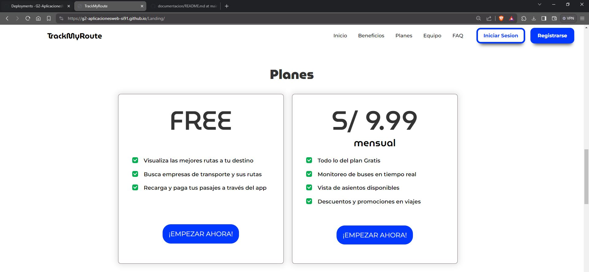
	
	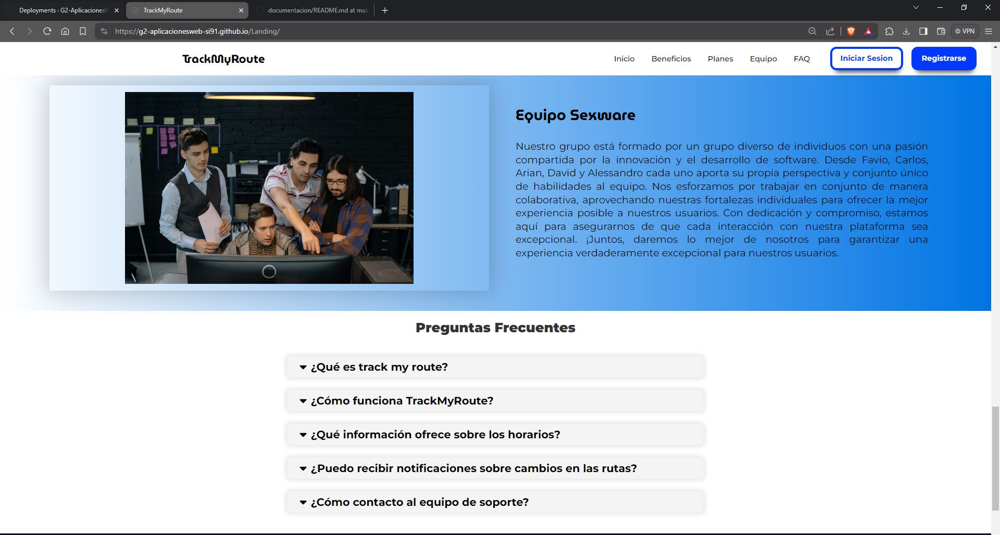

- #### 5.2.1.8. Team Collaboration Insights during Sprint

  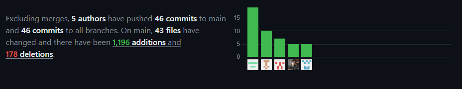

  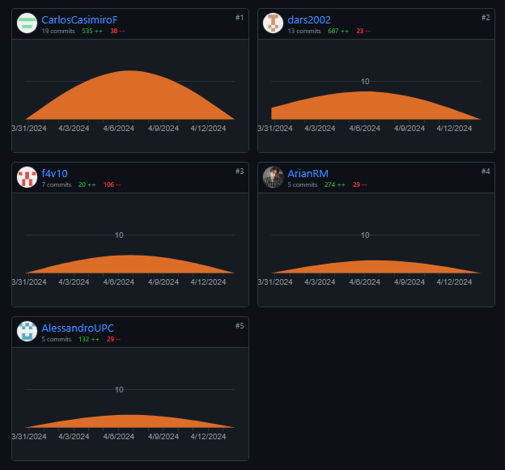

### 5.2.2. Sprint 2

- #### 5.2.2.1 Sprint Planning 2

<table>
    <thead>
        <tr>
            <td>Sprint #</td>
            <td>Sprint 2</td>
        </tr>
        <tr>
            <td colspan="2">Sprint Planning Background</td>
        </tr>
    </thead>
    <tbody>
        <tr>
            <td>Date</td>
            <td>20/04/2024</td>
        </tr>
        <tr>
            <td>Time</td>
            <td>16:50 pm</td>
        </tr>
        <tr>
            <td>Location</td>
            <td>Google Meet</td>
        </tr>
        <tr>
            <td>Prepared By</td>
            <td>TrackMyRoute</td>
        </tr>
        <tr>
            <td>Attendees (to planning meeting)</td>
            <td>Rivas Sarango, David Alejandro / Ramirez Mendoza, Carlos Arian / Valenzuela Vallejos, Alessandro Stefano  / Casimiro Fernandez, Carlos Oswaldo / Landeo Simeón, Favio Sebastián</td>
        </tr>
        <tr>
            <td>Sprint n – 1 Review Summary</td>
            <td>Mejorar los call to action de la Landing Page y tener un buen despliegue del landing page.</td>
        </tr>
        <tr>
            <td>Sprint n – 1 Retrospective Summary</td>
            <td>La colaboración entre los miembros del equipo fue efectiva, lo que permitió resolver los problemas de manera oportuna. </td>
        </tr>
        <tr>
            <td colspan="2">Sprint Goal & User Stories</td>
        </tr>
        <tr>
            <td>Sprint 2 Goal</td>
            <td>Diseñar e implementar más del 80% del frontend de la aplicación web.</td>
        </tr>
        <tr>
            <td>Sprint 2 Velocity</td>
            <td>28</td>
        </tr>
        <tr>
            <td>Sum of Story Points</td>
            <td>32</td>
        </tr>
    </tbody>
</table>

- #### 5.2.2.2 Sprint Backlog 2

<table>
  <thead>
    <tr>
    <td>Sprint #:</td>
    <td colspan="7">Sprint 2</td>
    </tr>
    <tr>
        <td colspan="2">User Story</td>
        <td colspan="6">Work-Item / Task</td>
    </tr>
    <tr>
        <td>ID</td>
        <td>Title</td>
        <td>ID</td>
        <td>Title</td>
        <td>Description</td>
        <td>Estimation (Hours)</td>
        <td>Assigned to</td>
        <td>Status (To-Do/In-Process/To-Review/Done)</td>
    </tr>
  </thead>
  <tbody>
    <tr>
      <td>HU34</td>
      <td>Recuperación de contraseña</td>
      <td>T001</td>
      <td>Desarrollo de pagina de recuperación de contraseña</td>
      <td>Desarrollo e implementacion de la pagina de recuperación de contraseña</td>
      <td>4 hrs</td>
      <td>Favio Landeo</td>
      <td>Done</td>
    </tr>
    <tr>
      <td>HU01</td>
      <td>Registrar al usuario</td>
      <td>T002</td>
      <td>Desarrollo de pantalla de registro</td>
      <td>Desarrollo e implementación del la vista de registro de usuario</td>
      <td>4 hrs</td>
      <td>Alessandro Valenzuela</td>
      <td>Done</td>
    </tr>
    <tr>
      <td>HU02</td>
      <td>Inicio de sesión en la aplicación</td>
      <td>T003</td>
      <td>Desarrollo de sistema de inicio de sesion</td>
      <td>Desarrollo e implementación de la vista de inicio de sesión y autenticacion</td>
      <td>4 hrs</td>
      <td>Alessandro Valenzuela</td>
      <td>In Process</td>
    </tr>
    <tr>
      <td>HU16</td>
      <td>Notificaciones personalizadas</td>
      <td>T003</td>
      <td>Desarrollo de pagina de notificaciones</td>
      <td>Desarrollo e implementación de la vista de notificaciones</td>
      <td>4 hrs</td>
      <td>Favio Landeo</td>
      <td>Done</td>
    </tr>
    <tr>
      <td>HU08</td>
      <td>Visualización del menú de opciones</td>
      <td>T004</td>
      <td>Desarrollo de menu de opciones	</td>
      <td>Desarrollo e implementación del side nav con opciones para el usuario</td>
      <td>4 hrs</td>
      <td>Arian Ramirez</td>
      <td>In Process</td>
    </tr>
    <tr>
      <td>HU10</td>
      <td>Visualización del mapa</td>
      <td>T005</td>
      <td>Desarrollo de vista del mapa</td>
      <td>Desarrollo e implementación de la vista del mapa con los campos de ingreso de origen y destino</td>
      <td>5 hrs</td>
      <td>Arian Ramirez</td>
      <td>Done</td>
    </tr>
    <tr>
      <td>HU15</td>
      <td>Compra de boletos</td>
      <td>T006</td>
      <td>Desarrollo de vista pay-ticket</td>
      <td>Desarrollo e implementación de la vista de la sección para pagar pasaje de algun bus seleccionado</td>
      <td>7 hrs</td>
      <td>Arian Ramirez</td>
      <td>Done</td>
    </tr>
    <tr>
      <td>HU30</td>
      <td>Promociones</td>
      <td>T007</td>
      <td>Desarrollo de pagina de promociones</td>
      <td>Desarrollo e implementación de la vista de promociones que se le ofreceran al usuario premiun</td>
      <td>4hrs</td>
      <td>David Rivas</td>
      <td>Done</td>
    </tr>
    <tr>
      <td>HU31</td>
      <td>Soporte y Ayuda</td>
      <td>T008</td>
      <td>Desarrollo de pagina de ayuda</td>
      <td>Desarrollo e implementación de la vista de soporte y ayuda</td>
      <td>4hr</td>
      <td>Carlos Casimiro</td>
      <td>In Process</td>
    </tr>
    <tr>
      <td>HU32	</td>
      <td>Configuración	</td>
      <td>T008</td>
      <td>Desarrollo de pagina de configuración</td>
      <td>Desarrollo e implementación de la pagina de configuración</td>
      <td>4 hr</td>
      <td>Carlos Casimiro</td>
      <td>In Process</td>
    </tr>
    <tr>
      <td>HU33</td>
      <td>Historial de Viajes</td>
      <td>T008</td>
      <td>Desarrollo de pagina de historial de viajes</td>
      <td>Desarrollo e implementación de la pagina de historial de viajes</td>
      <td>4 hrs</td>
      <td>David Rivas</td>
      <td>Done</td>
    </tr>
  </tbody>
</table>

- #### 5.2.2.3 Development Evidence for Sprint Review

<table>
  <thead>
    <tr>
        <td><strong>Repository</strong></td>
        <td><strong>Branch</strong></td>
        <td><strong>Commit ID</strong></td>
        <td><strong>Commit Message</strong></td>
        <td><strong>Commited on (Date)</strong></td>
    </tr>
  </thead>
  <tbody>
    <tr>
      <td>https://github.com/G2-AplicacionesWeb-SI91/frontend</td>
      <td>feature/search-routes</td>
      <td>d7b5c312db3ba249542b9b2b434d95d8ade15766</td>
      <td>feat: search routes page</td>
      <td>04/05/2024</td>
    </tr>
    <tr>
      <td>https://github.com/G2-AplicacionesWeb-SI91/frontend</td>
      <td>feature/pay-ticket</td>
      <td>4119f514426ebcb93fd17bca8deae143e49b8bd4</td>
      <td>feat: pay tickets view</td>
      <td>04/05/2024</td>
    </tr>
    <tr>
      <td>https://github.com/G2-AplicacionesWeb-SI91/frontend</td>
      <td>feature/promos</td>
      <td>2fc2e16784405f25b9289084d5300fa5ab077dac</td>
      <td>fixed: promo.entity, promo.component, index.js, app.vue</td>
      <td>03/05/2024</td>
    </tr>
    <tr>
      <td>https://github.com/G2-AplicacionesWeb-SI91/frontend</td>
      <td>featur/trips-history</td>
      <td>78d7a6165d458718ff533ce621c8b0603502a756</td>
      <td>feat: history component and configuration</td>
      <td>03/05/2024</td>
    </tr>
    <tr>
      <td>https://github.com/G2-AplicacionesWeb-SI91/frontend</td>
      <td>feature/notifications</td>
      <td>94e67283e2f100ec0a8752140e6ddb7578f34321</td>
      <td>feat(side-bar.component): added routes and margin left to side bar.</td>
      <td>03/05/2024</td>
    </tr>
    <tr>
      <td>https://github.com/G2-AplicacionesWeb-SI91/frontend</td>
      <td>feature/recovery-pass</td>
      <td>383cb4dc4ff7873858e1bae32fdb53b97f308d19</td>
      <td>feat: added header to recovery-pass component</td>
      <td>03/05/2024</td>
    </tr>
  </tbody>
</table>

- #### 5.2.2.4 Testing Suite Evidence for Sprint Review

En esta entrega no se hace uso de sistemas de Testing ya que solo nos enfocamos en la parte visual de la Web Application

- #### 5.2.2.5 Execution Evidence for Sprint Review

  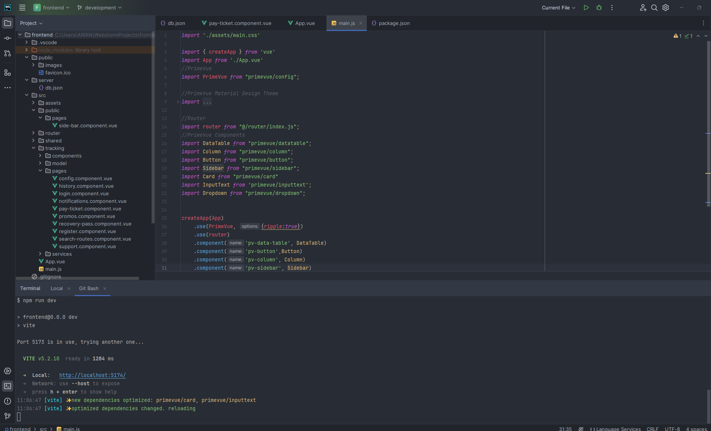

  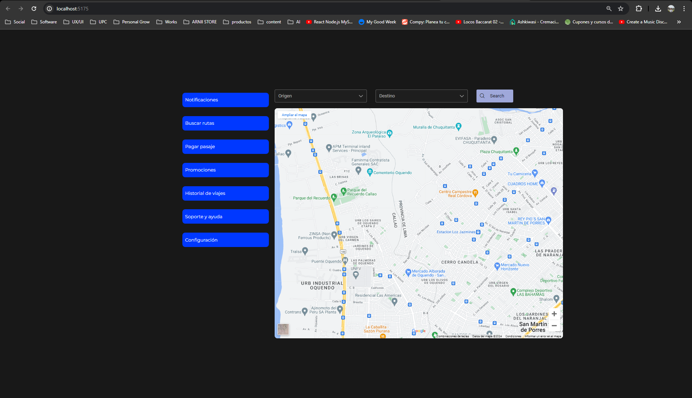

- #### 5.2.2.6 Services Documentation Evidence for Sprint Review

En esta entrega no se hace uso de Web Services por lo que no hay documentación de ello.

- #### 5.2.2.7 Software Deployment Evidence for Sprint Review

- #### 5.2.2.8 Team Collaboration Insights during Sprint

  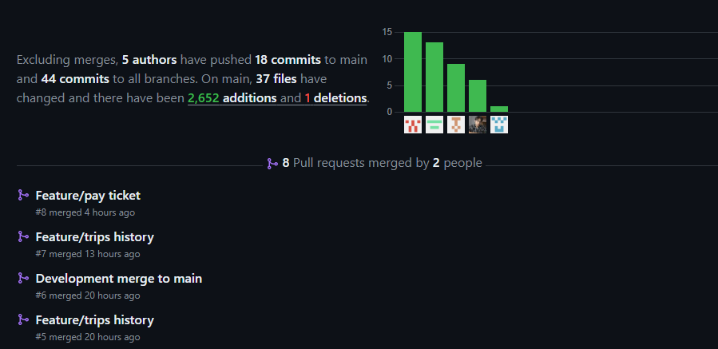

  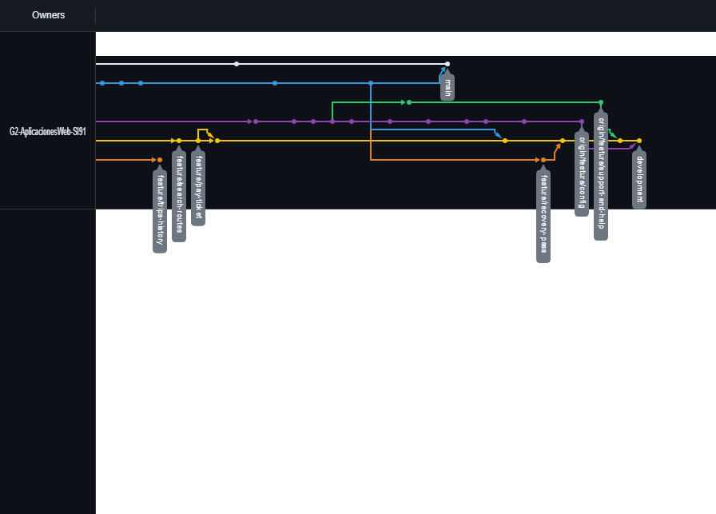

### 5.2.3. Sprint 3

- #### 5.2.3.1 Sprint Planning 3

<table>
    <thead>
        <tr>
            <td>Sprint #</td>
            <td>Sprint 3</td>
        </tr>
        <tr>
            <td colspan="2">Sprint Planning Background</td>
        </tr>
    </thead>
    <tbody>
        <tr>
            <td>Date</td>
            <td>26/05/2024</td>
        </tr>
        <tr>
            <td>Time</td>
            <td>16:50 pm</td>
        </tr>
        <tr>
            <td>Location</td>
            <td>Google Meet</td>
        </tr>
        <tr>
            <td>Prepared By</td>
            <td>TrackMyRoute</td>
        </tr>
        <tr>
            <td>Attendees (to planning meeting)</td>
            <td>Rivas Sarango, David Alejandro / Ramirez Mendoza, Carlos Arian / Valenzuela Vallejos, Alessandro Stefano  / Casimiro Fernandez, Carlos Oswaldo / Landeo Simeón, Favio Sebastián</td>
        </tr>
        <tr>
            <td>Sprint n – 2 Review Summary</td>
            <td>Se logró desarrollar los respectivos bounded context en el frontend de TrackMyRoute con las herramientas de Vue.js y mejora en el frontend. </td>
        </tr>
        <tr>
            <td>Sprint n – 2 Retrospective Summary</td>
            <td>El equipo mantendrá la comunicación como viene haciendo desde el primer sprint y se establecerán mejores parámetros de desarrollo para realizar el desarrollo del backend.</td>
        </tr>
        <tr>
            <td colspan="2">Sprint Goal & User Stories</td>
        </tr>
        <tr>
            <td>Sprint 3 Goal</td>
            <td>Se utilazarán las herramientas de C#, .NET, Swagger y MySQL. Diseñar e implementar más del 40% del backend de la aplicación web.</td>
        </tr>
        <tr>
            <td>Sprint 3 Velocity</td>
            <td>26</td>
        </tr>
        <tr>
            <td>Sum of Story Points</td>
            <td>32</td>
        </tr>
    </tbody>
</table>

- #### 5.2.3.2 Sprint Backlog 3

En esta entrega nos enfocamos en el backlog del negocio, el funcionamiento interno para que la API funcione correctamente.

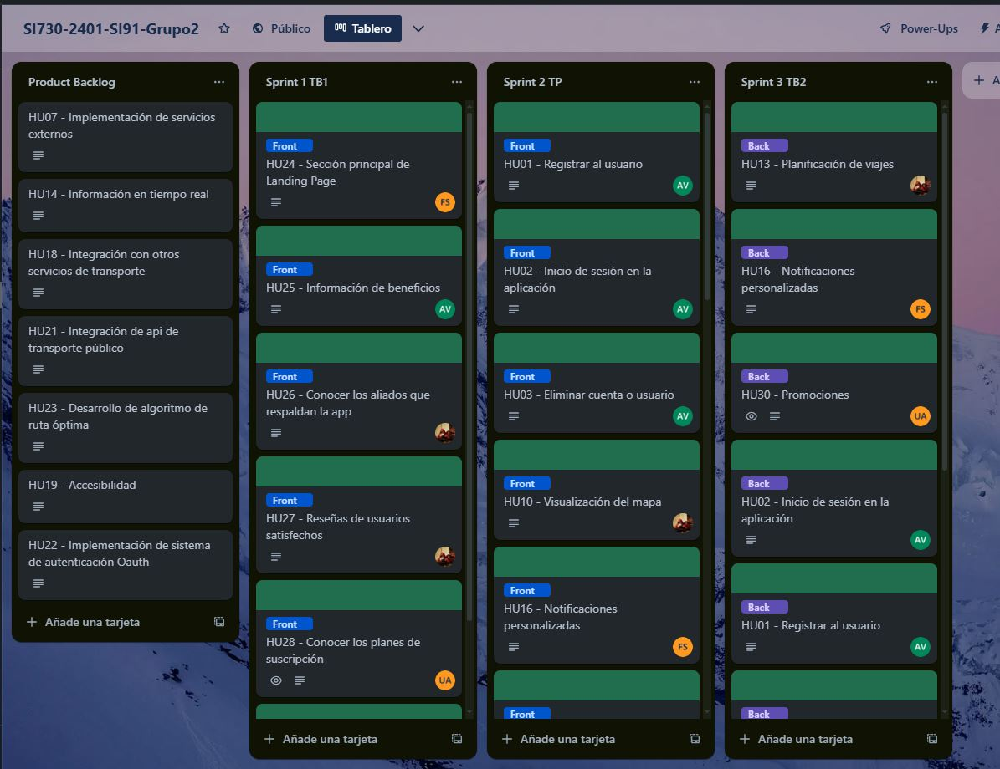

<table>
  <thead>
    <tr>
    <td>Sprint #:</td>
    <td colspan="7">Sprint 3</td>
    </tr>
    <tr>
        <td colspan="2">User Story</td>
        <td colspan="6">Work-Item / Task</td>
    </tr>
    <tr>
        <td>ID</td>
        <td>Title</td>
        <td>ID</td>
        <td>Title</td>
        <td>Description</td>
        <td>Estimation (Hours)</td>
        <td>Assigned to</td>
        <td>Status (To-Do/In-Process/To-Review/Done)</td>
    </tr>
  </thead>
  <tbody>
    <tr>
      <td>HU13</td>
      <td>Planificación de viajes</td>
      <td>1</td>
      <td>Planificación de viajes</td>
      <td>Como cliente quiero planificar mis viajes en función a mi ubicación actual y al destino (se muestran los horarios de salida y de llegada de los buses, su ubicación, etc.) para organizar mejor mis tiempos.</td>
      <td>5</td>
      <td>Arian Ramirez</td>
      <td>Done</td>
    </tr>
	  <tr>
      <td>HU16</td>
      <td>Notificaciones personalizadas</td>
      <td>1</td>
       <td>Notificaciones personalizadas</td>
      <td>Como cliente quiero recibir notificaciones personalizadas acerca de eventos pertinentes a mi viaje en bus (retrasos, horarios, etc.) para estar al tanto de las situaciones que pueden afectar mi futuro viaje</td>
      <td>2</td>
      <td>Favio Landeo</td>
      <td>Done</td>
    </tr>
	  <tr>
      <td>HU30</td>
      <td>Promociones</td>
      <td>1</td>
     <td>Promociones</td>
      <td>Como cliente, quiero ver las promociones disponibles en la aplicación para que pueda aprovechar descuentos al utilizar el servicio de transporte público.</td>
      <td>2</td>
      <td>David Rivas</td>
      <td>Done</td>
    </tr>
	  <tr>
      <td>HU02</td>
      <td>Inicio de sesión en la aplicación</td>
      <td>1</td>
     <td>Inicio de sesión en la aplicación</td>
      <td>Como cliente quiero iniciar sesión en la aplicación con mis credenciales (correo y contraseña) para poder entrar a la aplicación con mi cuenta existente</td>
      <td>2</td>
      <td>Alessandro Valenzuela</td>
      <td>Done</td>
    </tr>
	<tr>
      <td>HU01</td>
      <td>Registrar al usuario</td>
      <td>1</td>
     <td>Registrar al usuario</td>
      <td>Como cliente quiero registrarme con todos mis datos pertinentes (nombre, correo, edad, etc.) en la aplicación para poder hacer uso de sus funcionalidades.</td>
      <td>2</td>
      <td>Alessandro Valenzuela</td>
      <td>In process</td>
    </tr>
<tr>
      <td>HU20</td>
      <td>Retroalimentación de los usuarios</td>
      <td>1</td>
     <td>Retroalimentación de los usuarios</td>
      <td>Como cliente quiero dar una retroalimentación sobre mi experiencia de viaje o al utilizar la aplicación para dar a conocer mi agrado o mi malestar con respecto al funcionamiento de esta.</td>
      <td>3</td>
      <td>Casimiro</td>
      <td>In process</td>
    </tr>
	  <tr>
      <td>HU33</td>
      <td>Historial de Viajes</td>
      <td>1</td>
         <td>Historial de Viajes</td>
      <td>Como cliente, quiero poder acceder a un historial detallado de mis viajes anteriores en la aplicación para que pueda realizar un seguimiento de mis desplazamientos y gastos.</td>
      <td>5</td>
      <td>Arian Ramirez</td>
      <td>Done</td>
    </tr>
	  <tr>
      <td>HU31</td>
      <td>Soporte y Ayuda</td>
      <td>1</td>
      <td>Soporte y Ayuda</td>
      <td>Como cliente, quiero tener acceso a opciones de soporte y ayuda dentro de la aplicación para que pueda resolver cualquier problema o duda que pueda surgir durante su uso.</td>
      <td>2</td>
      <td>Casimiro</td>
      <td>In process</td>
    </tr>
	  <tr>
      <td>HU06</td>
      <td>Registro de las empresas operadoras de rutas</td>
      <td>1</td>
      <td>Registro de las empresas operadoras de rutas</td>
      <td>Como desarrollador quiero registrar a las empresas que operan en cada una de las rutas de transporte urbano en buses para así tener un registro de todas estas empresas en la base de datos de la aplicación</td>
      <td>3</td>
      <td>David Rivas</td>
      <td>In process</td>
    </tr>  
  </tbody>
</table>

- #### 5.2.3.3 Development Evidence for Sprint Review

<table>
  <thead>
    <tr>
        <td><strong>Repository</strong></td>
        <td><strong>Branch</strong></td>
        <td><strong>Commit ID</strong></td>
        <td><strong>Commit Message</strong></td>
        <td><strong>Commited on (Date)</strong></td>
    </tr>
  </thead>
  <tbody>
    <tr>
      <td>https://github.com/G2-AplicacionesWeb-SI91/backend</td>
      <td>main</td>
      <td>7aad70f</td>
      <td>Project Files</td>
      <td>07/06/2024</td>
    </tr>
    <tr>
      <td>https://github.com/G2-AplicacionesWeb-SI91/backend</td>
      <td>bc-users</td>
      <td>f84130b</td>
      <td>Update Back-Auth 1.1</td>
      <td>07/06/2024</td>
    </tr>
    <tr>
      <td>https://github.com/G2-AplicacionesWeb-SI91/backend</td>
      <td>bc-notifications</td>
      <td>6420fd4</td>
      <td>fix: updated endpoint name.</td>
      <td>08/06/2024</td>
    </tr>
    <tr>
      <td>https://github.com/G2-AplicacionesWeb-SI91/backend</td>
      <td>bc-promo</td>
      <td>879395c</td>
      <td>feat: promos interface layer</td>
      <td>09/06/2024</td>
    </tr>
    <tr>
      <td>https://github.com/G2-AplicacionesWeb-SI91/backend</td>
      <td>feature/tracking</td>
      <td>ce1da0e</td>
      <td>feat(tracking): re do tracking bc</td>
      <td>09/06/2024</td>
    </tr>
  </tbody>
</table>

- #### 5.2.3.4 Testing Suite Evidence for Sprint Review

En esta entrega no se hace uso de sistemas de Testing ya que solo nos enfocamos en la parte del Backend

- #### 5.2.3.5 Execution Evidence for Sprint Review

  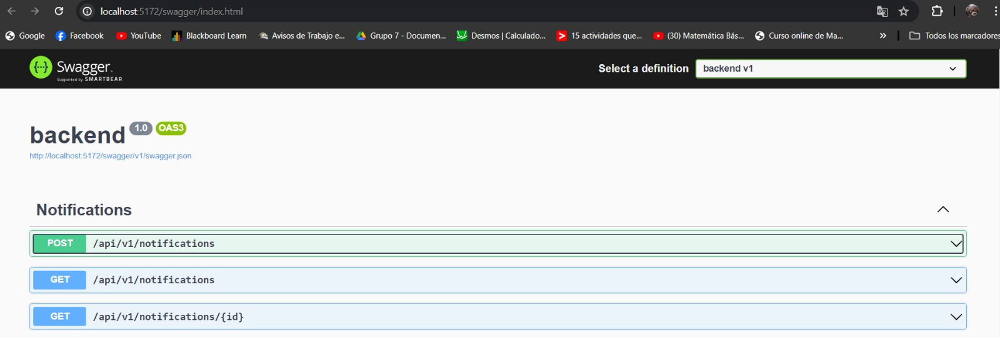

  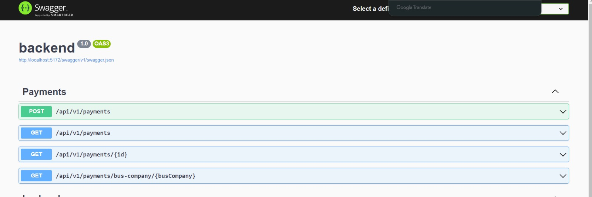

  

- #### 5.2.3.6 Services Documentation Evidence for Sprint Review

Backend Service:

<table>
    <thead>
        <tr>
            <th>Endpoint</th>
            <th>Operaciones</th>
            <th>Parametros</th>
            <th>URL</th>
        </tr>
    </thead>
    <tbody>
        <tr>
            <td rowspan="4">Notifications</td>
        </tr>
        <tr>
            <td>POST</td>
            <td>No tiene</td>
            <td>api/v1/notifications</td>
        </tr>
        <tr>
            <td>GET</td>
            <td>No tiene</td>
            <td>api/v1/notifications</td>
        </tr>
        <tr>
            <td>GET</td>
            <td>{id}</td>
            <td>api/v1/notifications/{id}</td>
        </tr>
	<tr>
		<td rowspan="5">Payments</td>
	</tr>
        <tr>
            <td>POST</td>
            <td>No tiene</td>
            <td>api/v1/payments</td>
        </tr>
        <tr>
            <td>GET</td>
            <td>{answerId}</td>
            <td>api/v1/payments/{id}</td>
        </tr>
        <tr>
            <td>GET</td>
            <td>{busCompany}</td>
            <td>api/v1/payments/bus-company/{busCompany}</td>
        </tr>
        <tr>
            <td>GET</td>
            <td>No tiene</td>
            <td>api/v1/payments</td>
        </tr>
	    <tr>
	    <td rowspan="3">Promos</td>
	    </tr>
        <tr>
            <td>GET</td>
            <td>{promoId}</td>
            <td>api/v1/promo/{promoId}</td>
        </tr>
        <tr>
            <td>POST</td>
            <td>No tiene</td>
            <td>api/v1/promo</td>
        </tr>
    </tbody>
</table>

- #### 5.2.3.7 Software Deployment Evidence for Sprint Review

* Langing Page
  <table>
    <tbody>
        <tr>
            <td> https://g2-aplicacionesweb-si91.github.io/Landing/</td>
        </tr>
    </tbody>
</table>
* Frontend-application
<table>
    <tbody>
        <tr>
            <td>https://trackmyroute-appsweb123.web.app/login</td>
        </tr>
    </tbody>
</table>
* Backend Service
  Nos enfocamos en la evidencia del backend para este sprint, se trabajo con SwaggerAPI para el testeo de conexión y correcto funcionamiento del backend.

  

  

  

- #### 5.2.3.8 Team Collaboration Insights during Sprint

  

  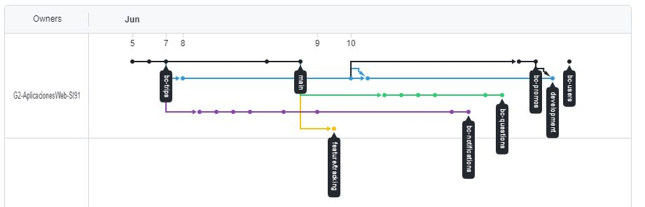

### 5.2.4. Sprint 4

- #### 5.2.4.1 Sprint Planning 4

<table>
    <thead>
        <tr>
            <td>Sprint #</td>
            <td>Sprint 4</td>
        </tr>
        <tr>
            <td colspan="2">Sprint Planning Background</td>
        </tr>
    </thead>
    <tbody>
        <tr>
            <td>Date</td>
            <td>28/06/2024</td>
        </tr>
        <tr>
            <td>Time</td>
            <td>7:00 am</td>
        </tr>
        <tr>
            <td>Location</td>
            <td>Google Meet</td>
        </tr>
        <tr>
            <td>Prepared By</td>
            <td>TrackMyRoute</td>
        </tr>
        <tr>
            <td>Attendees (to planning meeting)</td>
            <td>Rivas Sarango, David Alejandro / Ramirez Mendoza, Carlos Arian / Valenzuela Vallejos, Alessandro Stefano  / Casimiro Fernandez, Carlos Oswaldo / Landeo Simeón, Favio Sebastián</td>
        </tr>
        <tr>
            <td>Sprint n – 2 Review Summary</td>
            <td>Se logró desarrollar los respectivos bounded context en el frontend de TrackMyRoute con las herramientas de Vue.js y mejora en el frontend. </td>
        </tr>
        <tr>
            <td>Sprint n – 2 Retrospective Summary</td>
            <td>El equipo mantendrá la comunicación como viene haciendo desde el primer sprint y se establecerán mejores parámetros de desarrollo para realizar el desarrollo del backend.</td>
        </tr>
        <tr>
            <td colspan="2">Sprint Goal & User Stories</td>
        </tr>
        <tr>
            <td>Sprint 4 Goal</td>
            <td>Se logro implementar en su totalidad todas las funcionalidades del backend para el funcionamiento de la pagina web.</td>
        </tr>
        <tr>
            <td>Sprint 4 Velocity</td>
            <td>26</td>
        </tr>
        <tr>
            <td>Sum of Story Points</td>
            <td>32</td>
        </tr>
    </tbody>
</table>

- #### 5.2.4.2 Sprint Backlog 4

En esta entrega nos enfocamos en el backlog del negocio, el funcionamiento interno para que la API funcione correctamente.

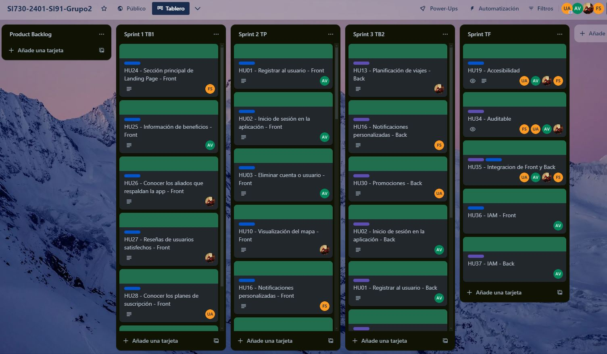

Link: [https://trello.com/b/8cUWzeGy/si730-2401-si91-grupo2]

<table>
  <thead>
    <tr>
    <td>Sprint #:</td>
    <td colspan="7">Sprint 4</td>
    </tr>
    <tr>
        <td colspan="2">User Story</td>
        <td colspan="6">Work-Item / Task</td>
    </tr>
    <tr>
        <td>ID</td>
        <td>Title</td>
        <td>ID</td>
        <td>Title</td>
        <td>Description</td>
        <td>Estimation (Hours)</td>
        <td>Assigned to</td>
        <td>Status (To-Do/In-Process/To-Review/Done)</td>
    </tr>
  </thead>
  <tbody>
    <tr>
      <td>HU13</td>
      <td>Planificación de viajes conexion Backend con Frontend</td>
      <td>1</td>
      <td>Planificación de viajes</td>
      <td>Como cliente quiero planificar mis viajes en función a mi ubicación actual y al destino (se muestran los horarios de salida y de llegada de los buses, su ubicación, etc.) para organizar mejor mis tiempos.</td>
      <td>5</td>
      <td>Arian Ramirez</td>
      <td>Done</td>
    </tr>
	  <tr>
      <td>HU16</td>
      <td>Notificaciones personalizadas conexion Backend con Frontend</td>
      <td>1</td>
       <td>Notificaciones personalizadas</td>
      <td>Como cliente quiero recibir notificaciones personalizadas acerca de eventos pertinentes a mi viaje en bus (retrasos, horarios, etc.) para estar al tanto de las situaciones que pueden afectar mi futuro viaje</td>
      <td>2</td>
      <td>Favio Landeo</td>
      <td>Done</td>
    </tr>
	  <tr>
      <td>HU30</td>
      <td>Promociones conexion Backend con Frontend</td>
      <td>1</td>
     <td>Promociones </td>
      <td>Como cliente, quiero ver las promociones disponibles en la aplicación para que pueda aprovechar descuentos al utilizar el servicio de transporte público.</td>
      <td>2</td>
      <td>David Rivas</td>
      <td>Done</td>
    </tr>
	  <tr>
      <td>HU02</td>
      <td>Inicio de sesión en la aplicación conexion Backend con Frontend</td>
      <td>1</td>
     <td>Inicio de sesión en la aplicación</td>
      <td>Como cliente quiero iniciar sesión en la aplicación con mis credenciales (correo y contraseña) para poder entrar a la aplicación con mi cuenta existente</td>
      <td>2</td>
      <td>Alessandro Valenzuela</td>
      <td>Done</td>
    </tr>
	<tr>
      <td>HU01</td>
      <td>Registrar al usuario conexion Backend con Frontend</td>
      <td>1</td>
     <td>Registrar al usuario</td>
      <td>Como cliente quiero registrarme con todos mis datos pertinentes (nombre, correo, edad, etc.) en la aplicación para poder hacer uso de sus funcionalidades.</td>
      <td>2</td>
      <td>Alessandro Valenzuela</td>
      <td>In process</td>
    </tr>
<tr>
      <td>HU20</td>
      <td>Retroalimentación de los usuarios conexion Backend con Frontend</td>
      <td>1</td>
     <td>Retroalimentación de los usuarios</td>
      <td>Como cliente quiero dar una retroalimentación sobre mi experiencia de viaje o al utilizar la aplicación para dar a conocer mi agrado o mi malestar con respecto al funcionamiento de esta.</td>
      <td>3</td>
      <td>Casimiro</td>
      <td>In process</td>
    </tr>
	  <tr>
      <td>HU33</td>
      <td>Historial de Viajes conexion Backend con Frontend</td>
      <td>1</td>
         <td>Historial de Viajes conexion Backend con Frontend</td>
      <td>Como cliente, quiero poder acceder a un historial detallado de mis viajes anteriores en la aplicación para que pueda realizar un seguimiento de mis desplazamientos y gastos.</td>
      <td>5</td>
      <td>Arian Ramirez</td>
      <td>Done</td>
    </tr>
	  <tr>
      <td>HU31</td>
      <td>Soporte y Ayuda conexion Backend con Frontend</td>
      <td>1</td>
      <td>Soporte y Ayuda</td>
      <td>Como cliente, quiero tener acceso a opciones de soporte y ayuda dentro de la aplicación para que pueda resolver cualquier problema o duda que pueda surgir durante su uso.</td>
      <td>2</td>
      <td>Casimiro</td>
      <td>In process</td>
    </tr>
	  <tr>
      <td>HU06</td>
      <td>Registro de las empresas operadoras de rutas conexion Backend con Frontend</td>
      <td>1</td>
      <td>Registro de las empresas operadoras de rutas</td>
      <td>Como desarrollador quiero registrar a las empresas que operan en cada una de las rutas de transporte urbano en buses para así tener un registro de todas estas empresas en la base de datos de la aplicación</td>
      <td>3</td>
      <td>David Rivas</td>
      <td>In process</td>
    </tr>  
  </tbody>
</table>

- #### 5.2.4.3 Development Evidence for Sprint Review

<table>
  <thead>
    <tr>
        <td><strong>Repository</strong></td>
        <td><strong>Branch</strong></td>
        <td><strong>Commit ID</strong></td>
        <td><strong>Commit Message</strong></td>
        <td><strong>Commited on (Date)</strong></td>
    </tr>
  </thead>
  <tbody>
    <tr>
      <td>https://github.com/G2-AplicacionesWeb-SI91/backend</td>
      <td>feature/payment</td>
      <td>ddb8626</td>
      <td>feat(feature/payment): get and post methods</td>
      <td>07/06/2024</td>
    </tr>
    <tr>
      <td>https://github.com/G2-AplicacionesWeb-SI91/backend</td>
      <td>bc-users</td>
      <td>f84130b</td>
      <td>Update Back-Auth 1.1</td>
      <td>07/06/2024</td>
    </tr>
    <tr>
      <td>https://github.com/G2-AplicacionesWeb-SI91/backend</td>
      <td>bc-notifications</td>
      <td>87926ea</td>
      <td>fix: fixed api controller route.</td>
      <td>08/06/2024</td>
    </tr>
    <tr>
      <td>https://github.com/G2-AplicacionesWeb-SI91/backend</td>
      <td>bc-promo</td>
      <td>5776b69</td>
      <td>feat: promoaudit</td>
      <td>09/06/2024</td>
    </tr>
    <tr>
      <td>https://github.com/G2-AplicacionesWeb-SI91/backend</td>
      <td>feature/tracking</td>
      <td>3d9c109</td>
      <td>fix(feature/tracking): new query</td>
      <td>09/06/2024</td>
    </tr>
  </tbody>
</table>

- #### 5.2.4.4 Testing Suite Evidence for Sprint Review

  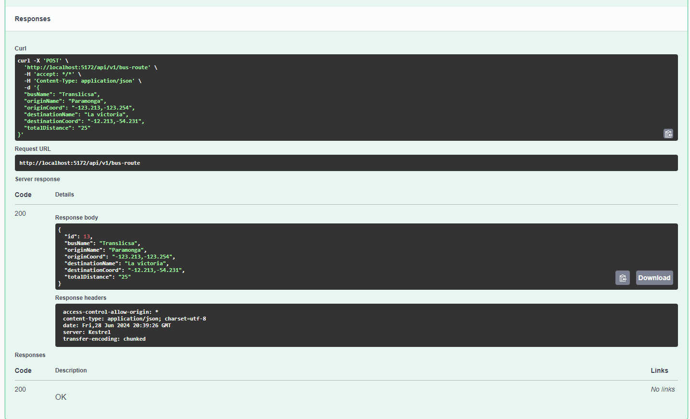

  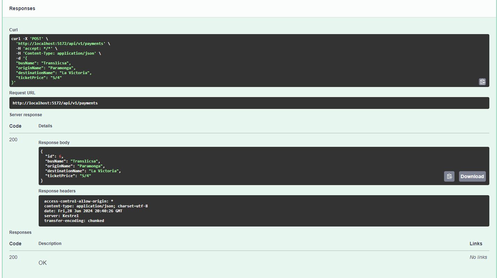

  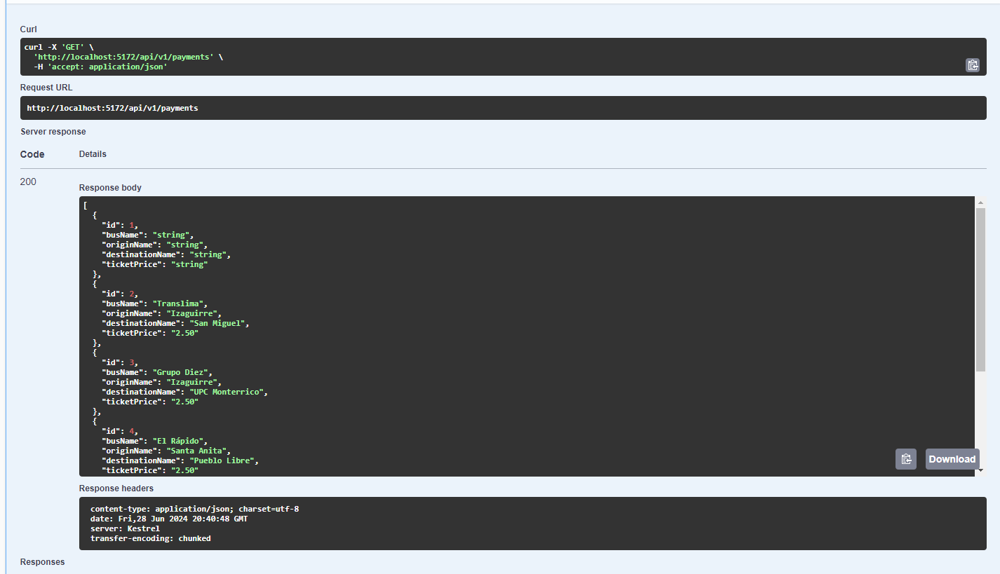

  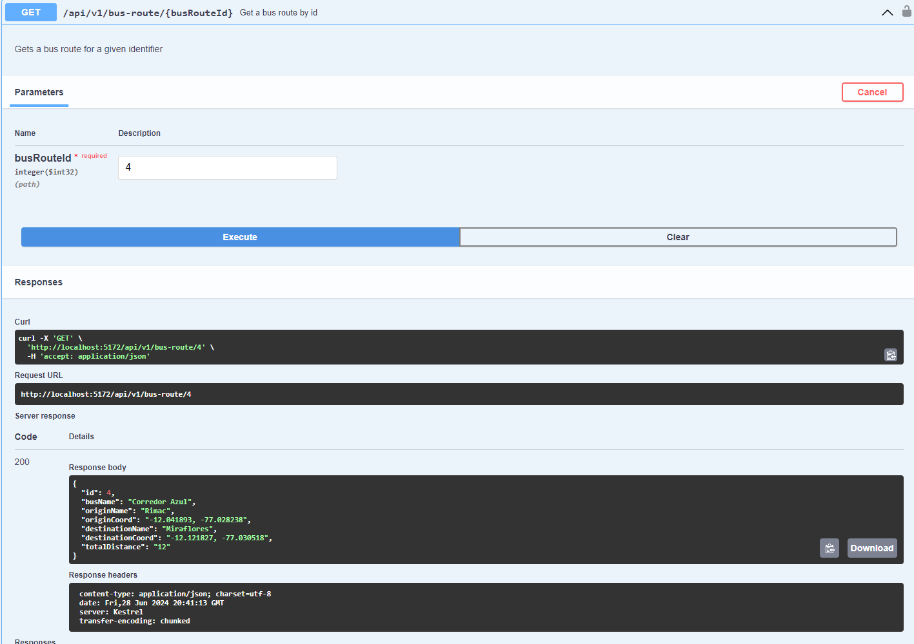

- #### 5.2.4.5 Execution Evidence for Sprint Review

  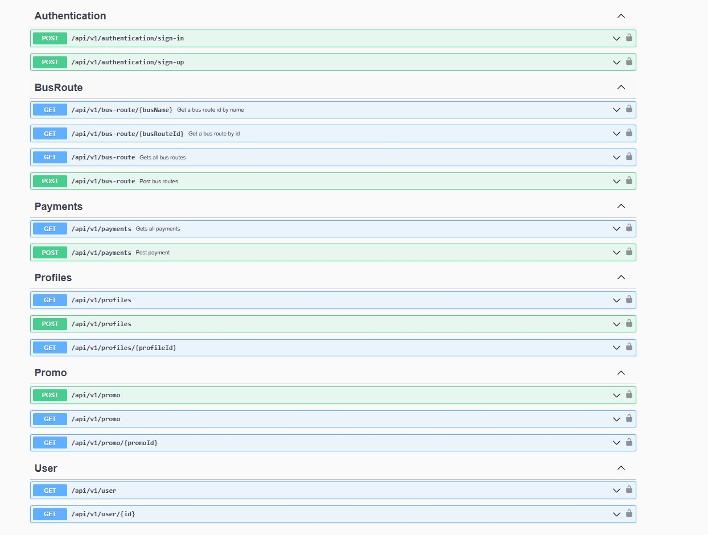

- #### 5.2.4.6 Services Documentation Evidence for Sprint Review

Backend Service:

<table>
    <thead>
        <tr>
            <th>Endpoint</th>
            <th>Operaciones</th>
            <th>Parametros</th>
            <th>URL</th>
        </tr>
    </thead>
    <tbody>
    <tr>
            <td rowspan="3">Authentication</td>
        </tr>
        <tr>
            <td>POST</td>
            <td>No tiene</td>
            <td>api/v1/authentication/sign-in</td>
        </tr>
        <tr>
            <td>POST</td>
            <td>No tiene</td>
            <td>api/v1/authentication/sign-up</td>
        </tr>
        <tr>
            <td rowspan="4">Profiles</td>
        </tr>
        <tr>
            <td>POST</td>
            <td>No tiene</td>
            <td>api/v1/profiles</td>
        </tr>
        <tr>
            <td>GET</td>
            <td>No tiene</td>
            <td>api/v1/profiles</td>
        </tr>
        <tr>
            <td>GET</td>
            <td>{id}</td>
            <td>api/v1/profiles/{id}</td>
        </tr>
        <tr>
            <td rowspan="4">Notifications</td>
        </tr>
        <tr>
            <td>POST</td>
            <td>No tiene</td>
            <td>api/v1/notifications</td>
        </tr>
        <tr>
            <td>GET</td>
            <td>No tiene</td>
            <td>api/v1/notifications</td>
        </tr>
        <tr>
            <td>GET</td>
            <td>{id}</td>
            <td>api/v1/notifications/{id}</td>
        </tr>
	<tr>
		<td rowspan="5">Payments</td>
	</tr>
        <tr>
            <td>POST</td>
            <td>No tiene</td>
            <td>api/v1/payments</td>
        </tr>
        <tr>
            <td>GET</td>
            <td>{answerId}</td>
            <td>api/v1/payments/{id}</td>
        </tr>
        <tr>
            <td>GET</td>
            <td>{busCompany}</td>
            <td>api/v1/payments/bus-company/{busCompany}</td>
        </tr>
        <tr>
            <td>GET</td>
            <td>No tiene</td>
            <td>api/v1/payments</td>
        </tr>
	    <tr>
	    <td rowspan="4">Promos</td>
	    </tr>
        <tr>
            <td>GET</td>
            <td>{promoId}</td>
            <td>api/v1/promo/{promoId}</td>
        </tr>
        <tr>
            <td>GET</td>
            <td>No tiene</td>
            <td>api/v1/promo/</td>
        </tr>
        <tr>
            <td>POST</td>
            <td>No tiene</td>
            <td>api/v1/promo</td>
        </tr>
    </tbody>
</table>

- #### 5.2.4.7 Software Deployment Evidence for Sprint Review

* Langing Page
  <table>
    <tbody>
        <tr>
            <td> https://g2-aplicacionesweb-si91.github.io/Landing/</td>
        </tr>
    </tbody>
</table>
* Frontend-application
<table>
    <tbody>
        <tr>
            <td>https://trackmyroute-appsweb123.web.app/login</td>
        </tr>
    </tbody>
</table>
* Backend Service
  Nos enfocamos en la evidencia del backend para este sprint, se trabajo con SwaggerAPI para el testeo de conexión y correcto funcionamiento del backend.

  

  

  

- #### 5.2.4.8 Team Collaboration Insights during Sprint

  

  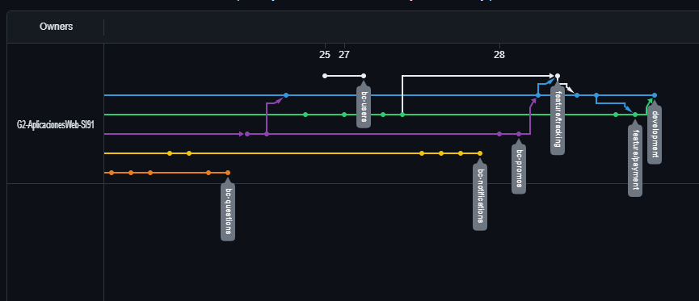

## 5.3. Validation Interviews

En esta sección, el equipo registra y explica las actividades de entrevistas de validación durante el proyecto.

### 5.3.1. Diseño de Entrevistas

**Segmento 1: Usuarios de servicios de transporte**

1. ¿La información en la página principal te ayuda a comprender claramente el objetivo de TrackMyRoute?
2. ¿Qué tan sencillo fue navegar por la página principal y encontrar la información que necesitabas?
3. ¿El diseño de la página principal es atractivo y profesional?
4. ¿Está bien comunicada la propuesta de valor de TrackMyRoute y te resulta convincente?
5. ¿Qué elementos o información adicional te gustaría ver en la página principal para sentirte más seguro al usar nuestro servicio?
6. ¿Qué tan intuitivo es el proceso de registro e inicio de sesión en la aplicación?
7. ¿Están claramente explicadas y son fáciles de usar las funcionalidades principales de TrackMyRoute?
8. ¿Te parecen agradables y prácticos el diseño y la disposición de los elementos en la aplicación web?
9. ¿Te sientes cómodo navegando por las diferentes secciones de la aplicación web?
10. ¿Crees que falta alguna funcionalidad o característica en la aplicación web?

**Segmento 2: Empresas y conductores de transporte público**

1. ¿La página principal comunica claramente los beneficios de TrackMyRoute para tu negocio?
2. ¿Encuentras fácilmente la información sobre planes y precios en la página principal?
3. ¿Qué tan profesional y confiable te parece la presentación de la página principal?
4. ¿La sección de testimonios o casos de éxito te ayuda a confiar en TrackMyRoute?
5. ¿Qué información adicional te gustaría ver en la página principal para considerar implementar TrackMyRoute en tu empresa?
6. ¿Es claro y fácil de seguir el proceso de configuración inicial de la aplicación web?
7. ¿Son adecuadas las funcionalidades de administración y gestión de rutas en la aplicación web para las necesidades de tu negocio?
8. ¿El diseño de la aplicación web es profesional y se alinea con las expectativas de tu empresa?
9. ¿Te resulta fácil acceder a informes y análisis dentro de la aplicación web?
10. ¿Hay alguna funcionalidad específica que crees que debería añadirse para mejorar la experiencia de uso en un entorno empresarial?

### 5.3.2. Registro de Entrevistas

- Entrevista 1

  

Link: https://upcedupe-my.sharepoint.com/:v:/g/personal/u202115412_upc_edu_pe/EQYMFUKssqhJmauBsFlZWVMBSaemDE5YDtg0jCwE_pByFw?nav=eyJyZWZlcnJhbEluZm8iOnsicmVmZXJyYWxBcHAiOiJPbmVEcml2ZUZvckJ1c2luZXNzIiwicmVmZXJyYWxBcHBQbGF0Zm9ybSI6IldlYiIsInJlZmVycmFsTW9kZSI6InZpZXciLCJyZWZlcnJhbFZpZXciOiJNeUZpbGVzTGlua0NvcHkifX0&e=e3bNzV

- Entrevista 2

  

Link: https://upcedupe-my.sharepoint.com/:v:/g/personal/u202115412_upc_edu_pe/EelZzGkqHWFJiHPGFeqyOo0BcaIKXQZPmBSSTJ6FMZC7Vg?nav=eyJyZWZlcnJhbEluZm8iOnsicmVmZXJyYWxBcHAiOiJPbmVEcml2ZUZvckJ1c2luZXNzIiwicmVmZXJyYWxBcHBQbGF0Zm9ybSI6IldlYiIsInJlZmVycmFsTW9kZSI6InZpZXciLCJyZWZlcnJhbFZpZXciOiJNeUZpbGVzTGlua0NvcHkifX0&e=O1TB3v

---

# Capítulo VI: Product Verification & Validation

## 6.1. Testing Suites & Validation

### 6.1.1. Core Entities Unit Tests

**Entidad Notification**

  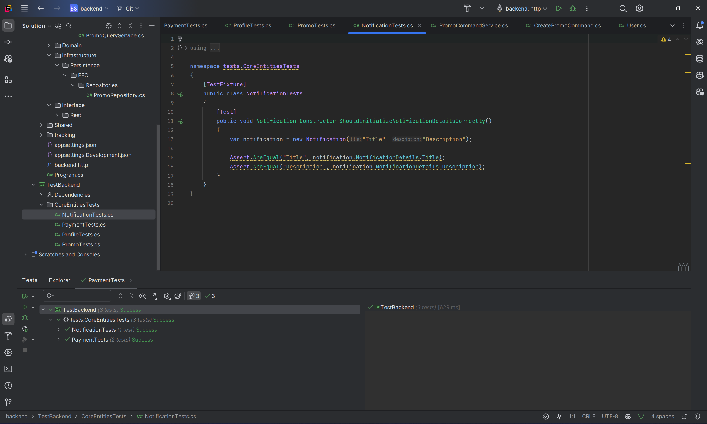

**Entidad Payment**

  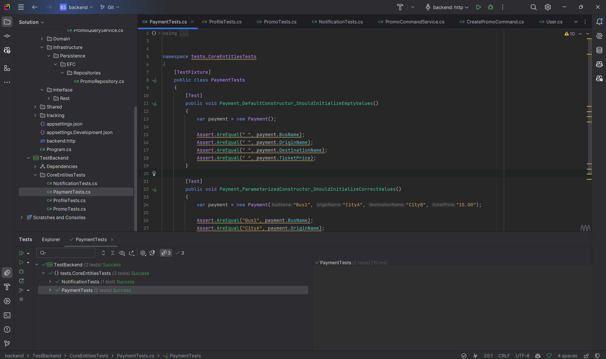

**Entidad Profile**

  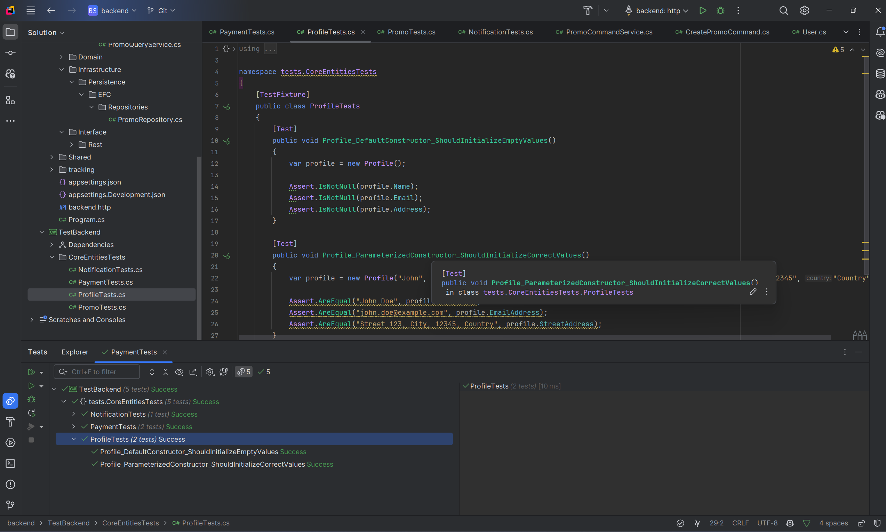

**Entidad Promo**

  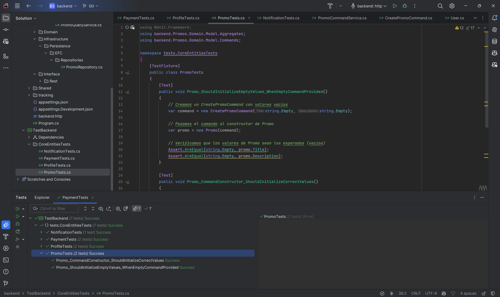

### 6.1.2. Core Integration Tests

  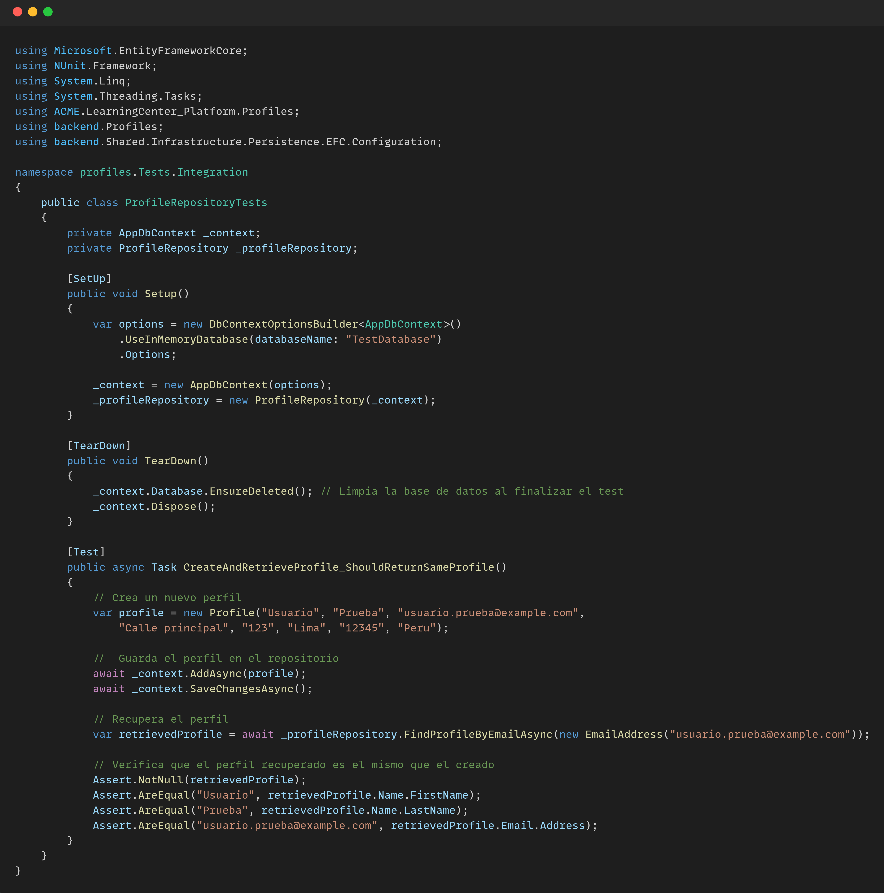

  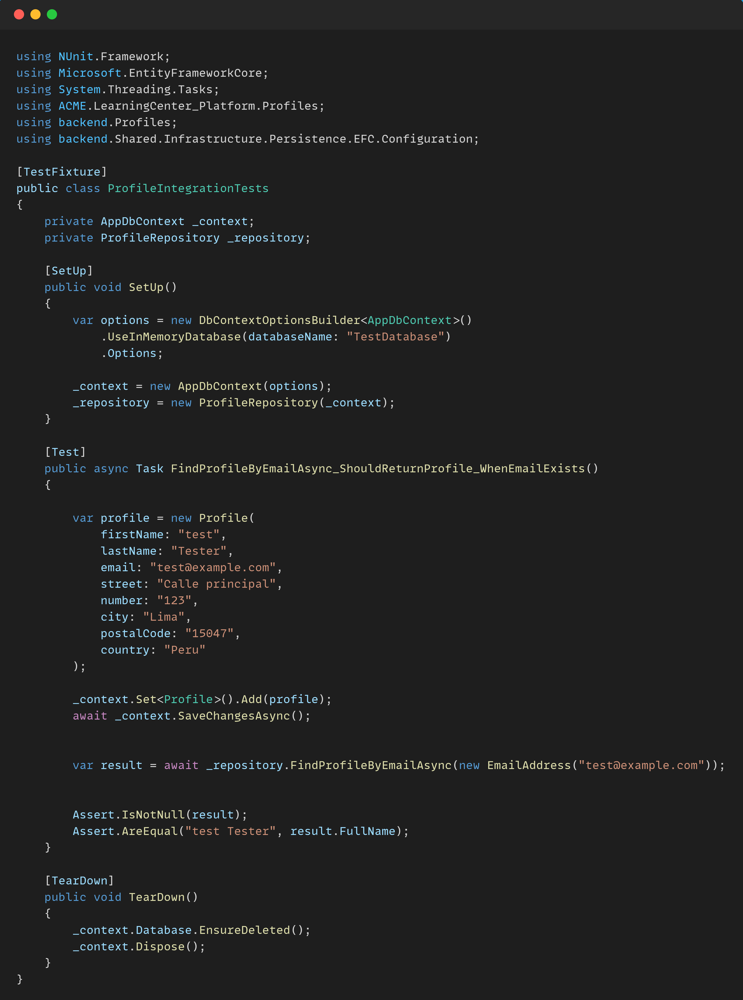

  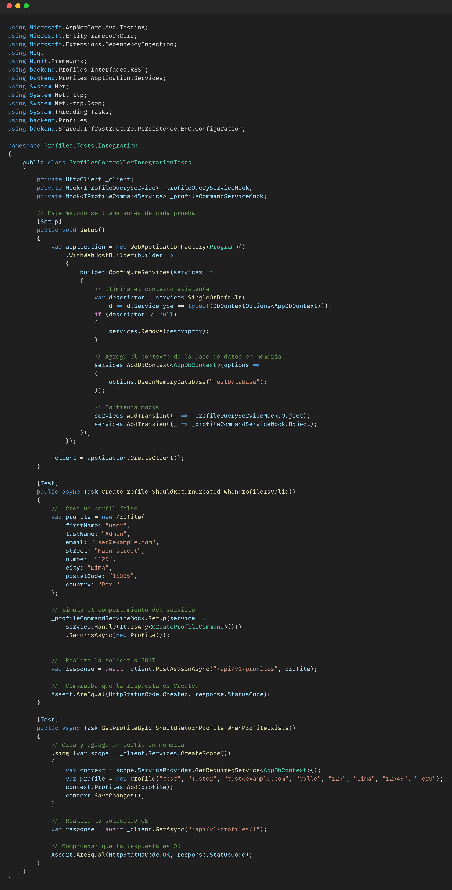

### 6.1.3. Core Behavior-Driven Development

  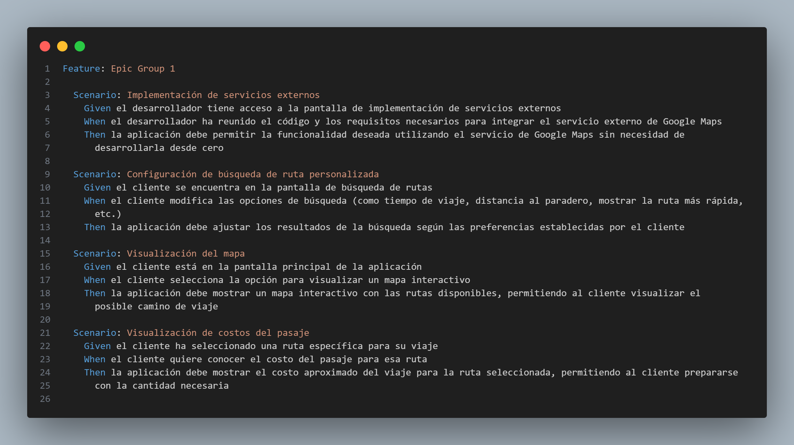

  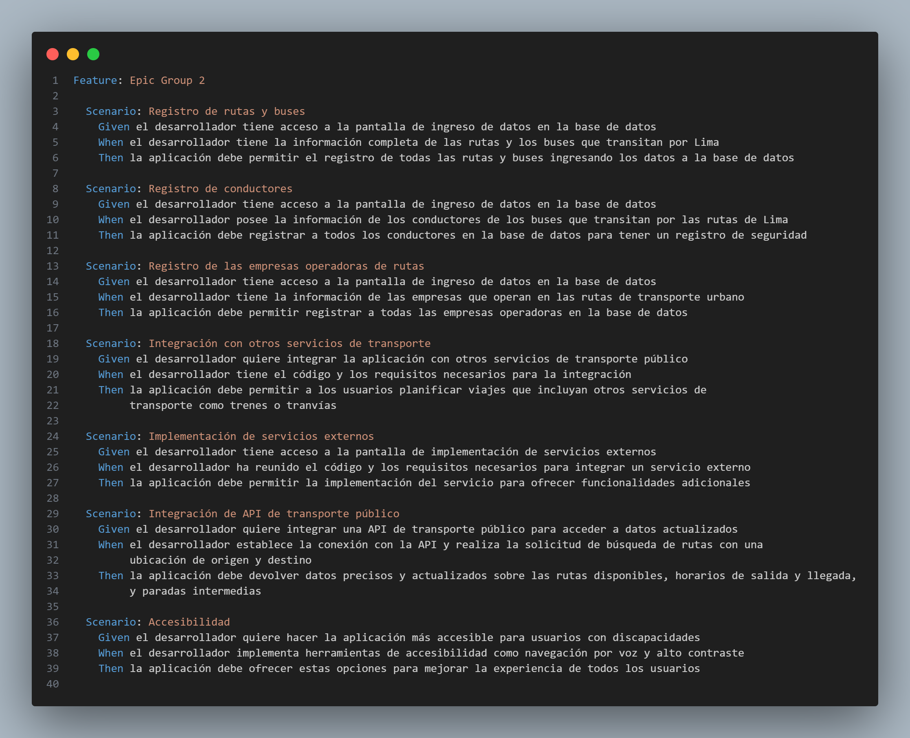

  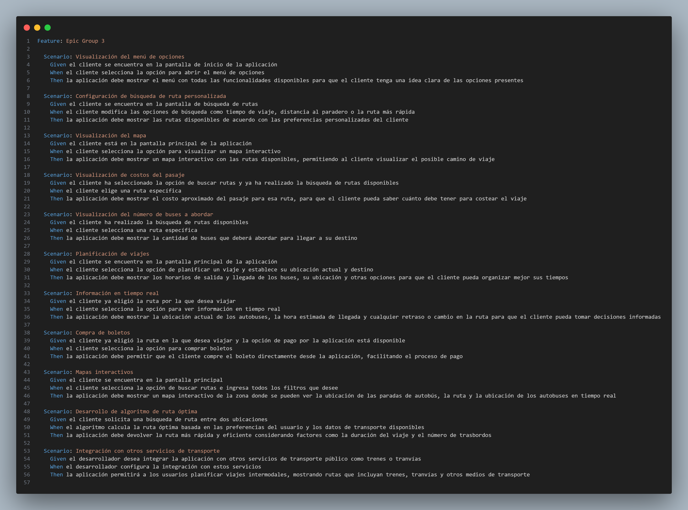

  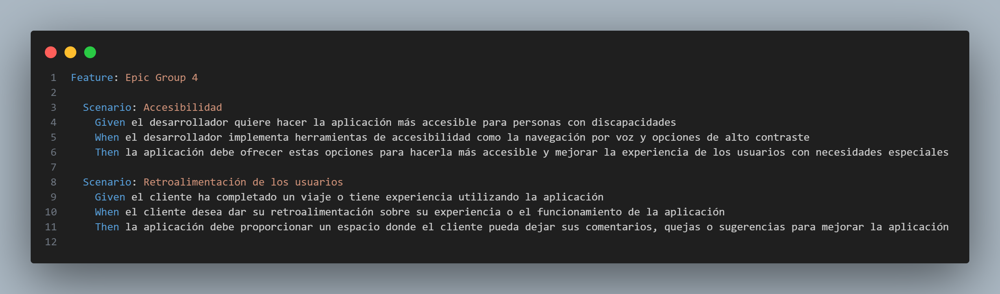

  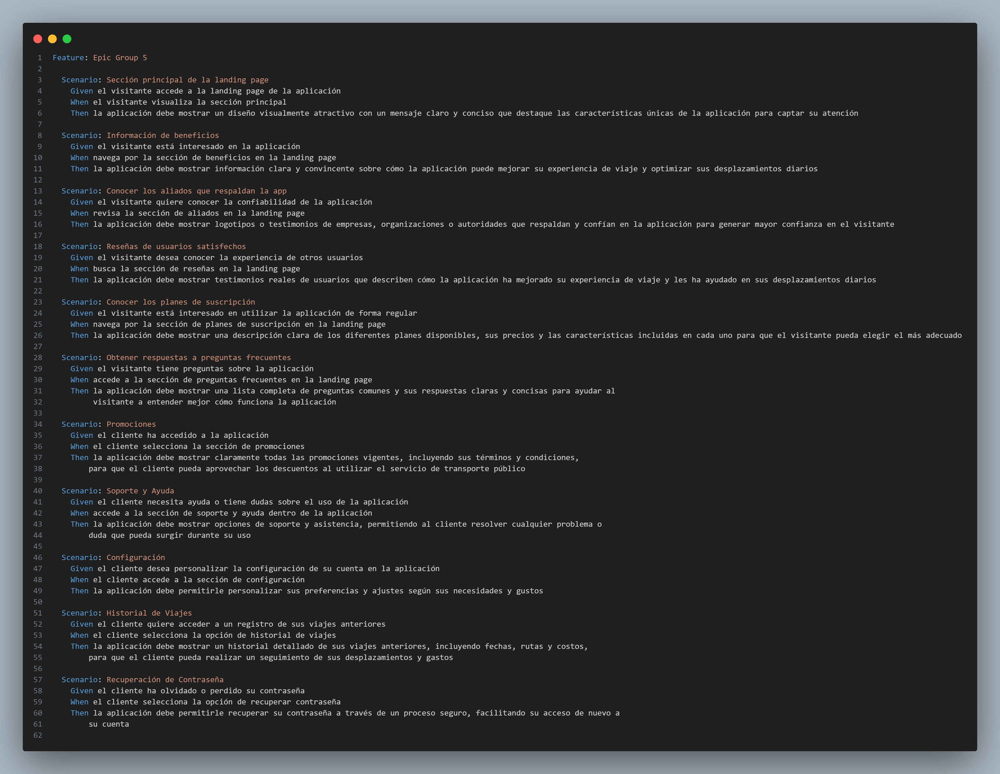

### 6.1.4. Core System Tests

  

  

# 6.2 Static testing & Verification

## 6.2.1. Static Code Analysis

### 6.2.1.1. Coding standard & Code conventions.

En esta sección se destacarán los estándares que se aplicarán para la codificación de las aplicaciones, ya sea en el desarrollo del frontend, backend o la página de aterrizaje.

### Naming Conventions

- **Nombres de proyectos, clases y variables:** se utilizarán nombres cortos.
- **Proyectos:** comenzarán en mayúscula; para clases y variables, en minúscula.
- **Formato:** CamelCase se empleará para nombrar proyectos, clases y variables, mientras que snake_case se usará para las tablas en el backend.

### Indentación y Espaciado

Para mejorar la legibilidad del código, se utilizará tabulación para separar visualmente las secciones de código.

### Comentarios

Se añadirán comentarios breves en inglés para facilitar la comprensión de partes específicas del código, explicando el propósito de algunas líneas o funciones.

### Organización de Archivos

- **Backend:** organizado en carpetas de `model`, `dto`, `controller` y `services`.
- **Frontend:** se usará una carpeta por funcionalidad, como `sign-in` o `crear-grupo-de-cinéfilos`.
- **Landing Page:** no se ha dividido en carpetas separadas por secciones.

### 6.2.1.2. Code Quality & Code Security.

En este caso, se utilizarán Jenkins, pruebas en IntelliJ para el Backend, y Lighthouse para el Frontend. Estas herramientas contribuirán al análisis de la seguridad y calidad del código, ayudando a prevenir vulnerabilidades y posibles errores cuando los usuarios interactúen con las aplicaciones.

## 6.2.2. Reviews

El proceso de revisión del código busca garantizar calidad, consistencia y seguridad antes de su implementación. Las revisiones se realizarán en equipo y de manera automatizada, siguiendo estas etapas:

1. **Revisión de Pares (Peer Review):** Un desarrollador revisa el código de otro para detectar errores y mantener la consistencia de las convenciones de codificación.

2. **Revisión Automática de Código:** Herramientas como Jenkins e IntelliJ detectarán problemas de calidad y seguridad en el código, asegurando el cumplimiento de los estándares.

3. **Revisión Final de Calidad:** Antes de la implementación, se verificará que el código esté limpio, documentado y sin errores críticos.

4. **Revisión de Seguridad:** Se identificarán vulnerabilidades en áreas sensibles del código usando Jenkins y Lighthouse para proteger el entorno de producción.

### Documentación de Revisiones

Cada revisión será documentada, registrando problemas y correcciones para fomentar una mejora continua en el desarrollo.

# 6.3 Validation Interviews

## 6.3.1 Diseño de Entrevistas

El objetivo de estas entrevistas es comprender las expectativas y experiencias de los usuarios al interactuar con nuestra página web. Buscamos conocer qué esperaban encontrar, qué observaron y qué esperan ver en futuras interacciones para mejorar su experiencia.

Las preguntas están diseñadas para explorar cómo la página web cumple con las expectativas de los usuarios y qué aspectos consideran relevantes o mejorables.

### Segmento 1: Usuarios Diarios de la Página Web

1. ¿Cuál fue tu primera impresión al ingresar a nuestra página web?
2. ¿Qué información esperabas encontrar en la página principal y qué encontraste realmente?
3. ¿Fue fácil para ti encontrar la información que buscabas? ¿Por qué o por qué no?
4. ¿Hay algo que esperabas ver en la página web que no estaba presente?
5. ¿Qué características de la página web encuentras más útiles en tu interacción diaria?
6. ¿Cómo calificas la organización y el diseño visual de la información en la página web?
7. ¿Te resultó intuitiva la navegación entre secciones? ¿Hubo algo que te causó confusión?
8. ¿Esperas algún tipo de funcionalidad o contenido adicional en la página web en futuras versiones?
9. ¿Qué aspectos de la página crees que podrían mejorar para satisfacer mejor tus expectativas?
10. ¿Cómo compararías la experiencia de nuestra página web con otras páginas similares que utilizas?
11. ¿Qué recomendarías para mejorar la usabilidad y la satisfacción general con la página web?

### Segmento 2: Empresas que Utilizan la Página Web

1. ¿Cuál fue la primera impresión que tuvo su equipo al visitar nuestra página web?
2. ¿Qué funcionalidades esperaba encontrar para su empresa y qué observó realmente?
3. ¿Fue fácil para su equipo encontrar la información o las herramientas necesarias?
4. ¿Hay alguna funcionalidad que esperaba ver en la página web que no estaba presente?
5. ¿Qué tan satisfecho está con las herramientas o servicios ofrecidos en la página web?
6. ¿Considera que la página web facilita la gestión de sus operaciones o procesos de negocio? ¿De qué manera?
7. ¿Hubo algo en el diseño o la estructura de la página que generara dudas o confusión?
8. ¿Qué aspectos le gustaría que mejoráramos en futuras versiones de la página web?
9. ¿Qué tan intuitiva le resulta la navegación para sus empleados o clientes?
10. ¿Cómo evalúa la calidad de la experiencia que la página ofrece en comparación con otros sitios que usa su empresa?
11. ¿Qué recomendaría para optimizar la funcionalidad y la experiencia en nuestra página web?

## 6.3.2 Registro de Entrevistas

Se documentará cada entrevista capturando tanto las respuestas como las observaciones sobre el comportamiento y las emociones de los participantes al interactuar con la página web. Esto permitirá una visión completa de sus expectativas y experiencias.

### Segmento 1

| Nombre          | Edad | Domicilio | Enlace al Video                                                                                                                                                                                                                                                                                                                              |
| --------------- | ---- | --------- | -------------------------------------------------------------------------------------------------------------------------------------------------------------------------------------------------------------------------------------------------------------------------------------------------------------------------------------------- |
| Alejandra Neyra | 19   | Surco     | [Entrevista #1](https://upcedupe-my.sharepoint.com/:v:/g/personal/u202213404_upc_edu_pe/EXU3cY_kNMhKhZHV1A5LhZcBQXHW2y91FhKBMOtxEZ5eBg?nav=eyJyZWZlcnJhbEluZm8iOnsicmVmZXJyYWxBcHAiOiJPbmVEcml2ZUZvckJ1c2luZXNzIiwicmVmZXJyYWxBcHBQbGF0Zm9ybSI6IldlYiIsInJlZmVycmFsTW9kZSI6InZpZXciLCJyZWZlcnJhbFZpZXciOiJNeUZpbGVzTGlua0NvcHkifX0&e=Foaq7S) |
| Martin Rioja    | 19   | Ate       | [Entrevista #2](https://upcedupe-my.sharepoint.com/:v:/g/personal/u202213404_upc_edu_pe/EdRbRJz9451Fp022enlwyPgB8a18Qmjm0-Y9kTGKlhDsYw?nav=eyJyZWZlcnJhbEluZm8iOnsicmVmZXJyYWxBcHAiOiJPbmVEcml2ZUZvckJ1c2luZXNzIiwicmVmZXJyYWxBcHBQbGF0Zm9ybSI6IldlYiIsInJlZmVycmFsTW9kZSI6InZpZXciLCJyZWZlcnJhbFZpZXciOiJNeUZpbGVzTGlua0NvcHkifX0&e=5qNXx4) |

**Resumen de la Entrevista - Alejandra Neyra**:  
La Joven Alejandra Neyra opina que la aplicacion tiene un toque extra a la hora de tener promociones por usar la pagina web, que es facil de usar y que las facilidades de pago son su mayor atractivo puesto a que es una persona que se moviliza bastante con el trasnporte publico.

**Resumen de la Entrevista - Martin Rioja**:  
El Joven Martin Rijoa opina que la informacion de las rutas de buses debe ser mas completa asi las personas sabran por donde es que se mueve la ruta, la pagina tiene un diseño entendible y ccompleto junto con un mapa Visual que le permite ver cuando no sabe a donde dirigirse,

### Segmento 2

| Nombre          | Edad | Domicilio            | Enlace al Video                                                                                                                                                                                                                                                                                                                              |
| --------------- | ---- | -------------------- | -------------------------------------------------------------------------------------------------------------------------------------------------------------------------------------------------------------------------------------------------------------------------------------------------------------------------------------------- |
| Juan Gamarra    | 23   | San Martin de Porres | [Entrevista #3](https://upcedupe-my.sharepoint.com/:v:/g/personal/u202213404_upc_edu_pe/EVorEH1PtO5BntEwErui7x0BqLI1fMt3M6fiFzceg8J-IA?nav=eyJyZWZlcnJhbEluZm8iOnsicmVmZXJyYWxBcHAiOiJPbmVEcml2ZUZvckJ1c2luZXNzIiwicmVmZXJyYWxBcHBQbGF0Zm9ybSI6IldlYiIsInJlZmVycmFsTW9kZSI6InZpZXciLCJyZWZlcnJhbFZpZXciOiJNeUZpbGVzTGlua0NvcHkifX0&e=zjfE83) |
| Sebastian Silva | 21   | Ate                  | [Entrevista #4](https://upcedupe-my.sharepoint.com/:v:/g/personal/u202213404_upc_edu_pe/EfqJMn9lKy5Bqmafd2YvZoUBXnDhfnypzLGkngZ8HKzfPQ?nav=eyJyZWZlcnJhbEluZm8iOnsicmVmZXJyYWxBcHAiOiJPbmVEcml2ZUZvckJ1c2luZXNzIiwicmVmZXJyYWxBcHBQbGF0Zm9ybSI6IldlYiIsInJlZmVycmFsTW9kZSI6InZpZXciLCJyZWZlcnJhbFZpZXciOiJNeUZpbGVzTGlua0NvcHkifX0&e=co6ewQ) |

**Resumen de la Entrevista - Juan Gamarra**:  
Juan Gamarra opina que es una pagina sencilla con la cual se puede trabajar y que tiene las pestañas claras para un correcto desplazamiento, que se debe centrar la informacion para que no se sienta todo muy acumlado a la vez que le gustaria poder mas rutas de buses en la pagina web.

**Resumen de la Entrevista - Sebastian Silva**:  
Sebastian Silva opina que es una pagina sencilla con la cual se realiza todo de forma rapida, informacion comoda y completa para poder consultar en cualquier momento.

## 6.3.3 Evaluación Según Heurísticas

### Segmento 1

| Entrevistado    | Heurística                 | Evaluación                                                                                                                                                                  |
| --------------- | -------------------------- | --------------------------------------------------------------------------------------------------------------------------------------------------------------------------- |
| Alejandra Neyra | Claridad de la Información | La información sobre promociones y pagos es clara y fácil de entender. Sin embargo, sugiere que algunas secciones podrían ser más descriptivas para mejorar la comprensión. |
|                 | Facilidad de Navegación    | Encuentra la navegación fácil e intuitiva, aunque en ocasiones le gustaría ver más indicaciones visuales para ubicar funciones específicas.                                 |
|                 | Satisfacción General       | Generalmente satisfecha, valora las promociones y la facilidad de pago, pero menciona que podría mejorar la orientación en ciertas secciones.                               |
| Martin Rioja    | Claridad de la Información | Aunque la información general es clara, considera que la descripción de las rutas es insuficiente, lo que limita la comprensión para los usuarios.                          |
|                 | Facilidad de Navegación    | Encuentra la navegación fácil y el diseño intuitivo. Sin embargo, sugiere que algunas secciones podrían ser menos densas en contenido visual para no saturar la vista.      |
|                 | Satisfacción General       | Satisfecho en general, pero menciona que la falta de detalles en las rutas reduce la utilidad de la página para nuevos usuarios.                                            |

### Segmento 2

| Entrevistado    | Heurística                 | Evaluación                                                                                                                                    |
| --------------- | -------------------------- | --------------------------------------------------------------------------------------------------------------------------------------------- |
| Juan Gamarra    | Claridad de la Información | La información es clara, pero siente que está un poco acumulada en algunas secciones, lo que puede dificultar la lectura rápida.              |
|                 | Facilidad de Navegación    | Le resulta fácil moverse entre las pestañas, aunque menciona que en dispositivos móviles algunas opciones son menos accesibles.               |
|                 | Satisfacción General       | Moderadamente satisfecho; sugiere que incluir más rutas de buses y mejorar la disposición visual podría incrementar la usabilidad.            |
| Sebastian Silva | Claridad de la Información | Considera que la información es clara y completa para sus necesidades, aunque le gustaría ver más opciones de personalización en la interfaz. |
|                 | Facilidad de Navegación    | La navegación le parece rápida y sin complicaciones, pero opina que podría beneficiarse de un botón de “volver” en algunas secciones.         |
|                 | Satisfacción General       | Muy satisfecho con la funcionalidad y la accesibilidad de la información, aunque cree que la personalización aumentaría su satisfacción.      |

---

# Capítulo VII: DevOps Practices

## 7.1. Continuous Integration

### 7.1.1. Tools and Practices

Para poder garantizar que el software desarrollado cumple con las especificaciones y se puedan realizar pruebas fácilmente dentro de la aplicación, se van a utilizar las siguientes herramientas:

**Jenkins**
Servidor de código abierto que sirve para compilar y probar aplicaciones de software de forma continua.

**JUnit**
Conjunto de bibliotecas para realizar pruebas unitarias en proyectos desarrollados en Java.

**Mockito**
Framework de código abierto para hacer pruebas unitarias automatizadas.

**Maven**
Administrador de proyectos de software para automatizar tareas.

Cada una de estas herramientas permitirá al grupo realizar pruebas y garantizar el cumplimiento de los requerimientos.

### 7.1.2. Build & Test Suite Pipeline Components

## 7.2. Continuous Delivery

### 7.2.1. Tools and Practices

En el marco del proceso de despliegue continuo (CD), se emplea Jenkins Pipeline como una herramienta central para automatizar la entrega de software. Jenkins Pipeline permite definir los pasos del proceso de construcción, prueba y despliegue como código, lo que facilita la creación y gestión de flujos de trabajo complejos de forma eficiente y flexible.

Además, se hace uso de NPM (Node Package Manager) como gestor de paquetes para aplicaciones JavaScript, incluyendo aquellas desarrolladas con Node.js. NPM proporciona funcionalidades para la gestión de dependencias, la ejecución de scripts y la automatización de tareas relacionadas con la construcción y despliegue de aplicaciones.

En el contexto de Jenkins Pipeline, se integra NPM como parte del proceso de construcción y despliegue de la aplicación. Esto incluye la instalación de dependencias utilizando el comando npm install, la ejecución de scripts de construcción y prueba definidos en el archivo package.json, y el despliegue de la aplicación utilizando los comandos específicos proporcionados por NPM, como npm run deploy.

### 7.2.2. Stages Deployment Pipeline Components

## 7.3. Continuous Deployment

### 7.3.1. Tools and Practices

En el proceso de Continuous Deployment (CD), el objetivo principal es automatizar el despliegue de la aplicación en los entornos de producción de manera continua y sin intervención manual, siempre y cuando todas las pruebas hayan sido exitosas. Las herramientas y prácticas utilizadas en este proceso son clave para garantizar una entrega rápida, confiable y sin errores. A continuación, se detallan las herramientas utilizadas para el Continuous Deployment:

Jenkins Pipeline: Se utiliza como la herramienta principal para automatizar el flujo de trabajo de despliegue. Permite definir todas las etapas del proceso de construcción, prueba y despliegue de manera automatizada y controlada, garantizando que el código que pasa todas las pruebas se despliegue de manera inmediata en producción.

### 7.3.2. Production Deployment Pipeline Components

- Pipeline de Jenkins para la produccion de la aplicacion web frontend

## 7.4. Continuous Monitoring

El monitoreo continuo implementado en TrackRoute ha transformado la gestión del transporte público en Lima, proporcionando una supervisión en tiempo real de las rutas y del comportamiento de desplazamiento de los pasajeros. A través de un sistema de monitoreo avanzado, las empresas de transporte ahora pueden acceder a datos actualizados sobre la ubicación de los autobuses, condiciones del tráfico y el cumplimiento de los horarios. Este monitoreo se traduce en dashboards y reportes dinámicos que permiten a los gerentes de operaciones realizar ajustes rápidos y eficientes según las condiciones de cada ruta.

Gracias a este sistema, TrackRoute detecta de manera temprana problemas como retrasos o congestión, permitiendo que las empresas respondan proactivamente y optimicen sus servicios en tiempo real. Para los pasajeros, el monitoreo continuo garantiza información precisa sobre los tiempos de llegada y disponibilidad de autobuses, mejorando significativamente la experiencia de viaje y reduciendo la incertidumbre en los tiempos de espera. Este enfoque integral no solo ha mejorado la eficiencia operativa de las empresas de transporte, sino que también ha elevado la satisfacción de los usuarios al brindarles un servicio más confiable y puntual.

# Capítulo VIII: Experiment-Driven Development

## 8.1. Experiment Planning

### 8.1.1. As-Is Summary

Route-Logic es una plataforma la cual está dirigida a que los pasajeros que buscan un transporte
público puedan encontrar la ruta mas eficiente para llegar a sus destinos, por medio de dichos transportes.
Esta plataforma permite que los usuarios puedan planificar sus viajes de forma eficaz, al igual que tener
información acerca de las rutas actuales de sus medios de transporte y disponibilidad de estos mismos.
De igual manera, esta plataforma ayuda a que las empresas de transporte puedan promover sus servicios
de forma precisa.
Route-Logic esta desarrollado con el framework de Vue.js y .NET

### 8.1.2. Raw Material: Assumptions, Knowledge Gaps, Ideas, Claims.

**Assumptions:**

- Se asume que los usuarios buscan encontrar la mejor ruta para un medio de transporte al momento como dentro de un rango de tiempo específico.
- Se asume que la aplicación es la mejor opción para que los pasajeros tengan información sobre medios de transporte y sus rutas en la ciudad.
- Se asume que la aplicación generará una cantidad considerable de usuarios los cuales usan el aplicativo con frecuencia.
- Se asume que las empresas de transporte encuentran un valor significativo para promover su negocio dentro de nuestra aplicación.

**Knowledge Gaps:**

- No se tiene conocimiento sobre aplicaciones que proporcionen los mismos beneficios en Peru.
- No se tiene conocimiento acerca de un grupo fijo de usuarios debido a falta de entrevistas.

**Ideas:**

- Realizar entrevistas a segmento objetivo Pasajeros
- Realizar entrevistas a segmento objetivo Empresas de Transporte
- Brindar constantes actualizaciones las cuales esten orientadas a feedback propuesto por los mismos usuarios

**Claims:**

- El proposito de la aplicacion es brindar la ruta mas eficiente a un usuario para que puede llegar a su destino.
- La aplicación permite que las empresas de transporte puedan ampliar el alcance de sus negocios.
- La aplicacion ayuda a planificar un viaje preciso y con informacion a tiempo real.

### 8.1.3. Experiment-Ready Question

- ¿Cuál es la cantidad de usuarios registrados que usan la aplicación para obtener rutas en un dia cotidiano?
- ¿Cuál es el nivel de satisfacción de los usuarios que interactúan con nuestra aplicación en comparación a su interacción con otras aplicaciones similares?
- ¿Qué nivel de conocimiento tecnológico tienen las personas que usan transporte público de manera regular para que puedan hacer uso del aplicativo?
- ¿Qué cantidad de personas han sido beneficiadas en cuanto a la eficacia en llegar a sus destinos desde que comenzaron a usar nuestra aplicación?

| Pregunta                                                                                                                                                   | Confianza | Riesgo | Impacto | Interés | Total Score |
| ---------------------------------------------------------------------------------------------------------------------------------------------------------- | --------- | ------ | ------- | ------- | ----------- |
| ¿Cuál es la cantidad de usuarios registrados que usan la aplicación para obtener rutas en un día cotidiano?                                                | 8         | 6      | 8       | 9       | 31          |
| ¿Cuál es el nivel de satisfacción de los usuarios que interactúan con nuestra aplicación en comparación a su interacción con otras aplicaciones similares? | 8         | 5      | 8       | 8       | 29          |
| ¿Qué nivel de conocimiento tecnológico tienen las personas que usan transporte público de manera regular para que puedan hacer uso del aplicativo?         | 7         | 7      | 8       | 8       | 30          |
| ¿Qué cantidad de personas han sido beneficiadas en cuanto a la eficacia en llegar a sus destinos desde que comenzaron a usar nuestra aplicación?           | 8         | 5      | 8       | 9       | 30          |

### 8.1.4. Questions Backlog

| Prioridad | Preguntas                                                                                                                                                  |
| --------- | ---------------------------------------------------------------------------------------------------------------------------------------------------------- |
| 8         | ¿Qué cantidad de personas han sido beneficiadas en cuanto a la eficacia en llegar a sus destinos desde que comenzaron a usar nuestra aplicación?           |
| 8         | ¿Cuál es la cantidad de usuarios registrados que usan la aplicación para obtener rutas en un día cotidiano?                                                |
| 8         | ¿Cuál es el nivel de satisfacción de los usuarios que interactúan con nuestra aplicación en comparación a su interacción con otras aplicaciones similares? |
| 5         | ¿Qué nivel de conocimiento tecnológico tienen las personas que usan transporte público de manera regular para que puedan hacer uso del aplicativo?         |

### 8.1.5. Experiment Cards

| QUESTION   | ¿Cuál es la cantidad de usuarios registrados que usan la aplicación para obtener rutas en un día cotidiano?                                                                                              |
| ---------- | -------------------------------------------------------------------------------------------------------------------------------------------------------------------------------------------------------- |
| WHY        | Si tenemos en cuenta la cantidad de usuarios registrados que usan la aplicación en su dia a dia podremos corroborar la eficacia de las estrategias para atraer usuarios.                                 |
| WHAT       | Implementar una funcion interna para obtener estadisticas acerca de la cantidad de usuarios activos en relacion a los registrados                                                                        |
| HYPOTHESIS | Creemos que al tener datos estadisticos acerca de nuestros usuarios activos podremos implementar estrategias para motivar a que los usuarios registrados vuelvan a la aplicación en un 10% inicialmente. |

| QUESTION   | ¿Cuál es el nivel de satisfacción de los usuarios que interactúan con nuestra aplicación en comparación a su interacción con otras aplicaciones similares?                                                            |
| ---------- | --------------------------------------------------------------------------------------------------------------------------------------------------------------------------------------------------------------------- |
| WHY        | Para tener conocimiento de que logramos llamar la atención de los usuarios y que logramos sobreponernos ante la competencia                                                                                           |
| WHAT       | Implementar encuestas en las cuales los usuarios nos den valoraciones acerca de su experiencia con la aplicación.                                                                                                     |
| HYPOTHESIS | Creemos que al identificar los niveles de satisfacción e insatisfacción de los usuarios con nuestra aplicación podremos implementar mejoras las cuales las cuales cambiarán la percepción de los usuarios en un 15% . |

| QUESTION   | ¿Qué nivel de conocimiento tecnológico tienen las personas que usan transporte público de manera regular para que puedan hacer uso del aplicativo?                                                                                                           |
| ---------- | ------------------------------------------------------------------------------------------------------------------------------------------------------------------------------------------------------------------------------------------------------------ |
| WHY        | Para saber a qué público está orientado principalmente la aplicación y qué se puede hacer para ayudar a que el resto de personas puedan hacer uso de la aplicación.                                                                                          |
| WHAT       | Entrevistar a usuarios aleatorios en las calles para conocer su nivel tecnológico y que tanto usan dispositivos electrónicos para planificar sus viajes.                                                                                                     |
| HYPOTHESIS | Creemos que al conocer que tanto usuarios pasajeros usan dispositivos electrónicos al planificar sus viajes podremos desarrollar estrategias para que más personas hagan uso de estos dispositivos y mejorar la eficacia de viaje de los usuarios en un 20%. |

| QUESTION   | ¿Qué cantidad de personas han sido beneficiadas en cuanto a la eficacia en llegar a sus destinos desde que comenzaron a usar nuestra aplicación?                                                                                  |
| ---------- | --------------------------------------------------------------------------------------------------------------------------------------------------------------------------------------------------------------------------------- |
| WHY        | Para saber si nuestros algoritmos dentro de la aplicación funcionan de manera correcta y poder ofrecer un producto de calidad a los usuarios.                                                                                     |
| WHAT       | Implementar una sección para que los usuarios publiquen comentarios acerca de la aplicación y tomar en cuenta el feedback brindado.                                                                                               |
| HYPOTHESIS | Creemos que al obtener comentarios por parte de los usuarios y conocer la eficacia de nuestra aplicación podremos seguir ofreciendo una aplicación de calidad y así aumentar nuestros usuarios en un 10% en los próximos 3 meses. |

# 8.2 Experiment Design

## 8.2.1 Hypotheses

Se espera que los usuarios de la aplicación TrackMyRoute puedan mejorar su eficiencia en el seguimiento de rutas en un %, reduciendo el tiempo de planificación y aumentando la precisión en la estimación de tiempos de llegada.

## 8.2.2 Measures

Para evaluar el éxito del experimento, se medirán los siguientes aspectos clave:

- **Tiempo promedio para completar una tarea de planificación de ruta.**
- **Porcentaje de errores o desviaciones en la ruta seleccionada.**
- **Nivel de satisfacción del usuario** medido a través de encuestas posteriores a la tarea.

## 8.2.3 Conditions

El experimento se llevará a cabo bajo dos condiciones principales:

1. **Entorno controlado**: Pruebas en un entorno de laboratorio donde se simulan rutas específicas.
2. **Escenario real**: Pruebas en un entorno real donde los usuarios realizan la planificación de rutas en situaciones cotidianas.

## 8.2.4 Scale Calculations and Decisions

Para obtener resultados significativos, se planea realizar pruebas con al menos 50 usuarios en cada grupo de condiciones. Este tamaño de muestra permitirá realizar comparaciones estadísticas entre los dos entornos.

## 8.2.5 Methods Selection

Se utilizarán los siguientes métodos de recolección de datos:

- **Encuestas de satisfacción** al finalizar cada tarea.
- **Análisis de logs de comportamiento** para monitorear el tiempo y los eventos de la aplicación.
- **Entrevistas** a una selección de usuarios para obtener retroalimentación cualitativa.

## 8.2.6 Data Analytics: Goals, KPIs, and Metrics Selection

Los objetivos de análisis de datos incluyen evaluar la precisión y satisfacción del usuario. Se medirán los siguientes KPIs:

- **Tasa de adopción de la funcionalidad de planificación de rutas.**
- **Tiempo promedio de uso por sesión.**
- **Índice de precisión en la estimación de tiempos de llegada.**

## 8.2.7 Web and Mobile Tracking Plan

Se implementará un plan de seguimiento tanto para la versión web como móvil de la aplicación. Se rastrearán los siguientes eventos:

- Inicio de sesión y frecuencia de uso de la aplicación.
- Acceso a funcionalidades clave, como la planificación de rutas y visualización de mapas.
- Duración de la sesión y eventos de interacción específicos, utilizando herramientas como Google Analytics y Firebase.

## 8.3. Experimentation

### 8.3.1. To-Be User Stories

| ID   | User Story                                                                                                                                                                                               | Criterios de Aceptación                                                                                                                                                                                                         |
| ---- | -------------------------------------------------------------------------------------------------------------------------------------------------------------------------------------------------------- | ------------------------------------------------------------------------------------------------------------------------------------------------------------------------------------------------------------------------------- |
| US01 | Como usuario frecuente de transporte público, quiero ver una lista de las rutas más eficientes en tiempo real, para optimizar mi viaje diario.                                                           | - La aplicación debe mostrar las rutas actualizadas en tiempo real.  - El sistema debe sugerir rutas alternativas en caso de alta congestión o problemas de transporte.                                                      |
| US02 | Como administrador de una empresa de transporte, quiero poder promocionar nuestras rutas y servicios a través de la plataforma, para atraer más usuarios.                                                | - El administrador debe tener acceso a una interfaz donde pueda publicar rutas, horarios y tarifas.  - El administrador debe poder ver estadísticas sobre el alcance de sus anuncios.                                        |
| US03 | Como usuario de la aplicación, quiero poder proporcionar retroalimentación sobre mi experiencia usando la aplicación, para que los desarrolladores puedan hacer mejoras.                                 | - La aplicación debe tener una sección donde el usuario pueda escribir comentarios y asignar una calificación.  - La aplicación debe recolectar y analizar los comentarios de manera periódica para su análisis.             |
| US04 | Como usuario, quiero recibir sugerencias de rutas y mejoras en la planificación de mis viajes según mis preferencias de transporte, para optimizar mi tiempo de llegada.                                 | - El usuario debe poder establecer preferencias de transporte (por ejemplo, evitar rutas largas o congestionadas).  - La aplicación debe recordar y ajustar las rutas sugeridas de acuerdo con las preferencias almacenadas. |
| US05 | Como equipo de desarrollo, queremos implementar encuestas automáticas que midan la satisfacción de los usuarios después de usar la aplicación, para evaluar nuestro rendimiento frente a la competencia. | - La encuesta debe activarse después de un número determinado de usos de la aplicación.  - Los datos de la encuesta deben almacenarse y analizarse regularmente para realizar mejoras en la experiencia del usuario.         |
| US06 | Como usuario, quiero recibir notificaciones sobre retrasos o interrupciones en mi ruta diaria, para ajustar mis planes a tiempo.                                                                         | - El sistema debe enviar notificaciones automáticas en caso de cambios o retrasos importantes en las rutas frecuentes del usuario.  - Las notificaciones deben incluir alternativas sugeridas.                               |
| US07 | Como administrador, quiero poder gestionar el acceso de nuevos usuarios empresariales a la plataforma, para mantener la calidad de los servicios publicados.                                             | - El administrador debe poder aprobar o rechazar solicitudes de registro de nuevas empresas en la plataforma.  - Debe existir un panel de control para administrar las cuentas empresariales.                                |
| US08 | Como usuario, quiero guardar mis rutas favoritas, para acceder fácilmente a ellas sin necesidad de buscarlas cada vez.                                                                                   | - El usuario debe poder marcar rutas como favoritas.  - La aplicación debe mostrar una lista de rutas favoritas accesible desde el menú principal.                                                                           |
| US09 | Como usuario, quiero poder planificar mis viajes con anticipación seleccionando fecha y hora específicas, para asegurarme de llegar a tiempo.                                                            | - La aplicación debe permitir ingresar fecha y hora para generar un plan de viaje.  - El sistema debe alertar al usuario si hay problemas previstos para la hora seleccionada (congestión, obras, etc.).                     |
| US10 | Como equipo de desarrollo, queremos implementar análisis de uso para identificar patrones en el comportamiento de los usuarios, para mejorar la experiencia general.                                     | - El sistema debe registrar datos de uso (frecuencia, rutas buscadas, retroalimentación, etc.).  - Los datos deben analizarse y presentarse en informes periódicos para detectar oportunidades de mejora.                    |

### 8.3.2. To-Be Product Backlog

| Prioridad | Historia de Usuario                         | Descripción                                                                                               | Tareas                                                                                                                                                         |
| --------- | ------------------------------------------- | --------------------------------------------------------------------------------------------------------- | -------------------------------------------------------------------------------------------------------------------------------------------------------------- |
| Alta      | Implementación de rutas en tiempo real      | Desarrollar la funcionalidad para mostrar las rutas más eficientes y en tiempo real a los usuarios.       | 1. Desarrollar la lógica para el cálculo de rutas en tiempo real. 2. Integrar con APIs de transporte público. 3. Probar y validar la precisión de rutas. |
| Alta      | Interfaz de administración para empresas    | Crear una interfaz para que los administradores puedan promocionar sus servicios y ver estadísticas.      | 1. Desarrollar la interfaz de administración. 2. Implementar sistema de publicación de rutas. 3. Añadir sección de estadísticas de alcance.              |
| Media     | Sección de retroalimentación de usuarios    | Crear una funcionalidad donde los usuarios puedan dejar comentarios y calificaciones sobre la aplicación. | 1. Desarrollar la sección de retroalimentación. 2. Almacenar comentarios en la base de datos. 3. Crear un panel para analizar los comentarios.           |
| Alta      | Notificaciones de retrasos o interrupciones | Implementar un sistema de notificaciones automáticas en caso de problemas en rutas.                       | 1. Integrar APIs de monitoreo de tráfico. 2. Crear sistema de alertas para usuarios afectados. 3. Probar y optimizar la funcionalidad.                   |
| Media     | Gestión de cuentas empresariales            | Desarrollar un panel para aprobar y administrar cuentas empresariales.                                    | 1. Crear un sistema de registro para empresas. 2. Implementar lógica de aprobación/rechazo. 3. Diseñar interfaz para administrar cuentas.                |
| Alta      | Guardar rutas favoritas                     | Permitir a los usuarios marcar y acceder fácilmente a sus rutas más usadas.                               | 1. Añadir opción de favoritos en la interfaz de usuario. 2. Crear lógica para almacenar rutas favoritas. 3. Implementar sección de favoritos.            |
| Media     | Planificación anticipada de viajes          | Diseñar funcionalidad para planificar viajes en fechas y horarios específicos.                            | 1. Añadir calendario y selector de horario. 2. Integrar predicciones de congestión. 3. Probar y validar funcionalidad.                                   |
| Alta      | Análisis de patrones de uso                 | Implementar análisis de datos para identificar comportamientos y preferencias de usuarios.                | 1. Crear lógica para recolectar datos de uso. 2. Diseñar panel para visualización de estadísticas. 3. Generar informes periódicos para el equipo.        |

### 8.3.3 Pipeline-supported, Experiment-Driven To-Be Software Platform Lifecycle

#### 8.3.3.1 To-Be Sprint Backlogs

### 8.3.3.1 To-Be Sprint Backlogs

| **#Orden** | **User Story ID** | **Título**                           | **ID** | **Tareas**                                                                                                                                                   | **Estado** | **Horas** |
| ---------- | ----------------- | ------------------------------------ | ------ | ------------------------------------------------------------------------------------------------------------------------------------------------------------ | ---------- | --------- |
| 1          | US-01             | Ver rutas eficientes en tiempo real  | W-01   | - Mostrar rutas actualizadas en tiempo real.   - Sugerir rutas alternativas en casos de congestión o problemas de transporte.                             | In Process | 5.0 h     |
| 2          | US-02             | Promoción de servicios empresariales | W-02   | - Crear una interfaz para publicar rutas, horarios y tarifas.   - Añadir estadísticas de alcance de anuncios.                                             | To-Do      | 4.5 h     |
| 3          | US-03             | Proporcionar retroalimentación       | W-03   | - Implementar sección para comentarios y calificaciones.   - Analizar y almacenar retroalimentación periódicamente.                                       | To-Do      | 3.5 h     |
| 4          | US-04             | Sugerencias de rutas personalizadas  | W-04   | - Permitir al usuario establecer preferencias de transporte.   - Ajustar rutas sugeridas según las preferencias.                                          | To-Do      | 3.0 h     |
| 5          | US-05             | Encuestas automáticas                | W-05   | - Implementar encuestas después de un número determinado de usos.   - Almacenar y analizar datos de encuestas regularmente.                               | To-Do      | 3.5 h     |
| 6          | US-06             | Recibir notificaciones de retrasos   | W-06   | - Enviar notificaciones automáticas por cambios o retrasos.   - Proporcionar alternativas sugeridas en las alertas.                                       | In Process | 3.0 h     |
| 7          | US-07             | Gestión de cuentas empresariales     | W-07   | - Aprobar/rechazar solicitudes de empresas.   - Diseñar panel para administrar cuentas empresariales.                                                     | To-Do      | 4.0 h     |
| 8          | US-08             | Guardar rutas favoritas              | W-08   | - Permitir al usuario marcar rutas favoritas.   - Mostrar lista accesible de rutas favoritas desde el menú principal.                                     | Done       | 2.5 h     |
| 9          | US-09             | Planificar viajes con anticipación   | W-09   | - Permitir seleccionar fecha y hora para planificar viajes.   - Alertar sobre problemas previstos en la hora seleccionada.                                | To-Do      | 3.5 h     |
| 10         | US-10             | Análisis de patrones de uso          | W-10   | - Registrar datos de uso (frecuencia, rutas buscadas, retroalimentación, etc.).   - Generar informes periódicos para identificar oportunidades de mejora. | To-Do      | 4.5 h     |
| 11         | US-11             | Landing Page                         | W-10   | - Implementacion del landing page en la app.   - Generar informes periódicos para identificar oportunidades de mejora.                                    | Done       | 4.5 h     |

#### 8.3.3.2 Implemented To-Be Landing Page Evidence

| **#Orden** | **User Story ID** | **Título**   | **ID** | **Tareas**                                                                                                                | **Estado** | **Horas** |
| ---------- | ----------------- | ------------ | ------ | ------------------------------------------------------------------------------------------------------------------------- | ---------- | --------- |
| 1          | US-11             | Landing Page | W-10   | - Implementación del landing page en la app.   - Generar informes periódicos para identificar oportunidades de mejora. | Done       | 4.5 h     |

  

#### 8.3.3.3 Implemented To-Be Frontend-Web Application Evidence

#### 8.3.3.4 Implemented To-Be Native-Mobile Application Evidence

#### 8.3.3.5 Implemented To-Be RESTful API and/or Serverless Backend Evidence

#### 8.3.3.6 Team Collaboration Insights

### 8.3.4 To-Be Validation Interviews

#### 8.3.4.1 Diseño de Entrevistas.

Llevaremos a cabo una serie de entrevistas de validacion que nos permitira evaluar nuestra aplicacion.

- ¿Que impresion te causa la pagina al verla por primera vez?

- ¿Puedes identificar facilmente el proposito de la aplicacion al ver la Landing Page?

- ¿La navegacion de la pagina es intuitiva y facil de usar?

- ¿El tiempo de cara de la pagina es satisfactorio para una buena experiencias del usuario?

- ¿Qué aspectos mejorarias o cambiarias en la pagina para hacerla mas efectiva?

#### 8.3.4.2 Registro de Entrevistas.

### Entrevista 1

- **Nombre y Apellido:** Juan David Gamarra Beltran
- **Edad:** 20
- **Distrito:** San Martin de Porres
- **Enlace:** [Entrevista Juan Gamarra ](https://upcedupe-my.sharepoint.com/:v:/g/personal/u202213404_upc_edu_pe/Ef7FdABP_3lMih5miP4-kOwBoEmn5k1KX1gbiEVj0Ms_Lw?nav=eyJyZWZlcnJhbEluZm8iOnsicmVmZXJyYWxBcHAiOiJPbmVEcml2ZUZvckJ1c2luZXNzIiwicmVmZXJyYWxBcHBQbGF0Zm9ybSI6IldlYiIsInJlZmVycmFsTW9kZSI6InZpZXciLCJyZWZlcnJhbFZpZXciOiJNeUZpbGVzTGlua0NvcHkifX0&e=izjFSg)
- **Duración:** 6:26
- **Resumen:**  
   Juan es un joven estudiante que opina que es una pagina funcional que ofrece la busqueda de rutas de manera rapida y que ayudaria bastante, recomienda hacer el cambio de tema para incluir el modo oscuro.
  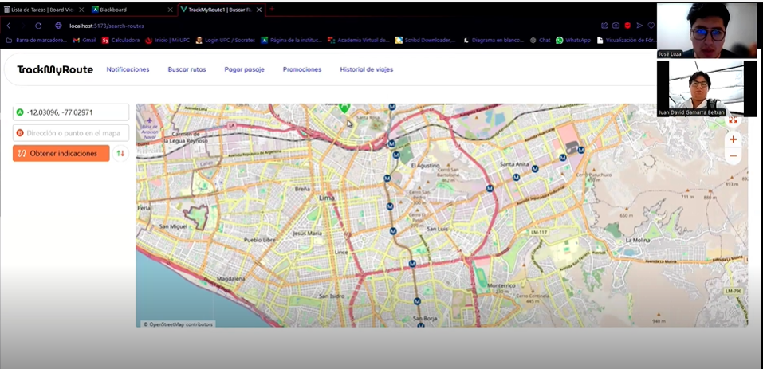

---

### Entrevista 2

- **Nombre y Apellido:** Estrella del Pilar Ticona Panduro
- **Edad:** 19
- **Distrito:** Rimac
- **Enlace:** [Entrevista Estrella Ticona ](https://upcedupe-my.sharepoint.com/:v:/g/personal/u202213404_upc_edu_pe/EWaQYLnigVxGsWD-TMeGbh8BBqimWllTnUzCeKFzHVhBaA?nav=eyJyZWZlcnJhbEluZm8iOnsicmVmZXJyYWxBcHAiOiJPbmVEcml2ZUZvckJ1c2luZXNzIiwicmVmZXJyYWxBcHBQbGF0Zm9ybSI6IldlYiIsInJlZmVycmFsTW9kZSI6InZpZXciLCJyZWZlcnJhbFZpZXciOiJNeUZpbGVzTGlua0NvcHkifX0&e=B71gWg)
- **Duración:** 7:08
- **Resumen:**  
   Estrella es una chica que usa tranportes publicos para irse de punto a punto y le parece muy util ya que puede tener el seguimiento de los paraderos y un mejor control de a donde quiere ir porque puede ver los paraderos y la ruta completa, opina que la carga de datos ha sido rapida y que se mejoraria a la hora de hacer las busquedas.
  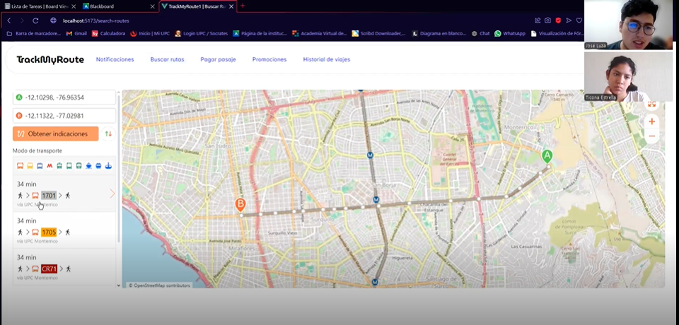

---

## Entrevista 3

- **Nombre y Apellido:** Elisa Mariafe Yataco Perez
- **Edad:** 21
- **Distrito:** Surco
- **Enlace:** [Entrevista Mariafe](https://upcedupe-my.sharepoint.com/:v:/g/personal/u202213404_upc_edu_pe/EaRXxerXrJZAmiS-xq2I5UcBX5xahOxr_LV2xk7tV7hbHw?nav=eyJyZWZlcnJhbEluZm8iOnsicmVmZXJyYWxBcHAiOiJPbmVEcml2ZUZvckJ1c2luZXNzIiwicmVmZXJyYWxBcHBQbGF0Zm9ybSI6IldlYiIsInJlZmVycmFsTW9kZSI6InZpZXciLCJyZWZlcnJhbFZpZXciOiJNeUZpbGVzTGlua0NvcHkifX0&e=rrUvDu)
- **Duración:** 8:37
- **Resumen:**  
  Mariafe es una persona que usa el transporte public muy seguido sin embargo, siempre tiene inconvenientes a la hora de ver donde subir o bajar, opina que para los turistas es una aplicacion muy util, le parece muy importante ver cuanto le costo y la duracion del viaje, para asi poder guiarse a la hora de tomar la ruta.

 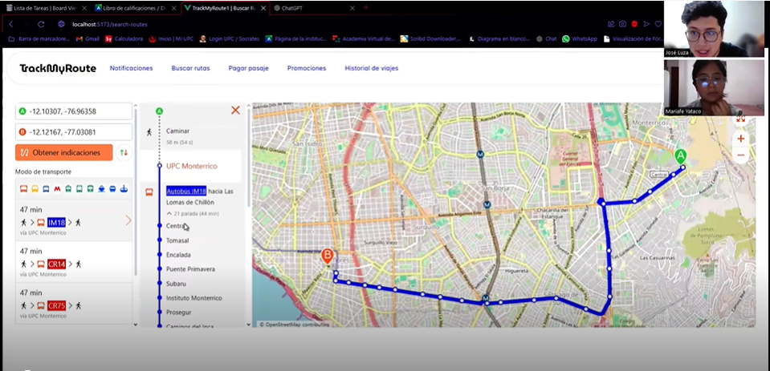

---

### Entrevista 4

- **Nombre y Apellido:** Sebastian Valentino Silva Tirado
- **Edad:** 22
- **Distrito:** San Borja
- **Enlace:** [Entrevista Sebastian](https://upcedupe-my.sharepoint.com/:v:/g/personal/u202213404_upc_edu_pe/EaHvLizkwzNNhVtLR_pCl78B0bXaRX9HDHFdT9nF6KV7cQ?nav=eyJyZWZlcnJhbEluZm8iOnsicmVmZXJyYWxBcHAiOiJPbmVEcml2ZUZvckJ1c2luZXNzIiwicmVmZXJyYWxBcHBQbGF0Zm9ybSI6IldlYiIsInJlZmVycmFsTW9kZSI6InZpZXciLCJyZWZlcnJhbFZpZXciOiJNeUZpbGVzTGlua0NvcHkifX0&e=1TNIbL)
- **Duración:** 7:53
- **Resumen:**  
   Sebastian es una persona que le interesa saber la informacion de la ruta que va a tomar, le parece un diseño claro y un mapa completo para poder ver la ruta como el quiere, opina que deberia haber estadisticas de los gastos y que bus se toma mas para poder asi estudiarlo y tomar las medidas adecuadas.
  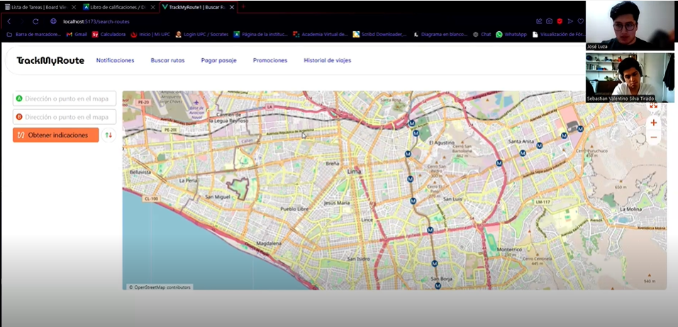

---

## 8.4 Experiment Aftermath & Analysis

## 8.4.1 Analysis and Interpretation of Results

## 8.4.2 Re-scored and Re-prioritized Question Backlog

## 8.5. Continuous Learning

La capacidad de aprendizaje continuo es clave para el éxito y la evolución de TrackMyRoute, permitiendo que el equipo incorpore lecciones aprendidas en el diseño, desarrollo y mejora de la aplicación. Esto asegura que la plataforma se mantenga alineada con las necesidades cambiantes de los usuarios y las mejores prácticas tecnológicas.

### 8.5.2. Shareback Sessions Artifacs: Learning Workflow

El flujo de trabajo para las sesiones de retroalimentación en TrackMyRoute se centra en capturar, analizar y compartir aprendizajes significativos derivados de las experiencias del equipo y los usuarios. Esto fomenta una mejora constante en el desarrollo y operación del producto.

Objetivos:

Documentar aprendizajes clave relacionados con la planificación de rutas, colaboración con empresas de transporte y la experiencia del usuario final.
Compartir prácticas efectivas y evitar repetir errores en futuras iteraciones.
Mantener al equipo informado sobre nuevas tecnologías aplicables, patrones de uso y métricas clave de la aplicación.
Flujo de trabajo:

Captura de datos:

Fuentes: métricas de uso, retroalimentación de usuarios, reuniones retrospectivas y estudios de mercado.
Herramientas: herramientas de análisis como Google Analytics, encuestas internas e Impact Mapping.

  

Análisis y síntesis:

Documentación compartida: resúmenes de aprendizajes clave organizados en Confluence o Notion.
Presentaciones: sesiones de retroalimentación periódicas para alinear al equipo en torno a las lecciones aprendidas.

Implementación de mejoras:

Priorizar y aplicar cambios basados en los aprendizajes documentados (por ejemplo, optimización de algoritmos de rutas o ajustes en la interfaz del usuario).
Retroalimentación continua:

Realizar ciclos iterativos de evaluación después de aplicar cambios, asegurando que las soluciones implementadas cumplan los objetivos deseados.

## 8.6. To-Be Software Platform Pre-Launch

El pre-lanzamiento de TrackMyRoute establece las bases necesarias para garantizar un despliegue exitoso de la plataforma, priorizando una experiencia óptima para los usuarios desde el primer momento.

Actividades clave:

Pruebas finales:

Validar las funcionalidades core como la búsqueda y planificación de rutas, colaboración con empresas de transporte y análisis de datos en tiempo real.
Ejecución de pruebas de estrés para garantizar la escalabilidad del sistema.
Entrenamiento del equipo:

  

Lanzar una campaña en redes sociales y realizar demostraciones en vivo para generar expectativa entre los usuarios.

Monitorear métricas clave durante el pre-lanzamiento, como la tasa de adopción y la precisión en la planificación de rutas.

  

Realizar ajustes en tiempo real basados en los resultados obtenidos.
Con este enfoque, TrackMyRoute estará preparada para ofrecer un servicio confiable y de alto impacto desde el primer día.

  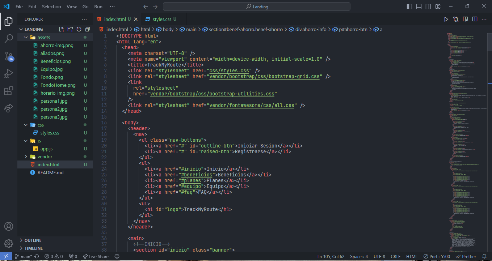

# Conclusiones

- TB1:
  Para esta entrega concluimos que es muy importante tener en cuenta la opinion de nuestros futuros usuarios, así como la ventaja competitiva que podemos brindar sobre nuestros competidores. Tambien concluimos que es necesaria una previa investigación y diseño de producto para tener claro los puntos principales de la aplicación.

- TP:
  Concluimos que es importante tener un buen orden en el control de versiones o Git Flow, para que no haya conflictos a la hora de hacer las integraciones correpondientes.

- TB2:
  En esta entrega comprendimos que cuando usamos metodologías ágiles en un proyecto trabajamos de manera más armoniona y beneficiosa en cuanto a eficacia.

- TF: Para la entrega final de Trackmyroute, concluimos que la combinación de Vue.js para el frontend y .NET para el backend, junto con la implementación de Domain-Driven Design (DDD), ha sido una elección técnica robusta que nos permitió abordar la complejidad del dominio de nuestro proyecto de manera eficaz. A lo largo del desarrollo, aprendimos la importancia de mantener una arquitectura bien estructurada y cohesiva, lo cual facilitó la gestión y evolución del código. Aunque no hemos completado la aplicación en su totalidad, el proceso nos brindó valiosas lecciones sobre la integración de tecnologías modernas y metodologías de diseño avanzadas. La utilización de DDD nos permitió enfocar nuestro esfuerzo en el comportamiento del negocio, asegurando que las funcionalidades clave estuvieran alineadas con las necesidades del usuario final. Además, trabajar con Git Flow fue crucial para mantener un control de versiones ordenado y minimizar conflictos durante las integraciones. Finalmente, la adopción de metodologías ágiles nos ayudó a mejorar la colaboración del equipo y la eficacia en la entrega de resultados incrementales, lo que nos permitirá continuar el desarrollo de Trackmyroute con una base sólida y bien fundamentada.

# Anexos

Link Landing Page mockup: https://www.figma.com/proto/aJREmuLbY7nLlgmOTtjcW5/TrackMyRoute-Web?type=design&node-id=1-2&t=vpM8mg1HtrwmaE8b-1&scaling=min-zoom&page-id=0%3A1&starting-point-node-id=1%3A2&mode=design

Link de prototipo: https://www.figma.com/proto/aJREmuLbY7nLlgmOTtjcW5/TrackMyRoute-Web?type=design&node-id=3-6&t=PO71zMM1GnVJDk1r-1&scaling=scale-down-width&page-id=1%3A3&starting-point-node-id=3%3A6&mode=design

Link Repositorio Landing Page: https://github.com/G2-AplicacionesWeb-SI91/Landing

Link Repositorio Frontend: https://github.com/G2-AplicacionesWeb-SI91/frontend

Link Repositorio Backend: https://github.com/G2-AplicacionesWeb-SI91/backend

Link Landing Page Desplegada: https://g2-aplicacionesweb-si91.github.io/Landing/

Link Web App Desplegada: https://trackmyroute-appsweb123.web.app/login

Link Web Service Desplegado:

Link video expo TB1: https://upcedupe-my.sharepoint.com/:v:/g/personal/u202020108_upc_edu_pe/EWG5NyVGtpVArTHxzr9npgMBf_cZyZDDOk5VOPT0KqlPWg?nav=eyJyZWZlcnJhbEluZm8iOnsicmVmZXJyYWxBcHAiOiJPbmVEcml2ZUZvckJ1c2luZXNzIiwicmVmZXJyYWxBcHBQbGF0Zm9ybSI6IldlYiIsInJlZmVycmFsTW9kZSI6InZpZXciLCJyZWZlcnJhbFZpZXciOiJNeUZpbGVzTGlua0NvcHkifX0&e=djw7bV
Link video expo TB2: https://upcedupe-my.sharepoint.com/:v:/g/personal/u202020108_upc_edu_pe/EdrPQyFP1i5OrawuOG0juK0B6KVfb2Ak78IviFQ6IFKIkw?nav=eyJyZWZlcnJhbEluZm8iOnsicmVmZXJyYWxBcHAiOiJPbmVEcml2ZUZvckJ1c2luZXNzIiwicmVmZXJyYWxBcHBQbGF0Zm9ybSI6IldlYiIsInJlZmVycmFsTW9kZSI6InZpZXciLCJyZWZlcnJhbFZpZXciOiJNeUZpbGVzTGlua0NvcHkifX0&e=huH7c0
Link video expo TP: https://upcedupe-my.sharepoint.com/:v:/g/personal/u202020108_upc_edu_pe/EVVqKmJMqIVHq8E1U6yoXwUBChC-lofGLCrTjTPqA8uxpw?nav=eyJyZWZlcnJhbEluZm8iOnsicmVmZXJyYWxBcHAiOiJPbmVEcml2ZUZvckJ1c2luZXNzIiwicmVmZXJyYWxBcHBQbGF0Zm9ybSI6IldlYiIsInJlZmVycmFsTW9kZSI6InZpZXciLCJyZWZlcnJhbFZpZXciOiJNeUZpbGVzTGlua0NvcHkifX0&e=xm0QJ7
Link video expo TF: https://upcedupe-my.sharepoint.com/:v:/g/personal/u202020108_upc_edu_pe/EVwWZyV6o1pLrrRyGqz7tH8BFs1HYOCp9Dq9LUTg6KaBIQ?nav=eyJyZWZlcnJhbEluZm8iOnsicmVmZXJyYWxBcHAiOiJPbmVEcml2ZUZvckJ1c2luZXNzIiwicmVmZXJyYWxBcHBQbGF0Zm9ybSI6IldlYiIsInJlZmVycmFsTW9kZSI6InZpZXciLCJyZWZlcnJhbFZpZXciOiJNeUZpbGVzTGlua0NvcHkifX0&e=MormXS

Video About-The-Team-Sprint-3: https://upcedupe-my.sharepoint.com/:v:/g/personal/u20191e831
