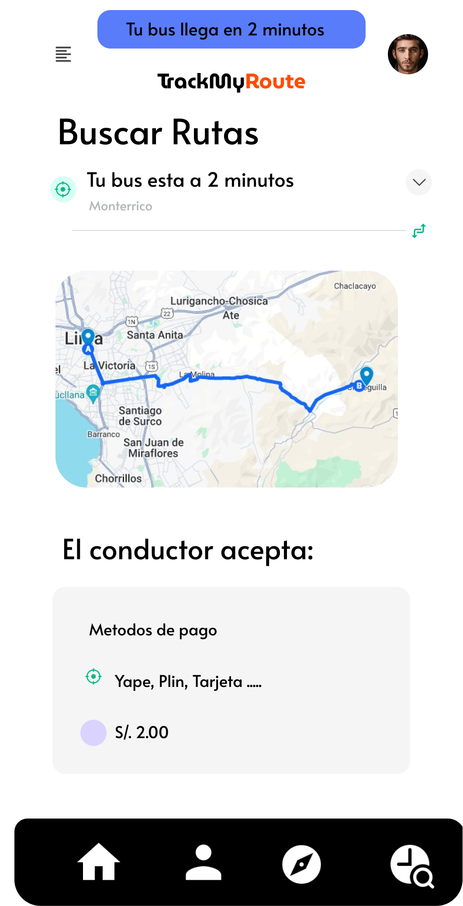

# Universidad Peruana de Ciencias Aplicadas

  

### 
Informe de Trabajo Final

- **Carrera**: Ingeniería de Software
- **Curso**: Diseño de Experimentos de Ingenieria de Software
- **Sección**: SW72
- **Profesor**: Juan Carlos Tinoco Licas
- **Ciclo**: 2024-2
- **Nombre del Startup**: RouteLogic
- **Nombre del Producto**: TrackMyRoute
- **Relación de Integrantes**:
   - **Relación de Integrantes**:
        | Nombre                                      | Código        |
        | --------------------------------------------| ------------- |
        | Luza Carhuamaca, Jose Adrian                | u202213404    |
        | Elsner De La Torre Ugarte, Julio Esteban    | u202111654    |
        | Miranda Sinarahua, Piero Stephano           | u20181g752    |
        | Landeo Simeón, Favio Sebastian              | u202119588    |
        | Poma Espinoza, Gustavo Arturo               | u20221c138    |
        | Ramirez Alfaro, Miguel Angel                | u202117152    |

- **Mes y Año**: Septiembre del 2024

---

# Registro de Versiones del Informe
El objetivo de esta sección es resumir las modificaciones relevantes que se realizan al informe durante el ciclo de vida del proyecto. Esta sección inicia en una página nueva y se incluye un cuadro con la siguiente estructura:

| **Versión** | **Fecha** | **Autor** | **Descripción de Modificación** |
|-------------|-----------|-----------|---------------------------------|
|    TB1      |           |           |                                 |
|             |           |           |                                 |
|             |           |           |                                 |
---
# Project Report Collaboration Insights 

URL del repositorio del proyecto: [https://github.com/upc-pre-2402-si732-sw72-G3/Informe]

  

  

  

---

# Tabla de contenidos
- [Universidad Peruana de Ciencias Aplicadas](#universidad-peruana-de-ciencias-aplicadas)
    - [Informe de Trabajo Final](#informe-de-trabajo-final)
- [Registro de Versiones del Informe](#registro-de-versiones-del-informe)
  - [| v4.0        | 28/06/2024| Todos     | Integración de Back y Front  de nuestro Sistema|](#-v40---------28062024-todos------integración-de-back-y-front--de-nuestro-sistema)
- [Project Report Collaboration Insights](#project-report-collaboration-insights)
- [Tabla de contenidos](#tabla-de-contenidos)
  - [STUDENT OUTCOME](#student-outcome)
- [Capítulo I: Introducción](#capítulo-i-introducción)
  - [1.1 Startup Profile](#11-startup-profile)
    - [1.1.1 Descripción de la Startup](#111-descripción-de-la-startup)
    - [1.1.2 Perfiles de integrantes del equipo](#112-perfiles-de-integrantes-del-equipo)
  - [1.2. Solution Profile](#12-solution-profile)
    - [1.2.1. Antecedentes y problemática](#121-antecedentes-y-problemática)
    - [1.2.2. Lean UX Process](#122-lean-ux-process)
      - [1.2.2.1. Lean UX Problem Statements](#1221-lean-ux-problem-statements)
      - [1.2.2.2. Lean UX Assumptions](#1222-lean-ux-assumptions)
      - [1.2.2.3. Lean UX Hypothesis Statements](#1223-lean-ux-hypothesis-statements)
      - [1.2.2.4. Lean UX Canvas](#1224-lean-ux-canvas)
  - [1.3. Segmentos Objetivo](#13-segmentos-objetivo)
- [Capítulo II: Requirements Elicitation \& Analysis](#capítulo-ii-requirements-elicitation--analysis)
  - [2.1. Competidores](#21-competidores)
    - [2.1.1. Análisis competitivo](#211-análisis-competitivo)
    - [2.1.2. Estrategias y tácticas frente a competidores](#212-estrategias-y-tácticas-frente-a-competidores)
  - [2.2 Entrevistas](#22-entrevistas)
    - [2.2.1 Diseño de entrevistas](#221-diseño-de-entrevistas)
    - [2.2.2. Registro de entrevistas](#222-registro-de-entrevistas)
    - [2.2.3. Análisis de entrevistas](#223-análisis-de-entrevistas)
  - [2.3 Needfinding](#23-needfinding)
    - [2.3.1. User Personas](#231-user-personas)
    - [2.3.2. User Task Matrix](#232-user-task-matrix)
    - [2.3.3. User Journey Mapping](#233-user-journey-mapping)
    - [2.3.4. Empathy Mapping](#234-empathy-mapping)
    - [2.3.5. As-is Scenario Mapping](#235-as-is-scenario-mapping)
- [Capítulo III: Requeriments Specifications](#capítulo-iii-requeriments-specifications)
  - [3.1 To-Be Scenario Mapping](#31-to-be-scenario-mapping)
  - [3.2 User Stories](#32-user-stories)
  - [3.3 Impact Mapping](#33-impact-mapping)
  - [3.4 Product Backlog](#34-product-backlog)
  - [|34| HU34| Recuperación de Contraseña| Como cliente, quiero tener la opción de recuperar mi contraseña en caso de olvido o pérdida para que pueda volver a acceder a mi cuenta sin problemas| 3|](#34-hu34-recuperación-de-contraseña-como-cliente-quiero-tener-la-opción-de-recuperar-mi-contraseña-en-caso-de-olvido-o-pérdida-para-que-pueda-volver-a-acceder-a-mi-cuenta-sin-problemas-3)
- [Capítulo IV: Product Design](#capítulo-iv-product-design)
  - [4.1 Style Guidelines](#41-style-guidelines)
  - [4.2 Information Architecture](#42-information-architecture)
  - [4.3 Landing Page UI Design](#43-landing-page-ui-design)
  - [4.4 Web Applications UX/UI Design](#44-web-applications-uxui-design)
  - [4.5 Web Applications Prototyping](#45-web-applications-prototyping)
  - [4.6 Domain-Driven Software Architecture](#46-domain-driven-software-architecture)
      - [4.6.1. Software Architecture Context Diagram](#461-software-architecture-context-diagram)
      - [4.6.2. Software Architecture Container Diagram](#462-software-architecture-container-diagram)
    - [4.6.3 Software Architecture Components Diagrams](#463-software-architecture-components-diagrams)
        - [Diagrama de componentes #1:](#diagrama-de-componentes-1)
        - [Diagrama de componentes #2:](#diagrama-de-componentes-2)
        - [Diagrama de componentes #3:](#diagrama-de-componentes-3)
        - [Diagrama de componentes #4:](#diagrama-de-componentes-4)
  - [4.7 Software Object-Oriented Design](#47-software-object-oriented-design)
    - [4.7.1 Class Diagrams](#471-class-diagrams)
    - [4.7.2 Class Dictionary](#472-class-dictionary)
  - [4.8 Database Design](#48-database-design)
    - [4.8.1 Database Diagram](#481-database-diagram)
- [Capítulo V: Product Implementation, Validation \& Deployment](#capítulo-v-product-implementation-validation--deployment)
  - [5.1 Software Configuration Management](#51-software-configuration-management)
    - [5.1.1 Software Development Environment Configuration](#511-software-development-environment-configuration)
    - [5.1.2 Source Code Management](#512-source-code-management)
    - [5.1.3 Source Code Style Guide \& Conventions](#513-source-code-style-guide--conventions)
    - [5.1.4 Software Deployment Configuration](#514-software-deployment-configuration)
      - [Repositorios de la Organización](#repositorios-de-la-organización)
      - [Creación de ramas](#creación-de-ramas)
    - [Agregar reglas de protección](#agregar-reglas-de-protección)
  - [Lanzamiento del proyecto](#lanzamiento-del-proyecto)
    - [Landing Page Deployment:](#landing-page-deployment)
    - [Frontend-Application Deployment](#frontend-application-deployment)
  - [5.2 Landing Page, Services \& Applications Implementation.](#52-landing-page-services--applications-implementation)
    - [5.2.2. Sprint 2](#522-sprint-2)
    - [5.2.3. Sprint 3](#523-sprint-3)
    - [5.2.4. Sprint 4](#524-sprint-4)
  - [5.3. Validation Interviews](#53-validation-interviews)
    - [5.3.1. Diseño de Entrevistas](#531-diseño-de-entrevistas)
    - [5.3.2. Registro de Entrevistas](#532-registro-de-entrevistas)
- [Conclusiones](#conclusiones)
- [Anexos](#anexos)
---

# Capítulo I: Introducción
## 1.1 Startup Profile

### 1.1.1 Descripción de la Startup

"RouteLogic" es una startup que busca revolucionar la manera en que las personas se desplazan por la ciudad usando el transporte público. Nuestro objetivo es optimizar y facilitar la movilidad urbana, ofreciendo a los residentes de Lima una aplicación integral que les permita encontrar las rutas de transporte público más eficientes para llegar a sus destinos. Nuestra plataforma no solo ayuda a los usuarios a planificar sus viajes de forma óptima, sino que también proporciona información en tiempo real sobre el estado de las rutas y la disponibilidad de los medios de transporte. Además, trabajamos en conjunto con las empresas de transporte público para ofrecerles una visión actualizada del uso de sus servicios, mejorando así la calidad que brindan a sus clientes.

### 1.1.2 Perfiles de integrantes del equipo

<table align="center"  border="1" width="70%" style="text-align:center;">
    <tr align="center">
        <td rowspan="3">
             
        </td>
        <td align="left">
            <b>Nombre y Apellido:</b>
             
            Jose Adrian Luza Carhuamaca
        </td>
    </tr>
    <tr>
        <td align="left">
        <b>Carrera:</b>
         
        Ingeniería de Software
        </td>
    </tr>
    <tr>
        <td align="left">
        <b>Acerca de:</b>
         
        Soy estudiante de Ingeniería de Software en la Universidad Peruana de Ciencias Aplicadas, con una profunda pasión por el aprendizaje continuo. Me gusta participar en proyectos que desafíen mi creatividad y habilidades para desarrollar soluciones innovadoras, contribuyendo activamente al trabajo en equipo y al logro de objetivos comunes. Estoy siempre en busca de nuevas oportunidades para mejorar, crecer y marcar una diferencia.
        </td>
    </tr>
    <tr align="center">
        <td rowspan="3">
            
        </td>
        <td align="left">
            <b>Nombre y Apellido:</b>
             
            Favio Sebastián Landeo Simeón
        </td>
    </tr>
    <tr>
        <td align="left">
        <b>Carrera:</b>
         
        Ingeniería de Software
        </td>
    </tr>
    <tr>
        <td align="left">
        <b>Acerca de:</b>
         
       Tengo 20 años y actualmente estoy cursando el séptimo ciclo de la carrera de Ingeniería de Software. Estoy disponible para ayudar siempre a mis compañeros y además tiendo a generar buenas relaciones sociales con diferentes tipos de personas gracias a mi tolerancia y capacidad de trabajo en equipo. En mis tiempos libres me gusta escuchar música, jugar videojuegos y editar videos.
        </td>
    </tr>
    <tr align="center">
        <td rowspan="3">
            
        </td>
        <td align="left">
            <b>Nombre y Apellido:</b>
             
            (Nombre aqui)
        </td>
    </tr>
    <tr>
        <td align="left">
        <b>Carrera:</b>
         
        Ingeniería de Software
        </td>
    </tr>
    <tr>
        <td align="left">
        <b>Acerca de:</b>
         
        (Texto Aqui)
        </td>
    </tr>
    <tr align="center">
        <td rowspan="3">
            
        </td>
        <td align="left">
            <b>Nombre y Apellido: </b>
             
            (Nombre aqui)
        </td>
    </tr>
    <tr>
        <td align="left">
        <b>Carrera:</b>
         
        Ingeniería de Software
        </td>
    </tr>
    <tr>
        <td align="left">
        <b>Acerca de:</b>
         
        (Texto Aqui).
        </td>
    </tr>
    <tr align="center">
        <td rowspan="3">
            
        </td>
        <td align="left">
            <b>Nombre y Apellido:</b>
             
            (Nombre aqui)
        </td>
    </tr>
    <tr>
        <td align="left">
        <b>Carrera:</b>
         
        Ingeniería de Software
        </td>
    </tr>
    <tr>
        <td align="left">
        <b>Acerca de:</b>
         
        (Texto Aqui)
        </td>
    </tr>
</table>

## 1.2. Solution Profile

En esta sección iniciaremos por un análisis de los antecedentes y problemática sobre la movilización en transporte público para identificar las raíces del problema e identificar algunas necesidades que se deban cubrir para llegar a una solución de la problemática. Asimismo, luego pasaremos por el proceso UX para poder analizar más a detalle la problemática y poder plantear una hipótesis acerca de la problemática.

### 1.2.1. Antecedentes y problemática

El transporte público en Lima ha estado influenciado por diversos problemas a lo largo de su historia. Con el crecimiento poblacional y urbano, la demanda de servicios de transporte ha aumentado, lo que ha planteado desafíos a la eficiencia y calidad del transporte en la ciudad. Lima alguna vez contó con sistemas de transporte como los tranvías en el siglo XIX, pero la falta de inversión y planificación condujo a su desaparición en la segunda mitad del siglo XX. Entre los problemas más urgentes, la congestión del tráfico, el aumento de vehículos particulares y la infraestructura inadecuada han resultado en largos tiempos de viaje y constante congestión en las calles de Lima. Asimismo, la falta de mantenimiento y servicios insuficientes han deteriorado la experiencia de los usuarios, quienes frecuentemente se ven obligados a usar autobuses y combis en malas condiciones. La inseguridad en el transporte, junto con tarifas elevadas y falta de accesibilidad para personas con discapacidad, son también problemas significativos que requieren atención urgente.

¿Qué?: La movilización en transportes públicos en Lima se refiere al desplazamiento de personas dentro de la ciudad utilizando diferentes medios de transporte público, tales como autobuses, combis, el sistema de buses de tránsito rápido Metropolitano, y el Tren Eléctrico. Este proceso abarca los desplazamientos diarios para trabajar, estudiar y realizar otras actividades cotidianas.

¿Quién?: Los principales actores en la movilización de transporte público en Lima son los usuarios, tanto residentes locales como visitantes de la ciudad. Además, las autoridades gubernamentales y las empresas de transporte público juegan un rol crucial en la gestión y regulación de estos servicios.

¿Por qué?: Las personas utilizan el transporte público en Lima por varias razones, incluyendo la congestión del tráfico, la falta de estacionamiento, la necesidad de una opción de movilidad asequible y la preocupación por el medio ambiente. Además, muchas personas no tienen acceso a un automóvil personal y dependen del transporte público para sus desplazamientos diarios.

¿Dónde?: Esta movilización ocurre en toda la ciudad de Lima, abarcando desde el centro histórico hasta los distritos periféricos y las áreas metropolitanas circundantes. Los usuarios se desplazan tanto dentro de la ciudad como hacia los suburbios.

¿Cuándo?: La movilización en transporte público en Lima se da todos los días, durante todas las horas del día, ya que es esencial para las actividades diarias de la población. Los horarios de operación varían según la ruta y el tipo de transporte.

¿Cómo?: Los usuarios acceden al transporte público en Lima a través de una red de paraderos y estaciones que conectan diversas rutas y servicios. Sistemas de transporte masivo como el Metropolitano y el Tren Eléctrico cuentan con tarjetas de acceso y estaciones designadas para abordar. Los autobuses y combis tienen paraderos específicos en las calles.

¿Cuánto?: El costo del transporte público en Lima varía según el tipo de servicio y la distancia recorrida. Los boletos pueden oscilar entre unos pocos céntimos y varios soles peruanos, dependiendo de la ruta y el sistema de transporte. Existen opciones de tarifas con descuento para aquellos que utilizan tarjetas de prepago, así como para estudiantes y personas mayores.

Conclusiones de las 5W y 2H: En resumen, la movilización en transporte público es una parte fundamental de la vida cotidiana en Lima, Perú, tanto para residentes como para visitantes. Este sistema es indispensable para muchas personas que lo utilizan para moverse por la ciudad debido a la congestión del tráfico, la falta de estacionamiento y la necesidad de alternativas de transporte accesibles. A pesar de los desafíos como la congestión, la seguridad y la insuficiencia en la infraestructura, el transporte público sigue siendo crucial para mantener la movilidad en una ciudad en constante expansión y cambio. Los esfuerzos de las autoridades locales y gubernamentales, como la implementación de sistemas de transporte masivo y la regulación del sector, son pasos importantes hacia la mejora de la movilización en Lima.

### 1.2.2. Lean UX Process

#### 1.2.2.1. Lean UX Problem Statements

El objetivo principal de TrackRoute es facilitar que las personas planifiquen y realicen viajes en transporte público de manera sencilla y eficiente. Además, buscamos disminuir los costos asociados al transporte y aliviar la congestión vehicular, lo que también contribuye a mejorar la calidad del aire, reduciendo así el impacto ambiental de los desplazamientos diarios en la ciudad.

#### 1.2.2.2. Lean UX Assumptions

User Assumptions

I. ¿Quién es el usuario?

TrackRoute está diseñado para cualquier persona que utilice el transporte público en Lima. Esto incluye estudiantes, trabajadores, turistas y cualquier otra persona que necesite planificar un viaje en la ciudad. La aplicación es útil para locales y visitantes que no están familiarizados con el sistema de transporte público de Lima y requieren asistencia para organizar sus desplazamientos.

II. ¿Dónde encaja nuestro producto en la vida del usuario?

Nuestro servicio es crucial para los residentes de Lima que dependen del transporte público para sus desplazamientos diarios. TrackRoute les proporciona una herramienta esencial para encontrar la mejor ruta hacia su destino, optimizando su tiempo y reduciendo la incertidumbre en sus viajes. Esto se traduce en una mayor comodidad y productividad en su vida cotidiana.

III. ¿Qué problemas enfrenta nuestro producto y cómo evitarlos?

La precisión de la información en tiempo real es fundamental para la efectividad de TrackRoute. Datos inexactos pueden llevar a los usuarios a rutas incorrectas, generando frustración. Asimismo, garantizar la privacidad y seguridad de los datos de ubicación es clave para evitar problemas como la exposición de información sensible o el seguimiento no autorizado.

IV. ¿Cuándo y cómo es utilizado nuestro producto?

Los usuarios pueden acceder a TrackRoute a través de dispositivos móviles como teléfonos inteligentes o tabletas. Tras descargar la aplicación desde tiendas como la App Store o Google Play, los usuarios ingresan su ubicación actual y destino. La aplicación ofrece información sobre rutas disponibles, tiempos estimados de viaje y actualizaciones en tiempo real sobre la ubicación de los vehículos de transporte público.

V. ¿Qué características son esenciales?

TrackRoute es una herramienta indispensable para los usuarios de transporte público en Lima. Ofrece características clave como búsqueda de rutas, información en tiempo real, notificaciones y alertas, mapas interactivos, detalles de tarifas y opciones de pago, comentarios de usuarios, historial de viajes, accesibilidad y medidas de seguridad. La aplicación mejora la experiencia del usuario al ayudarlo a planificar y seguir sus rutas de manera eficiente, brindando un servicio personalizado que facilita la movilidad en Lima.

VI. ¿Cómo debe verse y comportarse nuestro producto?

Nuestra plataforma debe ser visualmente atractiva e intuitiva, lo que permitirá a los usuarios confiar en nosotros y alcanzar sus objetivos al utilizar la aplicación.

Business Assumptions

1. Demanda de Usuarios:
Suponemos que existe una demanda significativa para una aplicación de planificación de rutas de transporte público en Lima, ya que muchas personas buscan optimizar sus viajes.

2. Colaboración con Empresas de Transporte:
Suponemos que las empresas de transporte público en Lima estarán dispuestas a colaborar, proporcionando datos actualizados sobre sus rutas y vehículos para integrarlos en nuestra aplicación.

3. Disponibilidad de Datos en Tiempo Real:
Suponemos que podemos acceder a datos en tiempo real de los sistemas de transporte público, lo que nos permitirá proporcionar información precisa sobre la ubicación y el estado de los vehículos.

4. Aceptación de Tecnología:
Suponemos que la población de Lima está dispuesta a adoptar y utilizar aplicaciones móviles para planificar sus viajes en transporte público, y que cuentan con los dispositivos y la conectividad necesarios.

5. Monetización:
Suponemos que podemos generar ingresos a través de modelos de monetización como la publicidad en la aplicación, la venta de boletos de transporte o la suscripción premium para características adicionales.

6. Seguridad de Datos:
Suponemos que podemos garantizar la seguridad y privacidad de los datos personales de los usuarios, lo que fomentará la confianza en nuestra aplicación.

7. Competencia:
Suponemos que habrá competidores en el mercado de aplicaciones de transporte público en Lima, y debemos encontrar formas de diferenciarnos y ofrecer un valor único a los usuarios.

8. Retención de Usuarios:
Suponemos que podemos mantener una base de usuarios activa y comprometida a largo plazo mediante actualizaciones regulares de la aplicación, características adicionales y un excelente servicio al cliente.

9. Regulaciones y Cumplimiento Normativo:
Suponemos que podemos cumplir con todas las regulaciones y requisitos legales relacionados con la operación de una aplicación de transporte público en Lima.

#### 1.2.2.3. Lean UX Hypothesis Statements

Creemos que existe una demanda no satisfecha para una aplicación de planificación de rutas de transporte público en Lima. Por ello, realizaremos encuestas y estudios de mercado para evaluar el interés y la disposición de los usuarios a utilizar la aplicación. 

Suponemos que las empresas de transporte público estarán interesadas en colaborar, proporcionando datos esenciales para nuestra aplicación. Iniciaremos conversaciones con estas empresas para determinar su voluntad de cooperar. También creemos que la población de Lima está dispuesta a utilizar aplicaciones móviles para planificar sus viajes en transporte público. 

Realizaremos encuestas sobre la aceptación de tecnología y evaluaremos la adopción inicial de la aplicación. Suponemos que habrá competencia en el mercado de aplicaciones de transporte público y que podemos diferenciarnos. Analizaremos la competencia y evaluaremos nuestra propuesta de valor única. Por último, suponemos que podemos generar ingresos a través de modelos de monetización como la publicidad en la aplicación y la venta de boletos. 

Implementaremos estos modelos y evaluaremos su efectividad en la generación de ingresos y la aceptación de los usuarios.

#### 1.2.2.4. Lean UX Canvas

---

## 1.3. Segmentos Objetivo

Segmento objetivo 1: Pasajeros en búsqueda de un autobús. (Pasajeros)

• Personas que se desplazan al trabajo o a la escuela utilizando el transporte público: Aquellos que realizan viajes       diarios en Lima y buscan una forma eficiente y confiable de llegar a sus destinos.

• Turistas que visitan Lima y prefieren utilizar el transporte público: Viajeros que exploran la ciudad y optan por un medio de transporte accesible y económico.

• Personas sin acceso a un vehículo personal: Aquellos que dependen exclusivamente del transporte público para sus desplazamientos diarios dentro de la ciudad.

Segmento objetivo 2: Empresas de transporte que operan en Lima.

• Gerentes de operaciones y logística de estas empresas: Profesionales encargados de la planificación, organización y optimización de las rutas y servicios de transporte público.

• Empresas de transporte formalizadas y en cumplimiento con la normativa: Entidades que operan legalmente en Lima y buscan mejorar la calidad y eficiencia de sus servicios a través de la colaboración con TrackRoute.

# Capítulo III: Requeriments Specifications

## 3.1 To-Be Scenario Mapping

Con la herramiento del To-be scenario mapping exploramos las mejoras y las nuevas funcionalidades que se incorporarán en la aplicación “TrackMyRoute”. Estas mejoras están diseñadas para optimizar la experiencia de los usuarios al movilizarse por la ciudad de Lima en transporte público y proporcionar a la empresa de transporte una visión en tiempo real de sus clientes. A través de este proceso, visualizamos cómo la aplicación evolucionará para brindar un servicio más eficiente y útil a los dos grupos de usuarios.

  

 

## 3.2 User Stories

En la sección de User Stories, detallaremos las diversas necesidades y requerimientos de nuestros
usuarios y la empresa de transporte. Cada historia de usuario representará un escenario o una función
específica que se espera que la aplicación proporcione, con el objetivo de cumplir connuestro
propósito principal: ayudar a las personas a navegar por la ciudad de Lima utilizando el transporte
público de manera eficiente y brindar a la empresa de transporte información en tiempo real sobre sus
clientes. A través de estas historias de usuario, podremos comprender mejor cómo la aplicación
satisfará las necesidades de ambas partes y proporcionará una solución integral para la movilidad
urbana.

| **Epic / Story ID** | **Título**                                      | **Descripción**                                                                                                                                                                                                    | **Criterios de Aceptación**                                                                                                                                                                                                                                                                                                                                                                                                                                                          | **Relacionado con (Epic ID)** |
|---------------------|-------------------------------------------------|--------------------------------------------------------------------------------------------------------------------------------------------------------------------------------------------------------------------|--------------------------------------------------------------------------------------------------------------------------------------------------------------------------------------------------------------------------------------------------------------------------------------------------------------------------------------------------------------------------------------------------------------------------------------------------------------------------------------|-------------------------------|
| HU01                | Registrar al usuario                            | Como cliente quiero registrarme con todos mis datos pertinentes (nombre, correo, edad, etc.) en la aplicación para poder hacer uso de sus funcionalidades.                                                         | Escenario: El cliente se registra en la aplicación. Dado que el cliente se encuentra en la pantalla de inicio de sesión,Y el cliente quiere registrarse para usar la aplicación,Cuando el cliente rellena un formulario de creación de una cuenta nueva con todos sus datos personales pertinentes,Entonces el sistema guardará todos sus datos y le permitirá acceder a las funcionalidades de la aplicación.                                                                       | HU02                          |
| HU02                | Inicio de sesión en la aplicación               | Como cliente quiero iniciar sesión en la aplicación con mis credenciales (correo y contraseña) para poder entrar a la aplicación con mi cuenta existente                                                           | Escenario: El cliente quiere iniciar sesión en la aplicación Dado que el cliente se encuentra en la pantalla de inicio de sesión,Y el usuario ya tiene una cuenta existente,Cuando el cliente rellena los campos de la pantalla de inicio de sesión con sus credenciales (correo y contraseña) correctamente,Entonces el cliente podrá acceder a las funcionalidades de la aplicación con su cuenta existente.                                                                       | HU01                          |
| HU03                | Eliminar cuenta o usuario                       | Como cliente quiero tener la posibilidad de borrar mi cuenta para que mis datos ya no permanezcan en la base de datos de la aplicación.                                                                            | Escenario: El cliente quiere eliminar una cuenta o usuario Dado que el cliente se encuentra en la pantalla de ajustes de la cuenta,Y el cliente tiene la intención de borrar su cuenta,Cuando el cliente selecciona la opción de borrar su cuenta en la aplicación,Entonces la aplicación eliminará su cuenta y los datos personales del cliente de la base de datos.                                                                                                                | HU01,HU02                     |
| HU04                | Registro de rutas y buses                       | Como desarrollador quiero registrar a las rutas de transporte urbano y a los buses que transitan por estas para así tener un registro de todas las que se encuentren en Lima.                                      | Escenario: el desarrollador quiere registrar las rutas de los buses. Dado que el desarrollador se encuentra en la pantalla de ingreso de datos en la base de datos,Y el desarrollador tiene a la mano los datos de las rutas y los buses,Cuando el desarrollador quiera insertar los datos pertinentes,Entonces la aplicación guardará en la base de datos todos los datos relacionados con las rutas y los buses                                                                    | HU05, HU06                    |
| HU05                | Registro de conductores                         | Como desarrollador quiero registrar a los conductores de los buses para así tener un registro de todos los conductores que transitan por las rutas por motivos de seguridad al usuario.                            | Escenario: El desarrollador quiere registrar a los conductores de los buses. Dado que el desarrollador se encuentra en la pantalla de ingreso de datos en la base de datos,Y el desarrollador tiene a la mano los datos de las rutas y los buses,Cuando el desarrollador quiera insertar los datos pertinentes,Entonces la aplicación guardará en la base de datos todos los datos relacionados con las rutas y los buses.                                                           | HU04, HU06                    |
| HU06                | Registro de las empresas operadoras de rutas    | Como desarrollador quiero registrar a las empresas que operan en cada una de las rutas de transporte urbano en buses para así tener un registro de todas estas empresas en la base de datos de la aplicación       | Escenario: El desarrollador quiere registrar a las empresas operadoras de rutas. Dado que el desarrollador se encuentra en la pantalla de ingreso de datos en la base de datos,Y el desarrollador tiene a la mano los datos de las empresas operadoras de las rutas de transporte de buses,Cuando el desarrollador quiera insertar los datos pertinentes, Entonces la aplicación guardará en la base de datos todos los datos relacionados con las empresas operadoras de las rutas. | HU04, HU05                    |
| HU07                | Implementación de servicios externos            | Como desarrollador quiero implementar servicios externos de otras empresas como Google Maps para así poder darle la funcionalidad deseada a la aplicación sin tener que desarrollar todo desde cero                | Escenario: El desarrollador quiere implementar servicios externos a la app.Dado que el desarrollador se encuentra en la pantalla de implementación de servicios externos,Y el desarrollador ha juntado el código y los requisitos necesarios para llamar al servicio externo,Cuando el desarrollador quiera crear una funcionalidad que llame a un servicio externo de otra empresa,Entonces la aplicación hará uso de este servicio cuando lo requiera.                             | HU06                          |
| HU08                | Visualización del menú de opciones              | Como cliente quiero ver el menú de opciones de la aplicación para así tener una idea de las funcionalidades que están presentes en esta.                                                                           | Escenario: El cliente quiere ver las funciones de la aplicación.Dado que el cliente se encuentra en la pantalla de inicio de la aplicación,Y el cliente quiere ver qué puede ser la aplicación,Cuando el cliente selecciona el botón que abre el menú de opciones,Entonces la aplicación deberá mostrarle al usuario el menú de opciones con todas las funcionalidades presentes.                                                                                                    | HU10                          |
| HU09                | Configuración de búsqueda de ruta personalizada | Como cliente quiero modificar ciertas opciones relacionadas a la búsqueda de rutas (tiempo de viaje, distancia al paradero, mostrar la ruta más rápida, etc.) para optimizar esta búsqueda según mis preferencias. | Escenario: El cliente quiere realizar una búsqueda personalizada.Dado que el cliente se encuentra en la pantalla de búsqueda de rutas,Y el cliente quiere especificar las condiciones de búsqueda según su parecer,Cuando el cliente modifique los criterios de búsqueda,Entonces la aplicación le mostrará las rutas disponibles según los filtros de búsqueda establecidos por el usuario.                                                                                         | HU10                          |
| HU10 | Visualización del mapa                        | Como cliente quiero ver un mapa interactivo con las rutas presentes para tener una idea más clara del posible camino por el que quiera viajar.                                                                                                      | Escenario: El cliente quiere ver el mapa. Dado que el cliente se encuentra en la pantalla principal, Y el cliente desea visualizar el mapa  con las rutas disponibles, Cuando el cliente seleccione la opción  de buscar rutas e ingrese todos los filtros que desee, Entonces la aplicación deberá mostrar  un mapa interactivo de la zona con las posibles rutas.                                                                                                                                                   | HU12       |
| HU11 | Visualización de costos del pasaje            | Como cliente quiero ver el costo del pasaje aproximado al elegir una ruta en la aplicación para saber con anticipación cuánto dinero debo tener para costear el viaje                                                                               | Escenario: El cliente quiere ver los costos de pasaje. Dado que el cliente se encuentra en la pantalla principal, Y el cliente desea ver cuánto le costaría realizar un viaje por cierta ruta, Cuando el cliente haya seleccionado  la opción de buscar rutas y haya  realizado la búsqueda de las rutas  disponibles, Entonces la aplicación deberá mostrar el costo aproximado de cada viaje por ruta.                                                                                                              | HU12       |
| HU12 | Visualización del número de buses a abordar   | Como cliente quiero ver cuántos buses se tiene que abordar para llegar al destino para determinar qué ruta sería la mejor conforme a la situación en la que me encuentre.                                                                           | Escenario: El cliente quiere ver cuántos buses puede abordar Dado que el cliente se encuentra en la pantalla principal, Y el cliente desea saber cuántos buses debe abordar para llegar a cierto lugar, Cuando el cliente haya seleccionado la opción de buscar rutas y haya realizado la búsqueda de las rutas disponibles, Entonces la aplicación deberá mostrar la cantidad de buses que se deberá abordar para llegar al destino.                                                                                 | HU14       |
| HU13 | Planificación de viajes                       | Como cliente quiero planificar mis viajes en función a mi ubicación actual y al destino (se muestran los horarios de salida y de llegada de los buses, su ubicación, etc.) para organizar mejor mis tiempos.                                        | Escenario: El cliente quiere planificar un viaje Dado que el cliente se encuentra en la pantalla principal, Y el cliente desea planificar un viaje, Cuando el cliente haya seleccionado la opción de buscar rutas y haya realizado la búsqueda de las rutas disponibles, Entonces la aplicación deberá permitirle al cliente el planificar su viaje dependiendo de los tiempos estimados del viaje hipotético.                                                                                                        | HU15       |
| HU14 | Información en tiempo real                    | Como cliente quiero observar la información pertinente a mi viaje en tiempo real (ubicación actual de los autobuses, su hora estimada de llegada y cualquier retraso o cambio en la ruta) para tomar mejores decisiones en el acto.                 | Escenario: El cliente quiere ver información de los buses en tiempo real Dado que el cliente ya eligió la ruta en la que desea viajar, Y el cliente desea ver información pertinente a su viaje en tiempo real, Cuando el cliente seleccione la opción para ver la información en tiempo real, Entonces la aplicación le tendrá que mostrar al cliente toda la información relacionada a su viaje actualizada y en tiempo real.                                                                                       | HU17       |
| HU15 | Compra de boletos                             | Como cliente quiero comprar boletos para el transporte público directamente desde la aplicación para agilizar y facilitar el proceso de pago por los boletos o pasajes.                                                                             | Escenario: El cliente quiere comprar un boleto anticipadamente Dado que el cliente ya eligió la ruta en la que desea viajar, Y los buses en los cuales el cliente va a viajar tienen el pago de pasajes por la aplicación disponible, Cuando el cliente le de a la opción para pagar por la aplicación, Entonces la aplicación le permitirá al cliente pagar por el boleto o pasaje desde esta.                                                                                                                       | HU13       |
| HU16 | Notificaciones personalizadas                 | Como cliente quiero recibir notificaciones personalizadas acerca de eventos pertinentes a mi viaje en bus (retrasos, horarios, etc.) para estar al tanto de las situaciones que pueden afectar mi futuro viaje                                      | Escenario: El cliente quiere recibir notificaciones acerca de eventos de buses Dado que el cliente está al tanto de las notificaciones de su celular, Cuando ocurra un evento de importancia para el viaje del cliente, Entonces la aplicación emitirá una notificación, la cual el cliente puede ver o ignorar si es que lo considera necesario.                                                                                                                                                                     | HU14       |
| HU17 | Mapas interactivos                            | Como cliente quiero visualizar mapas interactivos en los que pueda ver la ubicación de las paradas de autobús, la ruta y la ubicación de los autobuses en tiempo real, para así poder tomar mejores decisiones en el momento sobre qué ruta elegir. | Escenario: El cliente quiere visualizar mapas interactivos Dado que el cliente se encuentra en la pantalla principal, Y el cliente desea visualizar el mapa con las rutas disponibles, Cuando el cliente seleccione la opción de buscar rutas e ingrese todos los filtros que desee, Entonces la aplicación deberá mostrar un mapa interactivo de la zona donde se puede ver la ubicación de las paradas de autobús, la ruta y la ubicación de los autobuses en tiempo real.                                          | HU10, HU14 |
| HU18 | Integración con otros servicios de transporte | Como desarrollador quiero integrar la aplicación con otros servicios de transporte público, como trenes o tranvías, para permitir a los usuarios planificar viajes intermodales.                                                                    | Escenario: El desarrollador quiere implementar otros servicios de transporte Dado que el desarrollador se encuentra en la pantalla de implementación de servicios externos, Y el desarrollador ha juntado el código y los requisitos necesarios para incluir a otro servicio de transporte público, Cuando el desarrollador quiera crear una funcionalidad que se integre con otro servicio, Entonces la aplicación hará uso de esta función para permitirles a los clientes la planificación de viajes intermodales. | HU04       |
| HU19 | Accesibilidad                                 | Como desarrollador quiero hacer la aplicación más accesible para personas con discapacidades, ofreciendo opciones de accesibilidad como la navegación por voz y el alto contraste, para ampliar la cantidad de posibles usuarios.                   | Escenario: El desarrollador quiere hacer la aplicación más accesible para el usuario Dado que el desarrollador se encuentra en la pantalla de implementación de servicios de accesibilidad, Y el desarrollador ha juntado el código y los requisitos necesarios para hacer uso de herramientas de accesibilidad, Cuando el desarrollador quiera crear una funcionalidad que mejore la accesibilidad de la aplicación, Entonces la aplicación integrará esta funcionalidad.                                            | HU20       |
| HU20 | Retroalimentación de los usuarios             | Como cliente quiero dar una retroalimentación sobre mi experiencia de viaje o al utilizar la aplicación para dar a conocer mi agrado o mi malestar con respecto al funcionamiento de esta.                                                          | Escenario: El cliente quiere dar una retroalimentación sobre la app. Dado que el cliente está en la pantalla principal de la aplicación, Y el cliente desee dar una retroalimentación sobre su experiencia, Cuando el cliente seleccione la opción para dar una retroalimentación, Entonces la aplicación le deberá dar la posibilidad al cliente de dar una retroalimentación tanto sobre su viaje en el bus, la ruta o la funcionalidad de la aplicación en general.                                                | HU19       |
| HU21 | integración de api de transporte público         | como desarrollador, quiero integrar una api de transporte público para acceder a datos actualizados sobre rutas, horarios y paradas de transporte público en tiempo real.                               | dado que se ha establecido la conexión con la api de transporte público, cuando realizo una solicitud de búsqueda de rutas con una ubicación de origen y destino, entonces la aplicación devuelve datos precisos y actualizados sobre las rutas disponibles, horarios de salida y llegada, y paradas intermedias.                             | HU12, HU14 |
| HU22 | implementación de sistema de autenticación oauth | como desarrollador, quiero implementar un sistema de autenticación oauth para permitir que los usuarios inicien sesión utilizando sus cuentas de redes sociales.                                        | dado que un usuario intenta iniciar sesión en la aplicación utilizando oauth, cuando selecciona la opción de inicio de sesión con una plataforma de redes sociales, entonces la aplicación redirige al usuario al sitio web de la plataforma de redes sociales para autorizar el acceso.                                                      | HU01, HU02 |
| HU23 | desarrollo de algoritmo de ruta óptima           | como desarrollador, quiero diseñar un algoritmo eficiente para calcular la ruta óptima entre dos puntos dados, teniendo en cuenta factores como la distancia, el tiempo y las preferencias del usuario. | dado que un usuario solicita una búsqueda de ruta entre dos ubicaciones, cuando el algoritmo calcula la ruta óptima basada en las preferencias del usuario y los datos de transporte disponibles, entonces la aplicación devuelve la ruta más rápida y eficiente, considerando factores como la duración del viaje y el número de trasbordos. | HU13       |
| HU24 | sección principal de landing page                | como visitante de la landing page, quiero ser recibido por una sección principal llamativa para captar mi atención y despertar mi interés en explorar más sobre la aplicación de seguimiento de rutas.  | dado que ingreso a la landing page, cuando miro la sección principal, entonces encuentro un diseño visualmente atractivo con un mensaje claro y conciso que destaque las características únicas de la aplicación.                                                                                                                             |            |
| HU25 | información de beneficios                        | como visitante de la landing page, quiero encontrar una sección dedicada a los beneficios de la aplicación de seguimiento de rutas para comprender cómo puede mejorar mi experiencia de viaje.          | dado que estoy interesado en la aplicación, cuando navego por la sección de beneficios, entonces encuentro información clara y convincente sobre cómo la aplicación puede ayudarme a planificar mejor mis viajes, ahorrar tiempo y optimizar mis desplazamientos diarios.                                                                     |            |
| HU26 | conocer los aliados que respaldan la app         | como visitante de la landing page, quiero ver una lista de aliados que respaldan la aplicación de seguimiento de rutas para sentir confianza en su calidad y fiabilidad.                                | dado que estoy interesado en la aplicación, cuando reviso la sección de aliados, entonces encuentro logotipos o testimonios de empresas, organizaciones o autoridades que respaldan y confían en la aplicación.                                                                                                                               |            |
| HU27 | reseñas de usuarios satisfechos                  | como visitante de la landing page, quiero encontrar reseñas y testimonios de usuarios satisfechos para obtener una idea de su experiencia y satisfacción con la aplicación.                             | dado que estoy interesado en la aplicación, cuando busco la sección de reseñas, entonces encuentro testimonios reales de usuarios que describen cómo la aplicación ha mejorado su experiencia de viaje y les ha ayudado en sus desplazamientos diarios.                                                                                       |            |
| HU28 | conocer los planes de suscripción                | como visitante de la landing page, quiero encontrar información sobre los planes de suscripción disponibles para entender las opciones de pago y beneficios asociados con cada plan.                    | dado que estoy interesado en utilizar la aplicación de forma regular, cuando navego por la sección de planes de suscripción, entonces encuentro una descripción clara de los diferentes planes disponibles, sus precios y las características incluidas en cada uno.                                                                          |            |
| HU29 | obtener respuestas a preguntas frecuentes        | como visitante de la landing page, quiero acceder a una sección de preguntas frecuentes para encontrar respuestas a mis dudas más comunes sobre la aplicación de seguimiento de rutas.                  | dado que tengo preguntas sobre la aplicación, cuando accedo a la sección de preguntas frecuentes, entonces encuentro una lista completa de preguntas comunes y sus respuestas claras y concisas, lo que me ayuda a entender mejor cómo funciona la aplicación y cómo puedo utilizarla eficazmente.                                            |            |
|HU30 | Promociones | Como cliente, quiero ver las promociones disponibles en la aplicación para que pueda aprovechar descuentos al utilizar el servicio de transporte público. | Dado que el cliente abre la aplicación, Cuando accede a la sección de promociones, Entonces se muestran claramente todas las promociones vigentes, incluyendo sus términos y condiciones. |

## 3.3 Impact Mapping

En la sección de Impact Mapping, exploraremos las repercusiones más amplias y los objetivos
estratégicos que buscamos lograr con la implementación de esta aplicación. En lugar de centrarnos en
detalles técnicos o funcionalidades específicas, el Impact Mapping nos ayudará a comprender cómo
nuestro proyecto contribuirá a alcanzar metas más grandes y cómo afectará positivamente a los
diferentes grupos de interés. A través de este mapeo de impacto, identificaremos las conexiones entre
las características de la aplicación y los resultados deseados, lo que nos permitirá tomar decisiones
informadas sobre qué aspectos priorizar y cómo medir el éxito a largo plazo.

  

## 3.4 Product Backlog

|#Orden|User Story ID|Título|Descripción|Story Points|
|:----|:----|:----|:----|:----|
|1|HU07|Implementación de servicios externos|Como desarrollador quiero implementar servicios externos de otras empresas como Google Maps para así poder darle la funcionalidad deseada a la aplicación sin tener que desarrollar todo desde cero|5|
|2|HU09|Configuración de búsqueda de ruta personalizada|Como cliente quiero modificar ciertas opciones relacionadas a la búsqueda de rutas (tiempo de viaje, distancia al paradero, mostrar la ruta más rápida, etc.) para optimizar esta búsqueda según mis preferencias.|5|
|3|HU10|Visualización del mapa|Como cliente quiero ver un mapa interactivo con las rutas presentes para tener una idea más clara del posible camino por el que quiera viajar.|5|
|4|HU11|Visualización de costos del pasaje|Como cliente quiero ver el costo del pasaje aproximado al elegir una ruta en la aplicación para saber con anticipación cuánto dinero debo tener para costear el viaje|5|
|5|HU12|Visualización del número de buses a abordar|Como cliente quiero ver cuántos buses se tiene que abordar para llegar al destino para determinar qué ruta sería la mejor conforme a la situación en la que me encuentre.|5|
|6|HU13|Planificación de viajes|Como cliente quiero planificar mis viajes en función a mi ubicación actual y al destino (se muestran los horarios de salida y de llegada de los buses, su ubicación, etc.) para organizar mejor mis tiempos.|5|
|7|HU14|Información en tiempo real|Como cliente quiero observar la información pertinente a mi viaje en tiempo real (ubicación actual de los autobuses, su hora estimada de llegada y cualquier retraso o cambio en la ruta) para tomar mejores decisiones en el acto.|5|
|8|HU15|Compra de boletos|Como cliente quiero comprar boletos para el transporte público directamente desde la aplicación para agilizar y facilitar el proceso de pago por los boletos o pasajes.|5|
|9|HU17|Mapas interactivos|Como cliente quiero visualizar mapas interactivos en los que pueda ver la ubicación de las paradas de autobús, la ruta y la ubicación de los autobuses en tiempo real, para así poder tomar mejores decisiones en el momento sobre qué ruta elegir.|5|
|10|HU18|Integración con otros servicios de transporte|Como desarrollador quiero integrar la aplicación con otros servicios de transporte público, como trenes o tranvías, para permitir a los usuarios planificar viajes intermodales.|5|
|11|HU21|integración de api de transporte público|como desarrollador, quiero integrar una api de transporte público para acceder a datos actualizados sobre rutas, horarios y paradas de transporte público en tiempo real.|5|
|12|HU23|desarrollo de algoritmo de ruta óptima|como desarrollador, quiero diseñar un algoritmo eficiente para calcular la ruta óptima entre dos puntos dados, teniendo en cuenta factores como la distancia, el tiempo y las preferencias del usuario.|5|
|13|HU04|Registro de rutas y buses|Como desarrollador quiero registrar a las rutas de transporte urbano y a los buses que transitan por estas para así tener un registro de todas las que se encuentren en Lima.|3|
|14|HU05|Registro de conductores|Como desarrollador quiero registrar a los conductores de los buses para así tener un registro de todos los conductores que transitan por las rutas por motivos de seguridad al usuario.|3|
|15|HU06|Registro de las empresas operadoras de rutas|Como desarrollador quiero registrar a las empresas que operan en cada una de las rutas de transporte urbano en buses para así tener un registro de todas estas empresas en la base de datos de la aplicación|3|
|16|HU08|Visualización del menú de opciones|Como cliente quiero ver el menú de opciones de la aplicación para así tener una idea de las funcionalidades que están presentes en esta.|3|
|17|HU19|Accesibilidad|Como desarrollador quiero hacer la aplicación más accesible para personas con discapacidades, ofreciendo opciones de accesibilidad como la navegación por voz y el alto contraste, para ampliar la cantidad de posibles usuarios.|3|
|18|HU20|Retroalimentación de los usuarios|Como cliente quiero dar una retroalimentación sobre mi experiencia de viaje o al utilizar la aplicación para dar a conocer mi agrado o mi malestar con respecto al funcionamiento de esta.|3|
|19|HU22|implementación de sistema de autenticación oauth|como desarrollador, quiero implementar un sistema de autenticación oauth para permitir que los usuarios inicien sesión utilizando sus cuentas de redes sociales.|3|
|20|HU24|sección principal de landing page|como visitante de la landing page, quiero ser recibido por una sección principal llamativa para captar mi atención y despertar mi interés en explorar más sobre la aplicación de seguimiento de rutas.|3|
|21|HU25|información de beneficios|como visitante de la landing page, quiero encontrar una sección dedicada a los beneficios de la aplicación de seguimiento de rutas para comprender cómo puede mejorar mi experiencia de viaje.|3|
|22|HU26|conocer los aliados que respaldan la app|como visitante de la landing page, quiero ver una lista de aliados que respaldan la aplicación de seguimiento de rutas para sentir confianza en su calidad y fiabilidad.|3|
|23|HU27|reseñas de usuarios satisfechos|como visitante de la landing page, quiero encontrar reseñas y testimonios de usuarios satisfechos para obtener una idea de su experiencia y satisfacción con la aplicación.|3|
|24|HU28|conocer los planes de suscripción|como visitante de la landing page, quiero encontrar información sobre los planes de suscripción disponibles para entender las opciones de pago y beneficios asociados con cada plan.|3|
|25|HU29|obtener respuestas a preguntas frecuentes|como visitante de la landing page, quiero acceder a una sección de preguntas frecuentes para encontrar respuestas a mis dudas más comunes sobre la aplicación de seguimiento de rutas.|3|
|26|HU01|Registrar al usuario|Como cliente quiero registrarme con todos mis datos pertinentes (nombre, correo, edad, etc.) en la aplicación para poder hacer uso de sus funcionalidades.|2|
|27|HU02|Inicio de sesión en la aplicación|Como cliente quiero iniciar sesión en la aplicación con mis credenciales (correo y contraseña) para poder entrar a la aplicación con mi cuenta existente|2|
|28|HU03|Eliminar cuenta o usuario|Como cliente quiero tener la posibilidad de borrar mi cuenta para que mis datos ya no permanezcan en la base de datos de la aplicación.|2|
|29|HU16|Notificaciones personalizadas|Como cliente quiero recibir notificaciones personalizadas acerca de eventos pertinentes a mi viaje en bus (retrasos, horarios, etc.) para estar al tanto de las situaciones que pueden afectar mi futuro viaje|2|
|30| HU30 |Promociones |Como cliente, quiero ver las promociones disponibles en la aplicación para que pueda aprovechar descuentos al utilizar el servicio de transporte público.  | 2 |
|31|HU31 |Soporte y Ayuda |Como cliente, quiero tener acceso a opciones de soporte y ayuda dentro de la aplicación para que pueda resolver cualquier problema o duda que pueda surgir durante su uso. | 2|
|32|HU32 | Configuración | Como cliente, quiero tener la capacidad de personalizar la configuración de mi cuenta en la aplicación para que pueda adaptarla a mis preferencias y necesidades individuales.| 3|
|33|HU33 | Historial de Viajes| Como cliente, quiero poder acceder a un historial detallado de mis viajes anteriores en la aplicación para que pueda realizar un seguimiento de mis desplazamientos y gastos.| 5|
|34| HU34| Recuperación de Contraseña| Como cliente, quiero tener la opción de recuperar mi contraseña en caso de olvido o pérdida para que pueda volver a acceder a mi cuenta sin problemas| 3|
---
# Capítulo IV: Product Design

## 4.1. Style Guidelines.

Las guías de estilo son los criterios y sugerencias creados para uniformar la apariencia, el estilo y la facilidad de uso tanto de la Landing Page como de la Aplicación Web.

### 4.1.1. General Style Guidelines.

La paleta de colores que estamos usando en nuestra Landing Page y Web Application son los siguientes: 

  

El tono predominante y fundamental de nuestra solución es el azul y sus diversas variaciones, seleccionado con el propósito de generar en nuestros usuarios sensaciones de confianza, seguridad y calma. Nuestra meta es mantener la simplicidad y el minimalismo para lograr que nuestros usuarios se sientan comodos con la aplicación.

Se ha seleccionado MuseoModerno para el logotipo, los títulos y los subtítulos de la Landing Page y la Aplicación Web, ya que su diseño evoca pistas y carreteras, lo cual se considera adecuado para nuestro producto. Para los textos, el contenido informativo y los botones de la Landing Page, se utilizará Montserrat.

  

Optamos por establecer un espaciado entre letras de 1,15 para los textos y el contenido de la página, y de 2 píxeles para los títulos y subtítulos, con el objetivo de garantizar una visualización óptima para nuestros usuarios.

En cuanto al tono de nuestra comunicación, será formal, cortés y tranquilo, ya que la mayoría de nuestro público objetivo son adultos.

### 4.1.2. Web Style Guidelines.

Para el diseño de la Aplicación Web, hemos definido una paleta de colores principal compuesta por azul y blanco, junto con la tipografía Montserrat que abarca el 90% del diseño. Priorizamos la simplicidad en el diseño y la optimización para su funcionamiento eficiente en todos los dispositivos, siguiendo los principios de responsive design y usabilidad.

Utilizamos los siguientes iconos para la parte del dashboard.

  

### 4.1.3. Mobile Style Guidelines.

  

#### 4.1.3.1. iOS Mobile Style Guidelines.

  

#### 4.1.3.2. Android Mobile Style Guidelines.

  

## 4.2. Information Architecture.

En este apartado, presentaremos el procedimiento de ordenar, configurar y categorizar el contenido de la Landing Page y la Aplicación Web de Track My Route de manera que resulte comprensible y accesible para nuestros usuarios. Ponemos énfasis en diseñar la estructura y la navegación de sistemas de información, asi como páginas web y sistemas de gestión de contenido, con el fin de potenciar la usabilidad y la experiencia del usuario.

### 4.2.1. Organization Systems.

 - **Forma jerárquica**
        
        La aplicación web de TrackMyRoute se organizará de forma jerárquica, comenzando con un panel de control principal que ofrece acceso rápido a las funciones esenciales. Esto incluirá la búsqueda de rutas por ubicación y horarios en tiempo real, así como la opción de pago de pasajes. En un segundo nivel, los usuarios podrán acceder a su historial de viajes y pagos, además de encontrar promociones disponibles para ellos. En un nivel más profundo de jerarquía, tendrán la posibilidad de configurar notificaciones personalizadas y gestionar su perfil de usuario. Además, habrá una sección de ayuda que proporcionará recursos adicionales y soporte. Esta estructura jerárquica está diseñada para garantizar una navegación intuitiva y una experiencia fluida para los usuarios al buscar y gestionar información relacionada con el transporte público.
    - **Organización secuencial (step-by-step to accomplish)**
        En la aplicación web de TrackMyRoute, se ha implementado la organización secuencial en situaciones donde los usuarios necesitan completar una serie de pasos en un orden específico para alcanzar un objetivo determinado. Por ejemplo, durante el proceso de registro de un nuevo usuario, se les guiará a través de una secuencia de pasos que incluirá la creación de una cuenta, la configuración de preferencias y la aceptación de los términos y condiciones. Esto también se observa al buscar rutas y autobuses, así como al pagar el pasaje a través de la aplicación. Esta metodología de organización secuencial ayuda a simplificar y estructurar procesos complejos, lo que facilita la navegación y la comprensión para los usuarios.
    - **Organización matricial**
        
        En TrackMyRoute, se emplea la organización matricial en situaciones donde hay una diversidad de categorías o dimensiones que se entrelazan y se relacionan entre sí. Esto es evidente al buscar autobuses, donde se muestra un mapa junto con la información de los autobuses y se ofrecen filtros para refinar la búsqueda. Asimismo, se utiliza en la disposición visual de las promociones dirigidas a los usuarios.

### 4.2.2. Labeling Systems.

| Etiqueta            | Descripción                                                                                                                                    |
|:-------------------:|:----------------------------------------------------------------------------------------------------------------------------------------------:|
| Buscar Rutas        | En esta sección se le mostrará al usuario avisos por parte de la aplicación                                                                    |
| Notificaciones      | En esta sección el usuario podrá ingresar su origen y destino y visualizar sus rutas y buses, así como un mapa con información en tiempo real. |
| Pagar Pasaje        | En esta sección el usuario podrá pagar sus pasajes de su ruta de manera anticipada para ser más eficiente a la hora de abordar el bus.         |
| Promociones         | En esta sección el usuario podrá acceder a distintas promociones que brindamos a nuestros usuarios premium                                     |
| Historial de Viajes | En esta sección el usuario podrá visualizar sus viajes anteriores y pasajes pagados.                                                           |
| Soporte y Ayuda     | En esta sección el usuario accede a ayuda por parte de nuestro equipo de soporte.                                                              |
| Configuración       | En esta sección el usuario puede configurar sus preferencias y su perfil.           

### 4.2.3. SEO Tags and Meta Tags

Los tags de SEO y Meta tags son cruciales ya que desempeñan una función vital en la optimización para motores de búsqueda (SEO), contribuyendo a mejorar la visibilidad y el ranking de una página web en los resultados de búsqueda. Por ende, para optimizar la búsqueda y el posicionamiento de TrackMyRoute, hemos implementado lo siguiente:

| Landing Page | Web Application |
|---------------|-----------------|
|**Title:** TrackMyRoute **Description:** Optimiza tu viaje y libérate del estrés **Keywords:** Autobús, Metro, Tren, Paradas, Ubicación, Tráfico, Planificador, Seguridad, Comodidad, Precisión, Horario, Buses en Lima, Rutas. **Authors:** TrackMyRoute| **Title:**  TrackMyRoute   **Description:** Optimiza tu viaje y libérate del estrés   **Keywords:** Autobús, Metro, Tren, Paradas, Ubicación, Tráfico, Planificador, Seguridad, Comodidad, Precisión, Horario, Buses en Lima, Rutas, Buses, Seguimiento, Mapas, Transporte, Navegación, Tiempo, Notificaciones, Promociones, Pasajes, Historial.   **Authors:** TrackMyRoute|

### 4.2.4. Searching Systems.

El sistema de búsqueda de nuestra aplicación se fundamenta en la ubicación de los autobuses y sus rutas, así como en los puntos de recogida de pasajeros. Esta funcionalidad estará conectada a una base de datos que contiene información sobre los autobuses, sus rutas y los costos de los pasajes. Por lo tanto, esta herramienta de búsqueda estará disponible en las secciones de "Buscar Rutas", "Pagar Pasajes" y "Historial de Viajes".

### 4.2.5. Navigation Systems.

Los métodos de navegación utilizados en TrackMyRoute son los siguientes:

1. Barra de navegación en la Landing Page: Los usuarios pueden desplazarse por nuestra Landing Page para familiarizarse con nuestra aplicación y comprender nuestra propuesta de valor.
2. Barra de navegación en la Aplicación Web: Los usuarios tienen la posibilidad de explorar los distintos apartados y funciones de nuestra propuesta utilizando la barra de navegación.
3. Tarjetas de promociones: Los usuarios pueden ver fácilmente las promociones que les ofrecemos a través de las tarjetas de promociones.

## 4.3. Landing Page UI Design.
### 4.3.1. Landing Page Wireframe.

  

### 4.3.2. Landing Page Mock-up.

Link Landing Page mockup: https://www.figma.com/proto/aJREmuLbY7nLlgmOTtjcW5/TrackMyRoute-Web?type=design&node-id=1-2&t=vpM8mg1HtrwmaE8b-1&scaling=min-zoom&page-id=0%3A1&starting-point-node-id=1%3A2&mode=design 

  

## 4.4. Mobile Applications UX/UI Design.
### 4.4.1. Mobile Applications Wireframes.

  

  

  

  

  

  

  

  

  

  

  

### 4.4.2. Mobile Applications Wireflow Diagrams.

  

  

  

### 4.4.3. Mobile Applications Mock-ups.

  

### 4.4.4. Mobile Applications User Flow Diagrams.

  

  

## 4.5. Mobile Applications Prototyping.

  

Link de prototipo: https://www.figma.com/proto/aJREmuLbY7nLlgmOTtjcW5/TrackMyRoute-Web?type=design&node-id=3-6&t=PO71zMM1GnVJDk1r-1&scaling=scale-down-width&page-id=1%3A3&starting-point-node-id=3%3A6&mode=design

### 4.5.1. Android Mobile Applications Prototyping.

Link de prototipo: https://www.figma.com/design/gRfIpmDEc54Tptas8ZOsgU/TrackMyRoute---Experimentos?node-id=0-1&t=7fVzSFGuX1I6ZYXA-1

### 4.5.2. iOS Mobile Applications Prototyping.

Link de prototipo: https://www.figma.com/design/gRfIpmDEc54Tptas8ZOsgU/TrackMyRoute---Experimentos?node-id=0-1&t=7fVzSFGuX1I6ZYXA-1

### 4.6. Web Applications UX/UI Design.
### 4.6.1. Web Applications Wireframes.

Los wireframes actúan como el plano de la aplicación web, delineando la estructura y el diseño de cada página. Se enfocan en:

Diseño de la Página: Estructura básica sin colores ni gráficos.
Ubicación del Contenido: Posicionamiento de elementos clave como menús de navegación, botones y bloques de contenido.
Visualización del Flujo de Usuario: Ilustrando cómo los usuarios navegarán a través de la aplicación.

  

  

  

  

  

  

  

  

Link de wireframe:  https://www.figma.com/design/aJREmuLbY7nLlgmOTtjcW5/TrackMyRoute-Web?node-id=2053-676&node-type=FRAME&t=gDbP6FCDP3Ohxegw-0

### 4.6.2. Web Applications Wireflow Diagrams.

  

### 4.6.3. Web Applications Mock-ups.

  

  

  

  

  

  

  

  

  

  

  

  

### 4.6.4. Web Applications User Flow Diagrams.

  

## 4.7. Web Applications Prototyping.

Link de Interactive Prototype: https://www.figma.com/proto/aJREmuLbY7nLlgmOTtjcW5/TrackMyRoute-Web?type=design&node-id=3-6&t=PO71zMM1GnVJDk1r-1&scaling=scale-down-width&page-id=1%3A3&starting-point-node-id=3%3A6&show-proto-sidebar=1

## 4.8. Domain-Driven Software Architecture.

Para el modelo de negocio que utilizaremos para desarrollar nuestro software complejo que se centra en la problematica que abordamos. para ello utilizaremos la tecnica de modelado C4 Model.

### 4.8.1. Software Architecture Context Diagram.

Este es el diagrama de Contexto de nuestro sistema:
 <a target='_blank' href='https://es.imgbb.com/'>

### 4.8.2. Software Architecture Container Diagrams.

Este es el diagrama de Contenedores de nuestro sistema:
 <a target='_blank' href='https://es.imgbb.com/'>

### 4.8.3. Software Architecture Components Diagrams.

Esto son los diagramas de componentes de nuestro sistema:
##### Diagrama de componentes #1:
 <a target='_blank' href='https://es.imgbb.com/'>

##### Diagrama de componentes #2:
 <a target='_blank' href='https://es.imgbb.com/'>

##### Diagrama de componentes #3:
 <a target='_blank' href='https://es.imgbb.com/'>

##### Diagrama de componentes #4:
 <a target='_blank' href='https://es.imgbb.com/'>

## 4.9. Software Object-Oriented Design.
### 4.9.1. Class Diagrams.

Para nuestro sistema, hemos implementado un diagrama de clases. Este diagrama visualiza la estructura estática del software, mostrando las clases, sus atributos y las relaciones entre ellas. Es una herramienta esencial que nos ayuda a comprender cómo se organizan y comunican las diferentes partes de nuestro sistema de software.

Diagramas de clases por módulo:

- User Interface:

 <a target='_blank' href='https://es.imgbb.com/'>

- Subscription:

 <a target='_blank' href='https://es.imgbb.com/'>

- FAQ:

 <a target='_blank' href='https://es.imgbb.com/'>

- Track Route:

 <a target='_blank' href='https://es.imgbb.com/'>

### 4.9.2. Class Dictionary.

Explicacion del funcionamiento de cada funcion por módulo.
Módulos:

- User Interface:
Para explicar nuestro sistema de usuario este tendra que registrarse para luego iniciar sesion en su cuenta, donde este recibira un correo para confirmar su creacion, todo esto en una clase llamada UserInterface que recibira toda la información.

 <a target='_blank' href='https://es.imgbb.com/'>

- Subscription:
Este modulo de clases es referido a la eleccion que tenga el usuario sobre la subscripcion que desea poseer.

- FAQ:
Esta esta dirigido a una parte mas de dudas que tenga el usuario sobre el uso o funcionamiento de la aplicación.

- Track Route:
Esta es el modulo que explica el funcionamiento principal de la aplicacion, nos mostrara la ruta de los buses y como de acuerdo a las preferencias del usuario puede variar, ademas de una funcionalidad para pagar el servicio del bus que este desee tomar.

 <a target='_blank' href='https://es.imgbb.com/'>

## 4.10. Database Design.

Para explicar el sistema de nuestra aplicacion comenzemos por las entidades como buses company y customers cada una de ellas se refiere a los usuarios tanto de buses como el cliente que se transporta(Este de acuerdo a la subscripcion que posea tiene distintos beneficios)

### 4.10.1. Relational/Non-Relational Database Diagram.

Utilizamos MySql para le creación de la base de datos por lo cual es una relacional.

Tenemos una entidad que explica la data que va tener cada uno de los buses en nuestro sistema. 

Tenemos una entidad llamada tracMyRouteBuses esta se refiere a la data que va recibir sobre las rutas que van a tomar los distintos servicios de buses.

Estas pueden ser personalizadas por el usuario.
 <a target='_blank' href='https://es.imgbb.com/'>

Para que este verifique si es valido la ruta que ah sido escogida y el status es un dato uqe se mandara a la entidad "Status_TrackRouteBuses".

 <a target='_blank' href='https://es.imgbb.com/'>

Tenemos una entidad la cual se encarga de ver la subscripcion actual del usuario y que beneficios este va poseer.

